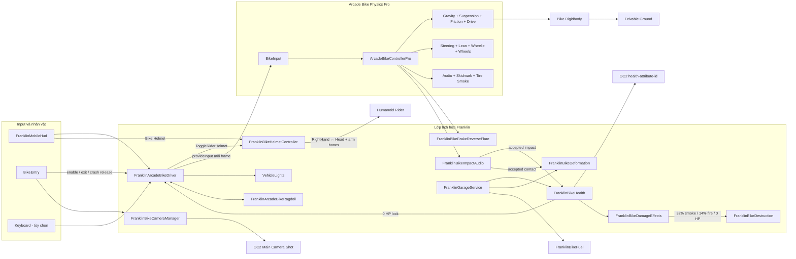
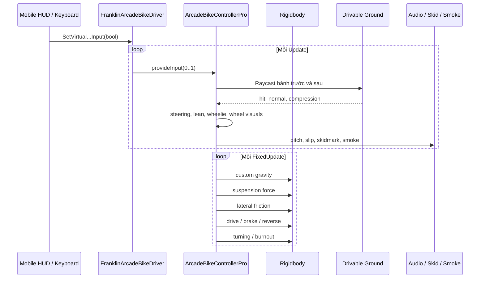
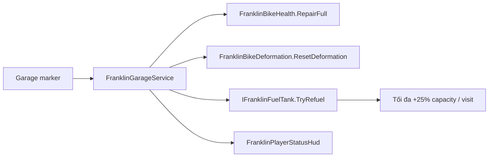

# Arcade Bike Physics Pro — Franklin Game Integration

Tài liệu này mô tả source Arcade Bike Physics Pro (ABP) đang có trong project,
cấu trúc prefab chuẩn và lớp tích hợp dành riêng cho Franklin Game.

> Source of truth của cấu hình hiện tại là `Prefabs/Bikes/Bike_01.prefab`. Các bike khác
> phải giữ cùng cấu trúc và mapping component; chỉ mesh/model được phép khác.

## 1. Tổng quan

ABP là bộ điều khiển xe máy dùng `Rigidbody`, raycast bánh xe và lực tùy chỉnh.
Package không dùng `WheelCollider` để tạo chuyển động. Controller chính xử lý:

- dò ground tại bánh trước/sau;
- gravity, suspension, ma sát ngang và rolling resistance;
- tăng tốc, phanh, lùi, drift, burnout và wheelie;
- xoay tay lái, nghiêng model và quay bánh xe;
- số xe, âm thanh động cơ, skid sound;
- skidmark, khói lốp và các UnityEvent khi cất cánh/hạ đất/đổi số.

Trong Franklin Game, ABP vẫn là physics engine duy nhất của bike. Các hệ thống
entry, mobile input, camera, đèn và ragdoll được nối qua lớp adapter Franklin.

## 2. Cấu trúc thư mục

```text
Arcade Bike Physics Pro/
├── README.md                       # Tài liệu chính, luôn nằm ở package root
├── Animations/
│   ├── Entry/                      # Animation enter mirror
│   └── RiderPoses/                 # Rider Fit đang dùng và pose Legacy
├── Audio/
│   ├── Engine/                     # Âm thanh động cơ
│   ├── Tires/                      # Skid/burnout loop
│   └── Transmission/               # Chuyển số
├── Data/
│   └── Lighting/                   # Flare/light data
├── Editor/
│   ├── Installation/               # Installer, integrator, validation
│   └── RiderTools/                 # Rider Fit và IK mirror tools
├── Materials/
│   ├── Bikes/
│   │   ├── Bike_01/ ... Bike_10/  # Material riêng của từng model
│   │   └── Shared/                 # Glass/body và material mâm dùng chung
│   ├── Effects/                    # Skidmark và tire smoke
│   ├── Helmets/                    # Helmet_01 ... Helmet_10
│   └── Physics/                    # Zero friction và ragdoll body
├── Models/
│   ├── Bikes/
│   │   └── Bike_01/ ... Bike_10/  # Mesh body, mâm và lốp
│   └── Helmets/
│       └── Helmet_01/ ... Helmet_10/ # Mesh mũ bảo hiểm
├── Prefabs/
│   ├── Bikes/                      # Bike_01.prefab ... Bike_10.prefab
│   ├── Collections/                # Helmet_Showcase
│   ├── Helmets/                    # Helmet_01.prefab ... Helmet_10.prefab
│   └── Effects/                    # TireSmoke, SkidmarkController
├── Scripts/
│   ├── Core/                       # ArcadeBikeControllerPro
│   ├── Animation/                  # Target animation ABP gốc
│   ├── Camera/                     # Camera ABP gốc, không dùng trong Franklin
│   ├── Effects/                    # Runtime skidmark
│   ├── Input/                      # UI button ABP gốc
│   ├── Ragdoll/                    # Dummy ragdoll ABP gốc
│   └── Integration/
│       ├── Camera/                 # Main Shot aim của Bike
│       ├── Damage/                 # Health, impact, VFX, deformation, destruction
│       ├── Effects/                # Đèn phanh và particle wind
│       ├── Fuel/                   # Nhiên liệu Bike
│       ├── Physics/                # Driver và Bike/Player ragdoll
│       └── Rider/                  # Entry, IK, rider pose và helmet
├── Shaders/
│   └── Effects/                    # Shader skidmark
└── Textures/
    ├── Bikes/
    │   └── Bike_01/ ... Bike_10/  # Texture riêng từng model
    ├── Effects/                    # Tire smoke và skidmark
    └── Helmets/                    # Texture Helmet_01 ... Helmet_10
```

Quy tắc tìm asset:

- Muốn kéo xe vào scene: mở `Prefabs/Bikes`.
- Muốn thay mesh: mở `Models/Bikes/Bike_XX`.
- Muốn thay màu/vật liệu: mở `Materials/Bikes/Bike_XX`.
- Material mâm trước/sau dùng chung nằm tại
  `Materials/Bikes/Shared/Bike_Shared_Wheel_Rim_Solid.mat`; asset giữ GUID gốc
  để cả Bike 01–10 không mất slot khi dọn thư mục nguồn DQP.
- Muốn sửa texture: mở `Textures/Bikes/Bike_XX`.
- Muốn thay mũ: mở `Prefabs/Helmets`; mesh, material và texture tương ứng nằm
  trong ba nhánh `Helmets` còn lại.
- Muốn sửa khói/vệt bánh: mở nhánh `Effects` tương ứng.
- Muốn sửa gameplay: mở `Scripts/Integration` trước; `Scripts/Core` chỉ chứa
  physics ABP gốc.

Asset Bike và Helmet đã được phân loại vào package này. Thư mục
`Assets/Model/DQP_MotorBikePack_URP14` chỉ còn giữ dữ liệu nguồn không thuộc hai
nhóm trên. Khi di chuyển/đổi tên, các file `.meta` gốc được giữ lại để GUID của
scene, prefab, mesh, material và texture không thay đổi.

## 3. Kiến trúc trong Franklin Game



### Quyết định tích hợp quan trọng

- Mobile UI dùng `FranklinMobileHud`, không dùng HUD riêng của package.
- Nút `Bike Helmet` nằm bên trái nút phanh/lùi khi lái Bike và gọi controller
  mũ dùng chung trên Player. Nếu Player exit trong lúc đang đội mũ, cùng nút đó
  tiếp tục hiện trong nhóm điều khiển đi bộ cho tới khi người dùng tháo mũ.
- Tất cả bike dùng một `FranklinBikeCameraManager` dưới Player và GC2 Main
  Camera Shot. Không tạo camera riêng cho từng bike.
- `bikeReferences.cameraController` để `null` trên bike đã tích hợp.
- Ragdoll dùng `FranklinArcadeBikeRagdoll` trực tiếp trên Rigidbody thật của
  bike. Không dùng dummy-bike flow của `RagdollActivator` gốc.
- `bikeReferences.ragdollActivator` để `null` trên bike đã tích hợp.
- Player và bike bỏ va chạm với nhau trong toàn bộ quá trình enter/ngồi/exit.
- Bike nằm ngã chỉ được park sau khi adapter xác nhận bề mặt trái/phải đã ổn
  định gần song song với ground.
- Khi ragdoll, Rigidbody Bike dùng `ContinuousDynamic`, solver `12/4` và ground
  safety theo bounds collider. Nếu solver xuyên quá `0.12m`, toàn bộ Bike được
  đẩy trở lại theo normal của đúng static ground bên dưới và vận tốc đi xuyên
  mặt nền bị loại bỏ. Guard kiểm tra `ClosestPoint`, vì vậy không giữ Bike lơ
  lửng khi đã rơi khỏi mép sàn.
- Player dùng `FranklinRagdollGroundGuard`: các Rigidbody xương được gia cố CCD,
  còn pelvis chỉ được recovery khi đã thực sự xuyên ground quá `0.08m`. Luồng
  này áp dụng cho crash Bike, bailout Car và các ragdoll GC2 khác.

## 4. Cấu trúc prefab bike chuẩn

Cây dưới đây là cấu trúc chức năng của `Prefabs/Bikes/Bike_01.prefab`. Tên mesh con sẽ
khác giữa các model, nhưng các node ABP/Franklin phải giữ cùng vai trò.

```text
Bike Root
├── CenterOfGravity
├── AudioSource-Engine
├── AudioSource-Drifting
├── AudioSource-Collision
├── Triggers-Control
├── Triggers_Enter/Exit
├── ABP Gear Shift
└── ABP Rotator
    └── ABP Wheelie
        └── ABP Lean
            └── ABP Bike Model
                ├── ABP Rear Wheel Parent
                │   └── RearWheelTarget
                │       ├── Rear Rim Mesh
                │       └── Rear Tire Mesh
                ├── ABP Steering Parent
                │   └── ABP Steering
                │       ├── ABP Front Wheel Parent
                │       │   └── FrontWheelTarget
                │       │       ├── Front Rim Mesh
                │       │       └── Front Tire Mesh
                │       └── ABP Steering Meshes
                │           └── Handlebar
                │               ├── LeftHand
                │               └── RightHand
                ├── ABP Collider
                ├── Franklin Rear Brake Flare
                └── BikeBody
                    ├── Body render meshes
                    │   └── Franklin Body Mesh Collider
                    ├── Parent                         # Seat target
                    ├── LeftFoot                       # Left footpeg
                    ├── RightFoot                      # Right footpeg
                    ├── GroundLeftFoot                 # Chân trái chống đất
                    ├── Bike Entry Standing Point
                    ├── Bike Entry Standing Point Mirrored
                    ├── Fallen Bike Body Grip Left
                    ├── Fallen Bike Body Grip Right
                    ├── Franklin Ragdoll Front Wheel Collider
                    ├── Franklin Ragdoll Rear Wheel Collider
                    ├── Bike Damage Effects
                    │   ├── Weak Health Smoke
                    │   ├── Critical Warning Fire
                    │   ├── Destroyed Fire
                    │   ├── Explosion Burst
                    │   ├── Occupant Burn Fire
                    │   └── Loop Audio
                    └── Spot Light(s)
```

### Mapping `BikeReferences`

| Field | Transform/component chuẩn |
|---|---|
| `Rotator` | `ABP Rotator` |
| `WheelieTransform` | `ABP Wheelie` |
| `LeanTransform` | `ABP Lean` |
| `FrontWheelParent` | `ABP Front Wheel Parent` |
| `RearWheelParent` | `ABP Rear Wheel Parent` |
| `FrontWheel` | `FrontWheelTarget` chứa cả mâm và lốp |
| `RearWheel` | `RearWheelTarget` chứa cả mâm và lốp |
| `BikeSteering` | `ABP Steering` |
| `BikeSteeringParent` | `ABP Steering Parent` |
| `SteeringMeshes` | `ABP Steering Meshes` |
| `BikeModel` | `ABP Bike Model` |
| `BodyMesh` | `BikeBody` |
| `BikeRb` | `Rigidbody` trên Bike Root |
| `collider` | `CapsuleCollider` dùng bởi controller ABP |
| `skidmarksPrefab` | `Prefabs/Effects/SkidmarkController.prefab` |
| `tireSmokePrefab` | `Prefabs/Effects/TireSmoke.prefab` |
| `BikerAnimationTargets` | `null` trong Franklin integration |
| `cameraController` | `null` trong Franklin integration |
| `ragdollActivator` | `null` trong Franklin integration |

> `FrontWheelTarget` và `RearWheelTarget` phải chứa tối thiểu hai phần render:
> mâm và lốp. Không trỏ controller vào riêng một mesh bánh xe.

## 5. Runtime flow



### Thứ tự xử lý của controller

`Update()`:

1. Raycast và đặt visual bánh trước/sau lên ground.
2. Tính ground normal, trạng thái grounded và phát event takeoff/landing.
3. Căn `Rotator` theo mặt đất hoặc world-up khi ở trên không.
4. Đọc `BikeInput`, cập nhật steer, lean, wheelie và wheel animation.
5. Cập nhật engine audio, slip, skidmark, smoke và skid sound.

`FixedUpdate()`:

1. Chuyển `Rigidbody.linearVelocity` sang local bike velocity.
2. Áp custom gravity.
3. Tính và áp lực suspension.
4. Áp ma sát ngang.
5. Xử lý tăng tốc, lùi, phanh và rolling resistance.
6. Xử lý burnout/rotation và gear shift.

## 6. API gốc của Arcade Bike Physics Pro

Namespace của package:

```csharp
using ArcadeBP_Pro;
```

### `ArcadeBikeControllerPro`

File: [Scripts/Core/ArcadeBikeControllerPro.cs](Scripts/Core/ArcadeBikeControllerPro.cs)

#### API điều khiển

| API | Mô tả |
|---|---|
| `provideInput(accelerate, reverse, handBrake, steerLeft, steerRight, wheelie)` | Ghi sáu kênh input. Giá trị sử dụng thực tế là `0..1`. Phải cập nhật mỗi frame hoặc trả về `0` khi thả nút. |
| `StartBike()` | Cho phép accelerate/turn và bật tiếng động cơ. |
| `StopBike()` | Khóa accelerate/turn và mute tiếng động cơ. |
| `reduceSurfaceNormalDownVelocity(factor)` | Loại bớt thành phần velocity hướng vào normal của mặt đường. |
| `RotateVector(vector, axis, degree)` | Utility xoay vector quanh một trục. |

#### Trạng thái đọc runtime

| Field/property | Ý nghĩa |
|---|---|
| `localBikeVelocity` | Velocity của Rigidbody trong không gian `Rotator`, đơn vị m/s. Setter private. |
| `CurrentSteerInput` | `-1`, `0` hoặc `1`. Setter private. |
| `bikeIsGrounded` | Ít nhất một bánh đang chạm drivable ground. |
| `frontWheelIsGrounded` | Bánh trước đang grounded. |
| `rearWheelIsGrounded` | Bánh sau đang grounded. |
| `isDoingWheelie` | Controller đang xử lý wheelie. |
| `canAccelerate` | Cho phép lực tăng tốc. |
| `canTurn` | Cho phép turning. |
| `currentGear` | Số hiện tại. |
| `CurrntGearProperty` | Property nội bộ của gear change; tên typo được giữ theo package. |
| `skidmarkController` | Instance skidmark được tạo trong `Awake()`. Setter private. |

#### Nhóm cấu hình Inspector

| Nhóm | Nội dung |
|---|---|
| `BikeInput` | Accelerate, reverse, handbrake, steer trái/phải, wheelie. |
| `BikeReferences` | Toàn bộ transform, Rigidbody, collider, FX và component phụ. |
| `BikeGeometry` | Radius, width và góc đặt bánh trước/sau. |
| `BikeSuspension` | Spring, damper, ground-stick và max compression. |
| `BikeSettings` | Layer, tốc độ, acceleration, brake, steering, lean, friction, gravity, burnout, wheelie và alignment. |
| `BikeCurves` | Acceleration, reverse acceleration, steering, friction và lean theo normalized speed. |
| `BikeAudio` | Engine, gear-shift, skid sound và khoảng pitch. |
| `BikeEvents` | `OnTakeOff`, `OnGrounded`, `OnGearChange`. |

#### Events

```csharp
controller.bikeEvents.OnTakeOff.AddListener(OnBikeTakeOff);
controller.bikeEvents.OnGrounded.AddListener(OnBikeLanded);
controller.bikeEvents.OnGearChange.AddListener(OnBikeGearChanged);
```

### `SkidmarkController`

File: [Scripts/Effects/SkidmarkController.cs](Scripts/Effects/SkidmarkController.cs)

| API | Mô tả |
|---|---|
| `AddSkidMark(position, normal, opacity, lastIndex)` | Thêm một segment bằng opacity `0..1`, trả về index dùng cho segment kế tiếp. |
| `AddSkidMark(position, normal, color, lastIndex)` | Biến thể dùng `Color32`. |
| `SkidmarkWidth` | Độ rộng vệt; controller gán theo width bánh sau. |

Truyền `lastIndex = -1` để bắt đầu một vệt mới. Mesh dùng ring buffer tối đa
2.048 mark và chỉ upload khi dữ liệu thay đổi.

### `UiButton_ABP_Pro`

File: [Scripts/Input/UiButton_ABP_Pro.cs](Scripts/Input/UiButton_ABP_Pro.cs)

Component triển khai `IPointerDownHandler` và `IPointerUpHandler`:

| API | Mô tả |
|---|---|
| `isPressed` | `true` từ PointerDown tới PointerUp. |
| `onButtonDown` | UnityEvent khi bắt đầu nhấn. |
| `onButtonUp` | UnityEvent khi thả. |

Franklin Game dùng HUD chung nên component này chỉ cần cho UI ABP độc lập.

### `CameraController` — legacy trong Franklin

File: [Scripts/Camera/CameraController.cs](Scripts/Camera/CameraController.cs)

| API | Mô tả |
|---|---|
| `SetCameratarget(followTarget, lookAtTarget)` | Đổi Follow/LookAt của toàn bộ camera ABP. |
| `resetCameratarget()` | Khôi phục target ban đầu. |

Component còn hỗ trợ đổi nhiều Cinemachine camera, speed shake và FOV theo tốc
độ. Không gắn component này vào bike Franklin vì `Awake()` của nó tự tách camera
root khỏi parent và tạo camera riêng cho từng bike.

### `RagdollActivator` — legacy trong Franklin

File: [Scripts/Ragdoll/RagdollActivator.cs](Scripts/Ragdoll/RagdollActivator.cs)

| API | Mô tả |
|---|---|
| `ForceActivateRagdoll()` | Ép kích hoạt ragdoll gốc. |
| `ReEnableBike()` | Hủy dummy ragdoll và bật lại bike gốc. |
| `ResetBike()` | Gọi `ReEnableBike()` nếu đang ragdoll. |
| `setCameraTargetToRagdoll()` | Cho camera ABP bám vào hips ragdoll. |
| `resetCameratoBike()` | Khôi phục camera target. |
| `onRagdollActivated` | Event sau khi spawn dummy bike và character ragdoll. |
| `onBikeReEnabled` | Event sau khi bật lại bike gốc. |

Flow gốc sẽ instantiate dummy bike + character ragdoll rồi disable bike thật.
Franklin không dùng flow này; xem `FranklinArcadeBikeRagdoll` bên dưới.

### `BikerAnimationTargets`

File: [Scripts/Animation/BikerAnimationTargets.cs](Scripts/Animation/BikerAnimationTargets.cs)

Data component chứa target hip, spine, leg và hand cho các trạng thái idle,
normal speed, high speed, in-air và reverse. Franklin dùng `BikeEntry`, Humanoid
pose clip và hand/foot IK riêng, vì vậy reference này để `null` trên bike hiện tại.

## 7. API tích hợp Franklin

Namespace chính:

```csharp
using FranklinGame.Vehicles;
using FranklinGame.Animations;
```

### `FranklinArcadeBikeDriver`

File: [Scripts/Integration/Physics/FranklinArcadeBikeDriver.cs](Scripts/Integration/Physics/FranklinArcadeBikeDriver.cs)

Đây là API nên dùng cho gameplay và mobile input.

| API | Mô tả |
|---|---|
| `SetVehicleEnabled(state)` | Bật/tắt quyền điều khiển bike. |
| `SetVehicleEnabled(state, preserveMomentum)` | Bật/tắt và tùy chọn giữ momentum. |
| `SetVirtualAccelerateInput(active)` | Ga đầy. |
| `SetVirtualSlowAccelerateInput(active)` | Ga chậm và giữ giới hạn `Slow Speed Limit Kph`. |
| `SetVirtualBrakeReverseInput(active)` | Phanh khi đang tiến, lùi khi đã dừng/đổi hướng. |
| `SetVirtualSteerLeftInput(active)` | Lái trái. |
| `SetVirtualSteerRightInput(active)` | Lái phải. |
| `SetVirtualHandbrakeInput(active)` | Phanh tay/drift. |
| `SetVirtualWheelieInput(active)` | Giữ input bốc bánh trước. |
| `SetVirtualBurnoutInput(active)` | Gửi đồng thời accelerate + reverse để kích hoạt burnout ABP. |
| `SetDamageLocked(locked)` | Khóa toàn bộ input lái khi Bike health bằng 0 nhưng vẫn giữ exit flow an toàn. |
| `SetHandbrakeInput(active)` | Nguồn phanh tay bên ngoài HUD. |
| `SetHeadlightEnabled(active)` | Bật/tắt đèn trước qua `VehicleLights`. |
| `ToggleRiderHelmet()` | Đội/tháo mũ của rider hiện đang ngồi trên bike. |
| `BeginExitStop()` | Khóa input và giảm tốc bike trước khi exit. |
| `CancelExitStop()` | Hủy trạng thái chờ dừng để exit. |
| `RequestExit()` | Yêu cầu `BikeEntry` chạy exit cho rider hiện tại. |
| `CrashDismount(fallSign, toppleAngularVelocity)` | Thả rider và chuyển bike sang physics ragdoll động. |
| `KeepCrashRagdollDynamic()` | Đảm bảo Rigidbody ragdoll không kinematic/freeze rotation. |
| `ParkGroundedRagdoll()` | Park sau khi adapter xác nhận bike nằm ổn định trên ground. |
| `ResetVehicle()` | Xóa velocity và dựng lại các transform điều khiển chính. |

Các property đọc quan trọng: `IsVehicleEnabled`, `IsDamageLocked`, `IsAirborne`,
`IsCrashCoasting`, `VehicleBody`, `SpeedMetersPerSecond` và `SlowSpeedLimitKph`.

`Slow Drive` mặc định giới hạn Bike ở `50 km/h` trên toàn bộ Bike 01–10. Khi
đang nhanh hơn giới hạn, driver nhả ga và giảm tốc mượt theo
`Slow Speed Deceleration`; người dùng vẫn có thể chỉnh giới hạn này riêng trên
component `FranklinArcadeBikeDriver` của từng prefab.

### `FranklinBikeHealth`

File: [Scripts/Integration/Damage/FranklinBikeHealth.cs](Scripts/Integration/Damage/FranklinBikeHealth.cs)

| API | Mô tả |
|---|---|
| `ApplyDamage(amount)` | Trừ GC2 `health-attribute-id`. |
| `Repair(amount)` | Hồi một lượng HP và mở khóa damage khi HP lớn hơn 0. |
| `RepairFull()` | Hồi đầy HP Bike. |
| `SetNormalizedHealth(ratio)` | Đặt HP theo tỷ lệ `0..1`. |
| `EventHealthChanged` | Event cập nhật health không cần polling. |
| `EventDestroyed` / `EventRestored` | Event một lần khi đi qua biên 0 HP. |

Damage chỉ nhận từ `FranklinBikeImpactAudio.EventImpactAccepted`, vì vậy dùng
chung phân loại light/heavy, cooldown và pooled impact FX; không chạy thêm một
`OnCollisionEnter` thứ hai. Player đang ngồi chỉ bị trừ `4–18 HP` sau khi
`FranklinBikeCrashRagdoll` xác nhận GC2 ragdoll đã thực sự bắt đầu; va chạm
nặng nhưng không kích hoạt ragdoll không làm mất máu Player. Ở 0 HP, Bike bị khóa ga/lái và không hiện khả năng
enter mới. Thanh máu Bike dùng chung `CanvasPlayerControl`, chỉ hiện khi Player đang lái Bike
và cập nhật trực tiếp từ `EventHealthChanged` (không poll mỗi frame).
Tốc độ Bike cũng dùng UI mobile chung và cùng style với Car: số lớn kèm `km/h`, cập nhật
mỗi `0.1s` và bám theo vị trí world-space bên trái Bike bằng chuyển động mượt.
Trong `FranklinMobileHud > Bike Speed UI`, có thể đổi font, cỡ số, cỡ chữ `km/h`, font
style, màu chữ/bóng, kích thước vùng chữ và vị trí. `Follow Bike` dùng world offset như
Car; tắt tùy chọn này để dùng `Fixed Screen Position`. Các giá trị đổi ngay trong Play Mode.

### Damage VFX, destruction và deformation

`FranklinBikeDamageEffects` dùng cùng ngưỡng với Car: smoke ở `<=32%`, warning
fire ở `<=14%`. Khi warning fire bắt đầu, Bike mất `1.5%` maximum HP mỗi giây,
theo tick `0.25s`, nên 14% HP cuối cháy hết trong khoảng 9,3 giây. Repair đưa HP
vượt 14% sẽ dừng drain. Khi HP bằng 0, hệ thống chờ thêm `1.35s` rồi mới phát
`Explosion11` đúng một lần. Smoke/fire/audio chỉ đổi trạng thái khi nhận
`EventHealthChanged`; gió hạt chỉ cập nhật tối đa `8 Hz` khi VFX đang hiện. Các
ParticleSystem đã được author sẵn dưới `BikeBody/Bike Damage Effects`, không
instantiate tại thời điểm nổ.

`FranklinBikeDestruction` ghi nhớ rider ngay lúc HP về 0, kể cả khi crash-ragdoll
đã văng rider khỏi yên trước khi vụ nổ chạy. Explosion đặt Rigidbody Bike về
dynamic, bỏ freeze rotation/kinematic, giữ bánh gắn với xe, áp lực ngã, làm sẫm
renderer bằng `MaterialPropertyBlock`, đưa Player Traits `hp` về 0 và gắn fire
4 giây. Sau explosion, wreck là terminal và API Repair chỉ còn tác dụng nếu gọi
trong cửa sổ cảnh báo trước nổ. Luồng này không đổi camera: Bike vẫn dùng GC2
Main Camera Shot.

`FranklinBikeDeformation` nhận chính `EventImpactContactAccepted` đã qua cooldown
và dùng kernel Edy giống Car, nhưng profile nhỏ hơn cho thân Bike: radius `0.38m`,
displacement tối đa `0.12m`, fracture `0.018m`, tối đa 10 dents. Chỉ render mesh
thân được clone/deform ở runtime; mâm, lốp, glass và MeshCollider vật lý giữ nguyên.
API sửa hình là `ResetDeformation()`.

### Garage dùng chung với Car

Prefab `auto_bay_garage_mobile.prefab` dùng `FranklinGarageService` từ module
Vehicle Integration. Khi Bike do Player điều khiển dừng dưới `3 km/h` trong một
bay, panel mobile cho phép sửa đầy bằng `FranklinBikeHealth.RepairFull()` và
phục hồi thân xe bằng `FranklinBikeDeformation.ResetDeformation()`. Bike đã nổ
thành terminal wreck không được garage hồi sinh.

Action xăng gọi qua `IFranklinFuelTank`, vì vậy không phụ thuộc trực tiếp vào
ABP controller. Mỗi lượt ghé chỉ cộng tối đa `25%` **dung tích bình**; nếu bình
gần đầy thì chỉ nhận phần còn thiếu. Tiền chỉ bị trừ theo lượng thực nhận và UI
fuel hiện có tiếp tục cập nhật bằng event.

Tại `fuel_station_mobile.prefab`, Bike vẫn dùng thao tác hold-to-refuel. Prompt
có progress bar, phần trăm và thời gian còn lại theo lượng xăng thiếu; control
lái mobile tạm ẩn khi prompt hiện. Nút `×` có thể đóng khi chưa bơm, nhưng bị
khóa trong lúc đang hold để tránh một touch thứ hai ngắt giao dịch.

Trong lúc panel garage hiện, `FranklinMobileHud` tạm ẩn toàn bộ nút lái Bike và
nhả input đang giữ. Nút `×` đóng panel, phục hồi control ngay và giữ panel đóng
cho tới khi Bike rời rồi đi vào lại một bay; suppression theo owner không ghi đè
trạng thái khóa control của death/destruction.

Sau khi bấm sửa, progress bar chạy từ `0–100%` và không cho đóng panel hoặc dùng
control cho tới khi hoàn tất. Thời gian mặc định biến thiên từ `2.5–12s` theo
tỷ lệ HP bị thiếu; health hồi dần trong thời gian chờ, còn render deformation
chỉ reset ở cuối tiến trình.



Profile damage Bike mặc định đã giảm: impact nhẹ `0.35–2 HP`, impact nặng
`4–12 HP`, và chỉ đạt damage tối đa từ severity `14`. Damage Player của impact
nặng không thay đổi.

### `BikeEntry`

File: [Scripts/Integration/Rider/BikeEntry.cs](Scripts/Integration/Rider/BikeEntry.cs)

| API | Mô tả |
|---|---|
| `RequestEnter(character)` | Bắt đầu approach/enter hoặc recovery nếu bike đang nằm. |
| `RequestExit(character)` | Giảm tốc nếu cần rồi chạy exit bên trái. |
| `ReleaseForCrash(character)` | Tách rider khỏi seat để chuyển sang crash ragdoll. |
| `ApplyRiderHandIK()` | Áp hand IK tại thời điểm yêu cầu. |
| `SetLiveRiderPosePreview(enabled)` | Bật/tắt preview pose memory-only trong Editor/Play. |
| `SeatedCharacter` | Character đang ngồi trên bike. |
| `IsTransitioning` | Đang enter hoặc exit. |
| `IsUsingMirroredEntry` | Enter hiện tại đang dùng phía mirror. |

Target rider chính gồm `entryParent`, hai standing point, hai hand grip,
`LeftFoot`, `RightFoot`, `GroundLeftFoot` và hai fallen-bike body grip.

### `FranklinBikeHelmetController`

File: [Scripts/Integration/Rider/FranklinBikeHelmetController.cs](Scripts/Integration/Rider/FranklinBikeHelmetController.cs)

Controller nằm trên prefab Player và dùng `Helmet_01` làm mũ mặc định. Khi đội,
mũ xuất hiện ở tay phải, hai tay vươn lên hai bên đầu, sau đó mũ được chuyển từ
bone `RightHand` sang bone `Head`. Khi tháo, luồng chạy ngược lại và mũ ẩn sau
khi tay hạ xuống. Chuyển động được tạo trực tiếp trên Humanoid arm bones trong
`LateUpdate`, không cần AnimationClip và không thay đổi parent/root của Player.

| API | Mô tả |
|---|---|
| `ToggleHelmet()` | Bắt đầu đội hoặc tháo tùy trạng thái hiện tại; trả `false` nếu đang chuyển tiếp hoặc thiếu bone/prefab. |
| `SetHelmetEquipped(equipped, immediate)` | Đặt trạng thái có animation hoặc áp ngay lập tức. |
| `HeadPosition` / `HeadRotation` | Đọc hoặc chỉnh pose mũ trên bone Head bằng code. |
| `RightHandPosition` / `RightHandRotation` | Đọc hoặc chỉnh pose mũ trong tay phải bằng code. |
| `ApplyCurrentHelmetPose()` | Áp lại ngay các offset hiện tại lên mũ đang hiển thị. |
| `IsEquipped` | Mũ đang ở trên đầu. |
| `IsTransitioning` | Animation thủ tục đang chạy. |
| `HelmetInstance` | Instance mũ runtime hiện tại. |

Hai nhóm `Helmet On Head - Live Editable` và
`Helmet In Right Hand - Live Editable` cho phép chỉnh trực tiếp Position,
Rotation và Scale trên component Player. Giá trị được áp realtime lên mũ đang
hiển thị trong Play Mode. Thời lượng, thời điểm chuyển mũ và độ vươn của từng tay
cũng chỉnh được tại đây. Collider của mũ bị tắt và Rigidbody con được đặt
kinematic để không tác động physics/ragdoll Bike.
`Head Local Euler Y = 180°` là hướng mặc định của bộ Helmet DQP trên bone Head.

### `FranklinArcadeBikeRagdoll`

File: [Scripts/Integration/Physics/FranklinArcadeBikeRagdoll.cs](Scripts/Integration/Physics/FranklinArcadeBikeRagdoll.cs)

| API | Mô tả |
|---|---|
| `ActivateRagdoll(fallSign, angularVelocity)` | Cho bike thật ngã bằng Rigidbody động. |
| `SettleRagdoll()` | Bắt đầu/tiếp tục đánh giá điều kiện nằm ổn định. |
| `TryPrepareManualRecoveryForInteraction()` | Chuẩn bị bike để player dựng xe. |
| `TryGetManualRecoveryTarget(...)` | Tính vị trí/rotation recovery theo bên bike đang nằm. |
| `AlignManualRecoveryTargetToGround(...)` | Ép target recovery bám ground an toàn. |
| `SetManualRecoveryPose(position, rotation)` | Phối hợp dịch bike gần player trong sequence dựng xe. |
| `CompleteManualRecovery()` | Hoàn tất dựng bike và chuyển về trạng thái upright. |
| `DeactivateRagdollForDriving()` | Khôi phục physics lái xe trước khi rider điều khiển. |

Trạng thái đọc: `IsRagdoll`, `RequiresManualRecovery`, `ParkedGroundSide` và
`IsConfigured`.

### Camera và đèn

- [`FranklinBikeMainShotAim`](Scripts/Integration/Camera/FranklinBikeMainShotAim.cs):
  `Activate(BikeEntry)` và `Deactivate()` quản lý một runtime GC2 Third Person
  Aim dùng chung dưới Player mà không đổi Main Camera Shot.
- [`VehicleLights`](../Vehicle%20Integration/Core/Runtime/Vehicle/VehicleLights.cs):
  `FrontLightsOn()`, `FrontLightsOff()`, `LightsOn()` và `LightsOff()`.
- [`FranklinBikeBrakeReverseFlare`](Scripts/Integration/Effects/FranklinBikeBrakeReverseFlare.cs):
  đọc `BikeInput` và velocity để blend đèn đỏ khi phanh hoặc đi lùi.

## 8. Ví dụ sử dụng

### Mobile button qua Franklin driver

```csharp
using FranklinGame.Vehicles;
using UnityEngine;

public sealed class BikeButtonsExample : MonoBehaviour
{
    [SerializeField] private FranklinArcadeBikeDriver bike;

    public void AccelerateDown() => bike.SetVirtualAccelerateInput(true);
    public void AccelerateUp() => bike.SetVirtualAccelerateInput(false);

    public void BrakeDown() => bike.SetVirtualBrakeReverseInput(true);
    public void BrakeUp() => bike.SetVirtualBrakeReverseInput(false);

    public void SteerLeftDown() => bike.SetVirtualSteerLeftInput(true);
    public void SteerLeftUp() => bike.SetVirtualSteerLeftInput(false);

    public void ToggleHeadlight(bool enabled) => bike.SetHeadlightEnabled(enabled);
    public void ToggleHelmet() => bike.ToggleRiderHelmet();
}
```

### Điều khiển ABP trực tiếp

Chỉ dùng khi xây scene ABP độc lập, không đi qua Franklin vehicle flow:

```csharp
using ArcadeBP_Pro;
using UnityEngine;

public sealed class DirectAbpInputExample : MonoBehaviour
{
    [SerializeField] private ArcadeBikeControllerPro controller;

    private void Update()
    {
        float accelerate = Input.GetKey(KeyCode.W) ? 1f : 0f;
        float reverse = Input.GetKey(KeyCode.S) ? 1f : 0f;
        float handbrake = Input.GetKey(KeyCode.Space) ? 1f : 0f;
        float left = Input.GetKey(KeyCode.A) ? 1f : 0f;
        float right = Input.GetKey(KeyCode.D) ? 1f : 0f;
        float wheelie = Input.GetKey(KeyCode.LeftShift) ? 1f : 0f;

        controller.provideInput(
            accelerate,
            reverse,
            handbrake,
            left,
            right,
            wheelie
        );
    }
}
```

## 9. Checklist khi thêm hoặc thay mesh bike

1. Lấy `Prefabs/Bikes/Bike_01.prefab` làm template chức năng.
2. Giữ nguyên `ABP Rotator > ABP Wheelie > ABP Lean > ABP Bike Model`.
3. Gán đúng front/rear wheel parent và wheel target.
4. Mỗi wheel target phải chứa cả mesh mâm và mesh lốp.
5. Cập nhật radius/width theo bounds của toàn bộ bánh, không theo riêng mâm.
6. Giữ `BikeBody` làm parent của body render, seat/grip/foot/recovery target.
7. Gán Rigidbody root, ABP CapsuleCollider, skidmark và tire-smoke prefab.
8. Kiểm tra `drivableLayerMask` không chứa layer Player/Ignore Raycast cần loại.
9. Giữ camera/ragdoll reference gốc của ABP là `null` trong Franklin integration.
10. Gắn `FranklinArcadeBikeDriver`, `BikeEntry`, `FranklinArcadeBikeRagdoll`,
    `FranklinBikeHealth`, `FranklinBikeDamageEffects`, `FranklinBikeDestruction`,
    `FranklinBikeDeformation`, `VehicleLights`, impact audio và brake/reverse
    flare như Bike 01.
11. Copy rider targets và pose từ Bike 01 nếu bike mới thuộc cùng rider-fit profile.
12. Không thêm `WheelCollider`; ABP dò ground bằng raycast.
13. Giữ `MobileBlobShadow` ở root và `FranklinBlobShadow` cùng profile với Bike 01.

## 10. Lưu ý kỹ thuật

- Source hiện dùng API Unity 6 như `Rigidbody.linearVelocity` và namespace
  `Unity.Cinemachine`.
- `ArcadeBikeControllerPro.Start()` tắt built-in gravity của Rigidbody;
  `bikeSettings.gravity` là gravity chính khi controller hoạt động.
- `gearSpeeds` không được rỗng vì engine pitch truy cập phần tử theo gear.
- `bikeInput`, các nhóm setting, audio source và references phải khác `null`.
- `drivableLayerMask` quyết định cả wheel placement, grounded và suspension.
- `bikeIsGrounded` là OR của hai bánh; logic cần cả hai bánh phải kiểm tra riêng
  `frontWheelIsGrounded` và `rearWheelIsGrounded`.
- Burnout bắt đầu quay khi cả hai bánh grounded và bike đã chậm dưới `1 m/s`.
  Tâm quay là contact point bánh trước, tốc độ mặc định `36°/s`; lái trái/phải
  chọn chiều quay, không nhập lái thì mặc định quay theo chiều kim đồng hồ.
  `burnoutLeanAngle` mặc định `8°` làm model nghiêng nhẹ theo hướng xoay.
- Khi tốc độ dưới `3 km/h`, `BikeEntry` blend chân trái tới `GroundLeftFoot`;
  từ ngưỡng này trở lên chân trở lại footpeg.
- Tên API `provideInput`, `resetCameratarget` và `CurrntGearProperty` giữ nguyên
  casing/typo của package để tránh phá serialized code hoặc integration hiện có.
- Stock `CameraController` tự detach khỏi parent trong `Awake()`. Không bật nó
  đồng thời với `FranklinBikeCameraManager`.
- Stock `RagdollActivator` disable bike thật và spawn dummy. Không bật nó đồng
  thời với `FranklinArcadeBikeRagdoll`.
- Thay đổi hierarchy/reference nên được thực hiện trên prefab asset; tránh chỉnh
  riêng scene instance khiến các bike không còn đồng bộ với Bike 01.
- Bike 01–10 dùng blob shadow `Ellipse` đen hơn (`opacity 0.64`), không dùng một
  hình tròn/scale chung. Installer đo mesh của từng model; footprint hiện nằm trong
  khoảng rộng `0.72–1.01m`, dài `2.11–2.23m`, ground probe `10 Hz`.
  Shadow nhỏ/mờ khi bike bay, biến mất khi quá cao và bị cull từ `40m`.
  Distance check chạy `4 Hz` có stagger; khi bị cull, ground raycast cũng dừng.
- API cài đặt lại đồng bộ là
  `FranklinGame.Rendering.Editor.FranklinBlobShadowInstaller.InstallAll()`;
  API đo lại width/length nhưng không sửa physics, rider target hoặc damage configuration
  của bike. Runtime có thể chỉnh riêng bằng `SetEllipse(width, length)`. Master switch
  `FranklinBlobShadow.SetGlobalEnabled(bool)` tắt/bật đồng thời Bike, Car, NPC và Player;
  khi tắt, Bike không render và không chạy ground raycast/distance check.

## 11. Source liên quan

- [ArcadeBikeControllerPro.cs](Scripts/Core/ArcadeBikeControllerPro.cs)
- [ArcadeBikePackIntegrator.cs](Editor/Installation/ArcadeBikePackIntegrator.cs)
- [FranklinArcadeBikeDriver.cs](Scripts/Integration/Physics/FranklinArcadeBikeDriver.cs)
- [FranklinBikeHealth.cs](Scripts/Integration/Damage/FranklinBikeHealth.cs)
- [FranklinBikeDamageEffects.cs](Scripts/Integration/Damage/FranklinBikeDamageEffects.cs)
- [FranklinBikeDestruction.cs](Scripts/Integration/Damage/FranklinBikeDestruction.cs)
- [FranklinBikeDeformation.cs](Scripts/Integration/Damage/FranklinBikeDeformation.cs)
- [FranklinArcadeBikeRagdoll.cs](Scripts/Integration/Physics/FranklinArcadeBikeRagdoll.cs)
- [FranklinRagdollGroundGuard.cs](../../FranklinAnimations/Runtime/FranklinRagdollGroundGuard.cs)
- [FranklinBikeMainShotAim.cs](Scripts/Integration/Camera/FranklinBikeMainShotAim.cs)
- [BikeEntry.cs](Scripts/Integration/Rider/BikeEntry.cs)
- [FranklinBikeHelmetController.cs](Scripts/Integration/Rider/FranklinBikeHelmetController.cs)
- [Helmet_01.prefab](Prefabs/Helmets/Helmet_01.prefab)
- [VehicleLights.cs](../Vehicle%20Integration/Core/Runtime/Vehicle/VehicleLights.cs)
- [FranklinGarageService.cs](../Vehicle%20Integration/Stations/Garage/Runtime/FranklinGarageService.cs)
- [IFranklinFuelTank.cs](../Vehicle%20Integration/Stations/Fuel/Runtime/IFranklinFuelTank.cs)
- [FranklinBlobShadow.cs](../../SettingGame/FastBlobShadow/Runtime/FranklinBlobShadow.cs)
