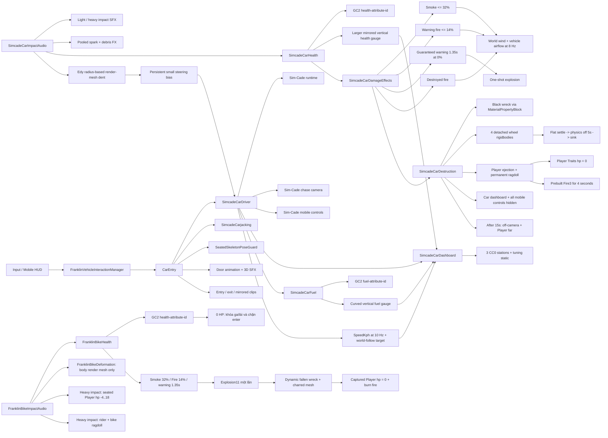
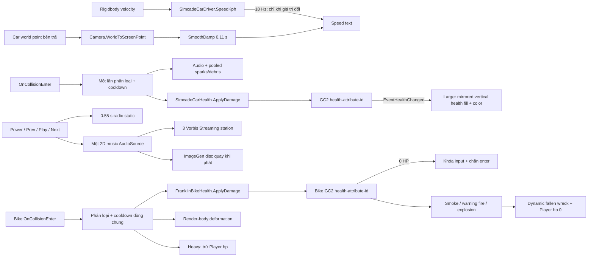
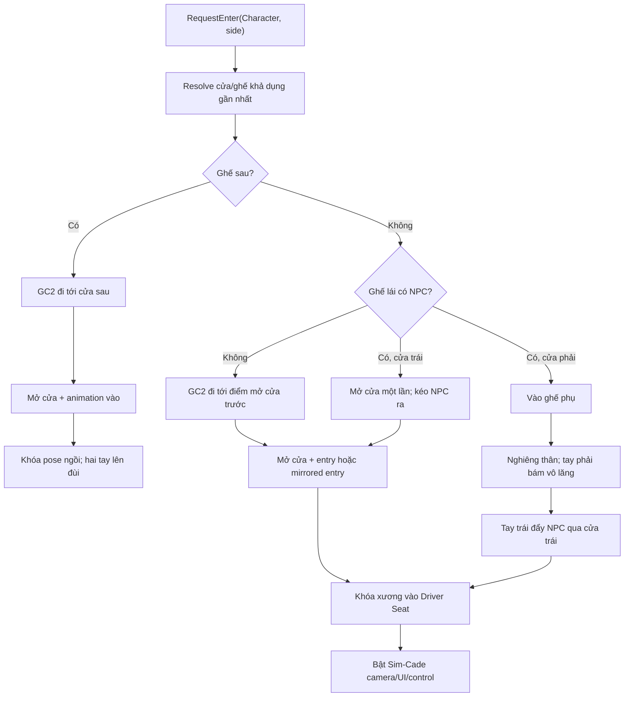
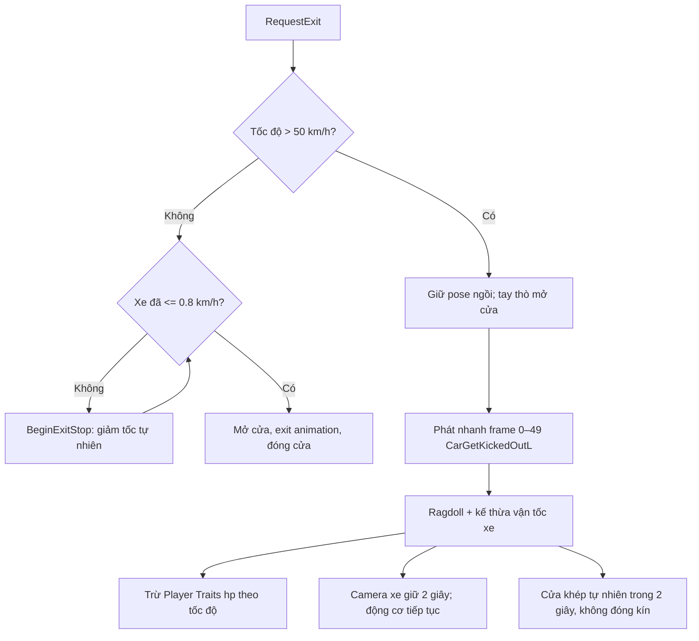

# Franklin Game — Vehicle Integration

Thư mục này là điểm sở hữu duy nhất cho phần tích hợp **Car** của Franklin Game. Các asset đã được di chuyển bằng `AssetDatabase.MoveAsset`, vì vậy GUID trong `.meta` được giữ nguyên và reference từ prefab/scene không thay đổi.

## Cấu trúc

```text
Vehicle Integration/
├── Car/
│   ├── Animations/
│   │   ├── EntryExit/       # Vào/ra xe, bailout đang chạy
│   │   ├── Carjacking/      # Player kéo/đẩy NPC khỏi ghế lái
│   │   └── Generated/       # Clip mirror cho cửa bên phải
│   ├── Audio/
│   │   ├── SFX/             # Mở/đóng cửa, va chạm nhẹ/nặng, giấy phép
│   │   └── Radio/
│   │       ├── Stations/    # Ba station CC0, import Streaming cho mobile
│   │       └── SFX/         # Static ngắn khi bật/chuyển kênh
│   ├── Editor/              # Installer, validator và Car Entry Live Setup
│   ├── Legacy/
│   │   └── PhysicsCarController/
│   │                          # Mã RVR cũ, chỉ lưu để tham khảo; không gắn lên Car
│   ├── Prefabs/Car.prefab   # Prefab Car chính thức
│   ├── Runtime/             # API vào/ra xe, Sim-Cade adapter, impact, carjacking
│   ├── Stats/               # Stats GC2 được migrate từ cấu trúc cũ
│   ├── UI/
│   │   └── Generated/       # Sprite ImageGen: disc, radio button, health frame
│   ├── VFX/                 # Khói, lửa, skidmark và VFX liên quan Car
│   └── Visuals/Models/      # Car.FBX và material
├── ThirdParty/
│   └── Sim-Cade Vehicle Physics/
│                              # Package Sim-Cade nguyên bản, giữ cấu trúc nội bộ
├── Editor/
│   └── VehicleCarAssetConsolidator.cs
├── Scripts/                 # API dùng chung cho nhiều loại vehicle
├── Animations/              # Animation Bike/shared còn lại
├── Audio/                   # Mixer và audio shared
├── UI/                      # UI Bike/shared còn lại
├── Variables/               # GC2 variables dùng chung
└── README.md
```

### Asset không chuyển vào `Car/`

Các thành phần dưới đây có liên quan tới luồng Car nhưng còn được Bike, Player hoặc GC2 dùng chung. Chúng được giữ ở vị trí shared để không tạo phụ thuộc sai:

- `Scripts/GeneralVehicles/CharacterIKSetter.cs`
- `Scripts/GeneralVehicles/IRvrVehicleDriveController.cs`
- `Scripts/GeneralVehicles/InstructionEnterVehicle.cs`
- `Scripts/GeneralVehicles/InstructionExitVehicle.cs`
- `Scripts/GeneralVehicles/VehicleLights.cs`
- `InputSystem_RT.inputactions`, `Variables/Global Variable - Vehicles.asset`
- `Assets/FranklinAnimations/Runtime/FranklinVehicleInteractionManager.cs`
- `Assets/FranklinAnimations/Runtime/FranklinMobileHud.cs`
- `Assets/Prefab/Player.prefab`, `Assets/Prefab/NPC.prefab`
- Game Creator 2, Input System và Cinemachine packages

`FranklinBikeImpactInstaller` vẫn tái sử dụng hai clip va chạm và pooled `Collision Spark` của Car/Sim-Cade; đường dẫn Editor đã được cập nhật sang cấu trúc mới.

## Đường dẫn script

### Car runtime

| Script | Đường dẫn | Trách nhiệm |
|---|---|---|
| `CarEntry` | [`Car/Runtime/CarEntry.cs`](Car/Runtime/CarEntry.cs) | Chủ sở hữu enter/exit, bốn cửa/ghế, door animation, mirror entry và speed-aware bailout. |
| `SimcadeCarDriver` | [`Car/Runtime/SimcadeCarDriver.cs`](Car/Runtime/SimcadeCarDriver.cs) | Adapter input, camera, mobile control, speed và presentation cho Sim-Cade. |
| `SimcadeCarDashboard` | [`Car/Runtime/SimcadeCarDashboard.cs`](Car/Runtime/SimcadeCarDashboard.cs) | Một Canvas HUD dùng chung cho mọi instance Car; tự bind driver/health/fuel/radio của Car đang lái. |
| `SimcadeCarHealth` | [`Car/Runtime/SimcadeCarHealth.cs`](Car/Runtime/SimcadeCarHealth.cs) | Nối impact đã phân loại với GC2 `health-attribute-id`; API damage/repair. |
| `SimcadeCarFuel` | [`Car/Runtime/SimcadeCarFuel.cs`](Car/Runtime/SimcadeCarFuel.cs) | Nối GC2 `fuel-attribute-id`, hao xăng theo garanti/ga/tốc độ và khóa ga/engine khi cạn. |
| `SimcadeCarDamageEffects` | [`Car/Runtime/SimcadeCarDamageEffects.cs`](Car/Runtime/SimcadeCarDamageEffects.cs) | Event-driven khói dưới 32% máu, explosion một lần và lửa khi xe hết máu. |
| `SimcadeCarDestruction` | [`Car/Runtime/SimcadeCarDestruction.cs`](Car/Runtime/SimcadeCarDestruction.cs) | Phá hủy terminal: cháy đen riêng instance, văng bốn bánh, cưỡng chế Player ragdoll/cháy/Traits về 0 và khóa UI/điều khiển. |
| `SimcadeCarParticleWind` | [`Car/Runtime/SimcadeCarParticleWind.cs`](Car/Runtime/SimcadeCarParticleWind.cs) | Lực gió world-space cho smoke/fire, cộng airflow ngược vận tốc xe và chỉ cập nhật 8 Hz khi VFX hoạt động. |
| `SimcadeDetachedWheelCleanup` | [`Car/Runtime/SimcadeDetachedWheelCleanup.cs`](Car/Runtime/SimcadeDetachedWheelCleanup.cs) | Vòng đời debris bánh: văng, nằm phẳng theo ground, khóa physics 5 giây, chìm và tự dọn. |
| `SimcadeCarImpactAudio` | [`Car/Runtime/SimcadeCarImpactAudio.cs`](Car/Runtime/SimcadeCarImpactAudio.cs) | Phân loại va chạm, audio, pooled spark/debris và phát event impact dùng chung. |
| `SimcadeCarDeformation` | [`Car/Runtime/SimcadeCarDeformation.cs`](Car/Runtime/SimcadeCarDeformation.cs) | Adapter event Sim-Cade gọi thuật toán deformation Edy cho các render mesh gần contact, đồng thời giữ sai lệch lái nhỏ. |
| `EdysVehicleMeshDeformation` | [`Car/Runtime/EdysVehicleMeshDeformation.cs`](Car/Runtime/EdysVehicleMeshDeformation.cs) | Phần duy nhất port từ `VehicleDamage.cs` của Edy's 5.5.3: falloff theo bán kính, impact velocity, fracture và giới hạn displacement. |
| `SimcadeCarjacking` | [`Car/Runtime/SimcadeCarjacking.cs`](Car/Runtime/SimcadeCarjacking.cs) | Kéo NPC cửa trái và nhánh ghế phụ đẩy NPC sang trái. |
| `SeatedSkeletonPoseGuard` | [`Car/Runtime/SeatedSkeletonPoseGuard.cs`](Car/Runtime/SeatedSkeletonPoseGuard.cs) | Giữ pelvis/spine/head đúng ghế trong camera handoff và bailout. |
| `ConditionCarEnabled` | [`Car/Runtime/ConditionCarEnabled.cs`](Car/Runtime/ConditionCarEnabled.cs) | Điều kiện Visual Scripting kiểm tra trạng thái Car. |

### Car editor

| Script | Đường dẫn | Trách nhiệm |
|---|---|---|
| `SimcadeCarInstaller` | [`Car/Editor/SimcadeCarInstaller.cs`](Car/Editor/SimcadeCarInstaller.cs) | Gắn và xác thực Sim-Cade stack, camera, mobile UI, audio/VFX. |
| `SimcadeCarDashboardInstaller` | [`Car/Editor/SimcadeCarDashboardInstaller.cs`](Car/Editor/SimcadeCarDashboardInstaller.cs) | Gắn HUD ImageGen, health, ba station CC0, radio tuning và validator mobile. |
| `SimcadeCarDamageEffectsInstaller` | [`Car/Editor/SimcadeCarDamageEffectsInstaller.cs`](Car/Editor/SimcadeCarDamageEffectsInstaller.cs) | Author/validate CPU particles và 3D explosion audio trực tiếp trong Car prefab. |
| `SimcadeCarDeformationInstaller` | [`Car/Editor/SimcadeCarDeformationInstaller.cs`](Car/Editor/SimcadeCarDeformationInstaller.cs) | Gắn 10 visible exterior meshes, profile Edy Sport Coupe và xác thực không có dependency EVP ngoài deformation kernel. |
| `SimcadeCarjackingInstaller` | [`Car/Editor/SimcadeCarjackingInstaller.cs`](Car/Editor/SimcadeCarjackingInstaller.cs) | Cấu hình animation, GC2 NPC, landing point và passenger push. |
| `SimcadeCarEntrySceneTool` | [`Car/Editor/SimcadeCarEntrySceneTool.cs`](Car/Editor/SimcadeCarEntrySceneTool.cs) | Preview/chỉnh anchor, cửa, IK và animation trực tiếp trong Scene view. |
| `CarEntryEditor` | [`Car/Editor/CarEntryEditor.cs`](Car/Editor/CarEntryEditor.cs) | Custom Inspector cho `CarEntry`. |
| `VehicleCarAssetConsolidator` | [`Editor/VehicleCarAssetConsolidator.cs`](Editor/VehicleCarAssetConsolidator.cs) | Migration giữ GUID và validator tổng hợp. |

### Script dùng chung ngoài `Car/`

| Script | Đường dẫn | Trách nhiệm |
|---|---|---|
| `IRvrVehicleDriveController` | [`Scripts/GeneralVehicles/IRvrVehicleDriveController.cs`](Scripts/GeneralVehicles/IRvrVehicleDriveController.cs) | Contract điều khiển dùng chung Car/Bike/vehicle interaction. |
| `CharacterIKSetter` | [`Scripts/GeneralVehicles/CharacterIKSetter.cs`](Scripts/GeneralVehicles/CharacterIKSetter.cs) | Cầu nối IK humanoid dùng chung. |
| `FranklinVehicleInteractionManager` | [`../../FranklinAnimations/Runtime/FranklinVehicleInteractionManager.cs`](../../FranklinAnimations/Runtime/FranklinVehicleInteractionManager.cs) | Phát hiện vehicle gần Player và gọi API enter/exit. |
| `FranklinMobileHud` | [`../../FranklinAnimations/Runtime/FranklinMobileHud.cs`](../../FranklinAnimations/Runtime/FranklinMobileHud.cs) | HUD điều khiển Player/Car/Bike dùng chung; không chứa logic riêng của Car dashboard. |
| `FranklinBikeImpactInstaller` | [`../../FranklinAnimations/Editor/FranklinBikeImpactInstaller.cs`](../../FranklinAnimations/Editor/FranklinBikeImpactInstaller.cs) | Bike tái sử dụng impact SFX/FX nhưng không phụ thuộc runtime dashboard Car. |
| `FranklinBikeHealth` | [`../../FranklinAnimations/Runtime/FranklinBikeHealth.cs`](../../FranklinAnimations/Runtime/FranklinBikeHealth.cs) | Nối impact Bike đã qua phân loại/cooldown với GC2 `health-attribute-id`; API damage/repair và khóa ga/lái ở 0 HP. |

## Sơ đồ thành phần



Quyền sở hữu luồng vào/ra nằm trên `CarEntry` của prefab Car. Player chỉ gọi API và cung cấp `Character`; Player không tự teleport hoặc tự điều khiển cửa.

## API runtime chính

### `CarEntry`

| API | Ý nghĩa |
|---|---|
| `bool RequestEnter(Character character)` | Yêu cầu vào cửa/ghế gần nhất. Car tự phân giải cửa, tình trạng ghế và carjacking. |
| `bool RequestEnter(Character character, CarEntrySideMode side)` | Yêu cầu cửa cụ thể: `DriverDoor`, `PassengerDoor`, `RearLeftDoor`, `RearRightDoor` hoặc `Automatic`. |
| `bool CanRequestEnter(Character character, CarEntrySideMode side)` | Kiểm tra trước mà không thay đổi state. |
| `CarEntrySideMode ResolveEntrySide(...)` | Trả về cửa/ghế thực tế sau khi xét khoảng cách và khả dụng. |
| `bool RequestExit(Character character)` | Ra xe theo tốc độ: dừng tự nhiên hoặc bailout trên 50 km/h; bailout nhanh trừ GC2 Player Traits `hp` theo vận tốc. |
| `bool IsCharacterSeated(Character character)` | Character có đang ở một trong bốn ghế hay không. |
| `bool IsRearPassenger(Character character)` | Character có đang ngồi ghế sau hay không. |
| `bool SeatOccupantInstant(Character character)` | API hệ thống để đặt NPC lái xe; tắt vật lý NPC khi ngồi. Không dùng cho tương tác Player bình thường. |
| `Task<bool> ForceEjectForDestructionAsync(...)` | API nội bộ của hệ thống nổ: nhả ghế không chạy exit animation, phục hồi physics rồi bật ragdoll không tự đứng dậy. |
| `Task<bool> MoveCharacterToEntryStandingPointAsync(Character character)` | Cho GC2 điều khiển Player đi tới điểm mở cửa; không teleport. |
| `Task<bool> EnterThroughOpenDoorAsync(...)` | Tiếp tục vào xe khi cửa đã được mở bởi carjacking; tránh mở/đóng cửa hai lần. |

Trạng thái đọc nhanh:

- `IsTransitioning`: đang vào hoặc ra xe.
- `IsUsingMirroredEntry`: đang dùng clip mirror cửa bên phải.
- `IsPassengerCarjackingSeatOccupied`: Player đang ở ghế phụ trong nhánh đẩy NPC.

### `SimcadeCarDriver`

| API | Ý nghĩa |
|---|---|
| `SetVehicleEnabled(bool state)` | Bật/tắt điều khiển xe, camera và presentation. |
| `SetVehicleEnabled(bool state, bool preserveMomentum)` | Tắt điều khiển nhưng tùy chọn giữ động lượng cho bailout. |
| `SetPassengerPresentation(bool active)` | Giữ camera/UI phù hợp khi Player là hành khách. |
| `SetDestroyed()` | Khóa vĩnh viễn input/controller/audio/dashboard của wreck; camera chỉ tắt ngay nếu không có destruction hold. |
| `RequestExit()` | Chuyển yêu cầu thoát từ UI/input về `CarEntry`. |
| `SetVirtualAccelerateInput(bool)` | Hold ga nhanh trên mobile. |
| `SetVirtualSlowAccelerateInput(bool)` | Hold ga chậm; giới hạn lực kéo tự nhiên, không giả lập bằng phanh. |
| `SetVirtualBrakeReverseInput(bool)` | Hold phanh/lùi. |
| `SetVirtualSteerLeftInput(bool)` / `SetVirtualSteerRightInput(bool)` | Điều khiển lái mobile. |
| `SetVirtualHandbrakeInput(bool)` | Phanh tay mobile. |
| `BeginExitStop()` / `CancelExitStop()` | Hãm tốc có kiểm soát cho nhánh exit dưới ngưỡng. |
| `BeginBailoutCameraHold()` / `EndBailoutCameraHold()` | Giữ camera xe thêm 2 giây khi nhảy khỏi xe. |
| `BeginDestructionCameraHold()` | Giữ camera Sim-Cade đang active tại wreck; không tự bật camera cho Car rỗng/off-screen. |
| `ReturnDestructionCameraToPlayer(...)` | Đợi explosion burst, lerp target tới hips Player ragdoll rồi trả quyền cho GC2 camera. |
| `KeepEngineRunningAfterBailout()` | Giữ tiếng động cơ và trạng thái máy khi Player nhảy khỏi xe. |
| `ResetVehicle()` | Đưa xe về tư thế an toàn. |

Thuộc tính đọc: `IsVehicleEnabled`, `IsPassengerPresentationActive`, `SpeedMetersPerSecond`, `SpeedKph`.

### `SimcadeCarjacking`

| API | Ý nghĩa |
|---|---|
| `bool CanCarjack(Character attacker)` | Kiểm tra có NPC lái và luồng không bận. |
| `bool TryBeginCarjack(Character attacker, ...)` | Bắt đầu kéo NPC qua cửa lái. |
| `bool TryEnterOccupiedCar(Character attacker, CarEntrySideMode side)` | Car tự chọn nhánh kéo bên trái hoặc vào ghế phụ rồi đẩy NPC sang cửa trái. |

### `SimcadeCarImpactAudio`

Component tự phân loại va chạm nhẹ/nặng theo impulse, điều chỉnh âm lượng/pitch so với động cơ và phát VFX tia lửa–mảnh vụn bằng pool. `EventImpactAccepted(bool isHeavy, float severity)` được phát một lần sau cooldown để `SimcadeCarHealth` dùng lại kết quả. `EventImpactContactAccepted(Collision, bool, float)` chuyển cùng kết quả và contact point cho deformation ngay trong callback, không tính collision lần hai. API `Configure(...)` chỉ dành cho installer/authoring.

### `SimcadeCarDeformation`

Car có đúng một collider thân xe: `BoxCollider` ở root, size `(1.7317466, 1.2402761, 4.327468)`, center `(-0.43742472, -0.08479142, 0.027270794)`. Không có `MeshCollider`, `SphereCollider` hoặc `CapsuleCollider` trong prefab. Collider primitive này chỉ giải quyết physics của Rigidbody; mesh bị móp là render mesh readable lấy từ `Car/Visuals/Models/Car.FBX`, không phải collider mesh.

Lý do không đổi sang MeshCollider: tài liệu Unity 6 xếp convex MeshCollider tốn CPU hơn primitive, còn non-convex MeshCollider không được gắn lên non-kinematic Rigidbody; mỗi lần thay đổi mesh collider còn có nguy cơ runtime cooking spike. Xem [Collider types and performance](https://docs.unity3d.com/kr/current/Manual/physics-optimization-cpu-collider-types.html) và [Mesh Collider cooking optimization](https://docs.unity3d.com/jp/current/Manual/physics-optimization-cpu-mesh-cooking-options.html).

Thuật toán cũ đã được thay bằng phần render-mesh deformation của `Assets/EVP5/Scripts/VehicleDamage.cs` trong Edy's Vehicle Physics 5.5.3 do chủ project cung cấp. Chỉ công thức `DeformMesh` được port: contact velocity nhân `0.02`, falloff tuyến tính trong bán kính, fracture ngẫu nhiên nhẹ, clamp tổng displacement, sau đó luôn `RecalculateNormals()` và `RecalculateBounds()`. Không import `EVP.VehicleController`, wheel/node damage, input, repair hotkey, camera, UI hay controller nào khác của package.

Profile lấy từ prefab `Sport Coupe` của Edy: minimum relative velocity `2.5 m/s`, multiplier `1`, radius `0.5m`, max displacement `0.2m`, max vertex fracture `0.03m`. Mỗi impact xử lý tất cả render panel có hình học nằm trong bán kính thay vì bắt nhiều mesh chồng nhau cạnh tranh một target. Danh sách gồm `FrontBumper`, `RearBumper`, hai `FrontFender`, cửa lái active `DoorFL (1)`, ba cửa còn lại, `RearSanoughDoor` và `MainBody`; `DoorFL` inactive không được dùng. Mesh chỉ clone khi lần đầu thực sự tham gia deformation, vertex buffer được tái sử dụng và tối đa 12 impact được giữ trên một Car.

Va chạm lệch trái/phải từ severity `4.5` trở lên cộng một steering bias nhỏ theo phía hư hỏng. Mỗi lần tối đa `0.055`, tổng được `SimcadeCarDriver` clamp ở `±0.16`; người chơi vẫn counter-steer được. API sửa chữa là `ResetDeformation(bool resetSteering = true)`, `RepairDamageSteering(float amount)` và `ResetDamageSteering()`.

### `SimcadeCarHealth`

| API | Ý nghĩa |
|---|---|
| `ApplyDamage(float amount)` | Trừ máu qua GC2 Runtime Attribute và tự clamp. |
| `Repair(float amount)` | Hồi một lượng máu. |
| `RepairFull()` | Hồi đầy máu Car. |
| `SetNormalizedHealth(float ratio)` | Đặt máu theo tỷ lệ `0..1`, phù hợp save/load hoặc garage. |
| `EventHealthChanged(current, maximum)` | Event cho UI; không poll health mỗi frame. |

Thuộc tính đọc: `CurrentHealth`, `MaximumHealth`, `HealthRatio`, `IsDestroyed`. Impact nhẹ gây `0.35–2.25` damage, impact nặng gây `4.5–14` damage theo severity (giảm khoảng 35% so với profile ban đầu); chỉ impact đã vượt ngưỡng/cooldown của `SimcadeCarImpactAudio` mới được tính. Phân loại âm thanh, VFX va chạm và deformation vẫn dùng severity gốc nên không bị làm yếu theo lượng máu trừ.

### `SimcadeCarFuel`

| API | Ý nghĩa |
|---|---|
| `Consume(float amount)` | Trừ trực tiếp GC2 `fuel-attribute-id` và tự clamp. |
| `Refuel(float amount)` / `RefuelFull()` | Thêm xăng hoặc đổ đầy bình. |
| `SetNormalizedFuel(float ratio)` | Đặt nhiên liệu theo tỷ lệ `0..1`, dùng cho save/load hoặc trạm xăng. |
| `SetEngineActive(bool)` | API nội bộ từ Driver để chỉ chạy tiêu hao khi động cơ thực sự hoạt động. |
| `EventFuelChanged(current, maximum)` | Cập nhật thanh xăng theo event, không poll GC2 mỗi frame. |

Mỗi instance Car mới khởi tạo `Starting Fuel = 100` đúng một lần; GC2 `Fuel` Stat cũng có base `100` và `FuelAtr` có start percent `1`. Disable/enable component không tự đổ đầy lại. Profile mặc định tiêu hao `0.02` đơn vị/giây ở garanti, cộng tối đa `0.1` theo mức ga và `0.03` theo tốc độ so với mốc `120 km/h`. Coroutine chỉ tồn tại khi engine được yêu cầu chạy và tick mỗi `0.25s`; Car đỗ/tắt máy không có công việc fuel theo frame. Khi cạn xăng, `SimcadeCarDriver` khóa ga/lùi và dừng engine audio nhưng vẫn giữ phanh, lái và quán tính. Nếu `Refuel` trong lúc Player vẫn ngồi, engine và khả năng tăng tốc được khôi phục tự động.

### `FranklinBikeHealth`

Bike dùng cùng kiến trúc event-driven của Car nhưng giữ profile riêng phù hợp khối lượng và ngưỡng impact của Arcade Bike. `FranklinBikeImpactAudio` tiếp tục là nơi duy nhất phân loại collision, áp cooldown, phát âm thanh và pooled spark; `FranklinBikeHealth` chỉ nhận `EventImpactAccepted` nên một contact không bị tính damage hai lần.

| API | Ý nghĩa |
|---|---|
| `ApplyDamage(float amount)` | Trừ trực tiếp GC2 `health-attribute-id`, tự clamp theo Runtime Attribute. |
| `Repair(float amount)` | Hồi một lượng HP và mở khóa damage khi HP lớn hơn 0. |
| `RepairFull()` | Hồi đầy HP Bike. |
| `SetNormalizedHealth(float ratio)` | Đặt HP theo tỷ lệ `0..1`, dùng cho save/load hoặc garage. |
| `EventHealthChanged(current, maximum)` | Cập nhật thanh máu Bike trong UI mobile dùng chung; không poll mỗi frame. |
| `SpeedMetersPerSecond × 3.6` | Hiển thị tốc độ Bike theo `km/h` trên UI mobile chung, cùng style với Car. |
| `EventDestroyed` / `EventRestored` | Phát đúng một lần khi đi qua biên 0 HP. |

Thuộc tính đọc: `CurrentHealth`, `MaximumHealth`, `HealthRatio`, `IsDestroyed`. Profile mặc định đã giảm: impact nhẹ gây `0.35–2` damage, impact nặng gây `4–12` damage và đạt mức tối đa ở severity `14`. Impact nặng còn trừ `4–18 HP` của GC2 Player đang ngồi. Khi HP bằng 0, `FranklinArcadeBikeDriver` giữ suspension/exit flow nhưng bỏ toàn bộ input ga, lùi, lái, wheelie và burnout; `BikeEntry` từ chối lượt enter mới. Repair chỉ mở khóa, không tự enter hoặc tự bật điều khiển.

### Bike damage VFX, destruction và deformation

`FranklinBikeDamageEffects` tái sử dụng asset Hovl và audio 3D của Car nhưng có
ngân sách nhỏ hơn: Smoke1 tối đa 22 hạt, warning Fire3 12, destroyed Fire3 18,
Player burn 10 và Explosion11 tổng tối đa 60. Ngưỡng là smoke `<=32%`, warning
fire `<=14%`. Trong critical fire, Bike tự mất `1.5%` maximum HP mỗi giây theo
tick `0.25s`; Repair vượt 14% sẽ dừng drain. Tại 0 HP luôn cảnh báo thêm `1.35s`
rồi mới nổ một lần. Critical drain chỉ trừ Bike health, không trừ Player lần hai.

`FranklinBikeDestruction` lưu rider ở thời điểm `EventDestroyed`, nên vụ nổ vẫn
trừ đúng Player dù `FranklinBikeCrashRagdoll` đã nhả rider khỏi seat. Xe thật
được bỏ kinematic/freeze rotation, giữ nguyên hai bánh, trở thành fallen wreck,
nhận lực ngã và char bằng `MaterialPropertyBlock`; Player Traits `hp` về 0 và
nhận burn fire 4 giây. Không có camera explosion riêng cho Bike.

`FranklinBikeDeformation` dùng `EventImpactContactAccepted` và kernel
`EdysVehicleMeshDeformation` của Car. Chỉ MeshFilter thân dưới `BikeBody` được
deform; wheel/tire, glass và MeshCollider không thay đổi. Profile mặc định:
minimum `2.5m/s`, radius `0.38m`, max displacement `0.12m`, fracture `0.018m`,
tối đa 10 dents và 32.000 vertices/panel. Giới hạn này bao phủ body panel DQP
lớn nhất hiện tại (30.320 vertices). `ResetDeformation()` phục hồi mesh.

### `SimcadeCarDamageEffects`

Component không có `Update`: chỉ nhận `EventHealthChanged`. Dưới hoặc bằng 32% máu, Hovl `Smoke1` được bật. Dưới hoặc bằng 14%, một `Critical Warning Fire` nhỏ bắt đầu cháy và tự rút máu theo tick `0.25s`; tốc độ được tính theo phần trăm maximum health nên từ đúng ngưỡng 14% sẽ mất khoảng `7s` để về 0. Nếu Repair đưa máu lên trên 14%, coroutine dừng mà không trừ thêm. Khi health chạm 0, smoke và warning fire luôn được giữ thêm `1.35s` rồi `Explosion11` mới chạy đúng một lần; vì vậy lửa tiếp tục báo nguy hiểm cho tới đúng lúc nổ. Sau explosion, warning/smoke tắt và `Destroyed Fire` duy trì cùng `SimcadeCarDestruction`. Wreck là trạng thái terminal: Repair không hồi sinh điều khiển hoặc arm lại explosion; muốn dùng lại phải respawn prefab Car.

Explosion audio dùng bản ghi thực tế từ một lần thử nghiệm nổ xe của `eth131`, giấy phép CC0. Bản dùng trong game được cắt khoảng lặng, downmix mono, resample `32 kHz` và giữ dynamic transient/đuôi vang tự nhiên; Unity nén Vorbis `Compressed In Memory` để phù hợp mobile. AudioSource là 3D logarithmic, không Doppler, nghe đầy ở gần trong `7m` và giảm tự nhiên đến `110m`. Nguồn và quy trình xử lý được lưu tại `Car/Audio/SFX/CarExplosionSfx_SOURCE.txt`.

Khi Weak Smoke hoạt động, một loop hơi/khí xì 3D rất nhẹ chạy ở volume `0.18`, nghe gần trong `2.5m` và tắt ở `30m`. Khi Critical Fire bắt đầu, loop lửa crackle chạy ở volume `0.5`; sau explosion cùng Destroyed Fire, volume tăng thành `0.8` và giảm tự nhiên tới `48m`. Runtime chỉ gọi `Play/Stop` lúc health đổi trạng thái, không poll âm thanh trong `Update`, không tạo AudioSource lúc chạy. Hai clip CC0 đã được xử lý mono `32 kHz`, nén Vorbis `Compressed In Memory`; nguồn được ghi tại `Car/Audio/SFX/CarDamageLoopSfx_SOURCES.txt`.

`SimcadeCarParticleWind` đặt toàn bộ smoke/fire loop ở simulation space `World` và dùng `Force over Lifetime` thay vì xoay emitter giả. Gia tốc cuối cùng là hướng gió thế giới cộng với airflow ngược vận tốc vật lý của Rigidbody Car, được clamp tối đa `6m/s²`. Không có `Update`: một coroutine duy nhất chỉ chạy khi ít nhất một loop VFX đang hiện và cập nhật tối đa `8 Hz`; khi VFX tắt coroutine dừng hoàn toàn. Trong Inspector có thể chỉnh `World Wind Direction`, `World Wind Acceleration`, `Vehicle Airflow Factor`, giới hạn lực và tần suất.

`SimcadeCarDestruction` quét renderer đúng một lần lúc nổ và ghi màu đen bằng `MaterialPropertyBlock`, vì vậy không clone material và không làm đổi màu những Car khác đang dùng chung material. Bốn wheel visual được tách thành rigidbody tạm thời, kế thừa một phần vận tốc xe và văng ngang/xoay. Khi chạm ground và giảm tốc (hoặc hết thời gian bay tối đa), `SimcadeDetachedWheelCleanup` căn trục bánh theo pháp tuyến mặt đất để lốp nằm phẳng, đặt Rigidbody kinematic, tắt gravity/collision/collider hoàn toàn, giữ nguyên 5 giây rồi chìm `0.48m` trong `0.8s` và tự dọn.

Nếu Player đang ngồi trong Car, camera Sim-Cade được giữ tại vụ nổ theo thời lượng visual burst của ParticleSystem, clamp trong `0.9–2.5s` (`Explosion11` hiện là `1.5s`). Đuôi vang 7 giây của audio không giữ camera quá lâu; audio length chỉ là fallback nếu không có particle. Sau đó camera target dùng smoothstep để lerp trong `0.75s` từ wreck tới hips của Player ragdoll, chờ thêm một `LateUpdate`, rồi mới trả camera cho GC2. Car rỗng hoặc camera xe không active không khởi tạo luồng camera này.

Xác Car luôn tồn tại ít nhất 15 giây. Sau mốc này hệ thống chỉ kiểm tra mỗi `0.5s` và chỉ ẩn toàn bộ wreck khi đồng thời thỏa hai điều kiện: bounds thân xe không nằm trong frustum của `Camera.main`, và Player cách xe ít nhất `35m`. Các giá trị này chỉnh được trong nhóm `Wreck Cleanup` của `SimcadeCarDestruction`. Khi Player đang ở bất kỳ ghế nào, Car nhả Player cạnh thân xe không qua exit animation, bật ragdoll không auto-recover, gắn `Fire3` đã author sẵn trong prefab trong 4 giây, đưa GC2 Player Traits `hp` về `0`, đồng thời ẩn cả dashboard/Car controls và Player mobile controls. Có thể mở lại HUD sau respawn bằng `FranklinMobileHud.SetControlsSuppressed(false)`.

Chỉ các asset/dependency cần thiết được lấy từ `3D Fire and Explosions v2.1`; không import toàn bộ package. Texture 2K được giới hạn còn `512px` (`Point19` là `256px`) và dùng ASTC 6x6 trên Android/iOS. Ngân sách mobile: smoke tối đa 28 hạt, critical fire 16 hạt, destroyed fire 24 hạt, Player burn 12 hạt và ba lớp explosion tổng capacity không quá 60 hạt. Tất cả ParticleSystem được author sẵn trong prefab, không `Instantiate` lúc nổ.

### `SimcadeCarDashboard`

| API | Ý nghĩa |
|---|---|
| `SetPresentationActive(bool)` | Hiện/ẩn dashboard cùng trạng thái driver/passenger Car. |
| `IsSharedHudActive` | Cho HUD vehicle dùng chung biết Car đang sở hữu Canvas; dùng để loại trừ telemetry Bike trong lúc chuyển vehicle. |
| `SetSpeedHudPosition(float left, float height, Vector2 screenOffset)` | Chỉnh điểm bám world và bù vị trí pixel của km/h bằng code. |
| `SetHealthHudPosition(float right, float height, Vector2 screenOffset)` | Chỉnh độc lập thanh máu bám bên phải thân xe và bù vị trí pixel. |
| `ToggleRadio()` / `SetRadioEnabled(bool)` | Bật hoặc tắt radio. |
| `PreviousTrack()` / `NextTrack()` | Chuyển track và bắt đầu phát. |
| `SelectTrack(int index, bool play)` | Chọn track bằng code, hỗ trợ mở rộng playlist. |

Dashboard dùng đúng một Canvas static dùng chung với sorting order `1210`, không tạo một Canvas cho từng Car. Khi đổi xe, `s_ActiveDashboard` chỉ rebind telemetry/radio sang `SimcadeCarDashboard` của xe đang lái; các Car còn lại không update HUD và event của chúng không được phép ghi lên UI. Khi Canvas Car active, `FranklinMobileHud` ưu tiên driver Car và tắt ngay speed/fuel/health cùng ba nút riêng của Bike; khi trở lại Bike, HUD Bike mới được bind lại. Vì vậy cung máu xanh lá của Bike không thể chồng lên dấu cộng/thanh máu xanh da trời của Car, kể cả trong frame handoff. Canvas dùng `ScaleWithScreenSize` ở mốc `1920x1080` và tự áp dụng `Screen.safeArea` cho màn hình tai thỏ.

- Tốc độ lấy từ `SimcadeCarDriver.SpeedKph`, cập nhật text tối đa 10 Hz. Tâm HUD lấy từ bounds của renderer thật thay vì pivot prefab, loại trừ particle/trail/line; khoảng cách trái/phải còn tự cộng half-width nhìn thấy theo góc camera. Vì vậy cùng một HUD giữ đúng tâm và kích thước trên các mẫu Car khác nhau. World target dùng local height `0.82m` và `SmoothDamp` `0.11s`.
- Typography dùng `Josefin Sans Bold`; speed `56px`, hậu tố `km/h` `29px` và shadow nhẹ `1px`/alpha `0.34` để không tạo quầng đen trên màn hình nhỏ.
- Thanh xăng nằm ngay dưới `km/h`, dùng sprite ImageGen flat vàng `VehicleFuelArc.png` kích thước nguồn `71x512`, alpha trong suốt, cong nhẹ sang trái (đã flip ngược hướng Car) và chỉ giữ shadow charcoal rất mềm. Không còn highlight, bevel hoặc gradient 3D. Một Image tối mờ làm rãnh nền; Image vàng phía trên dùng `Filled/Vertical` từ `E` lên `F`, nên `EventFuelChanged` chỉ đổi `fillAmount` và không rebuild custom mesh. Không có panel nền; texture tắt mipmap, clamp, giới hạn `512px` và nén cho mobile. Có thể chỉnh `Fuel Gauge Offset` trong Inspector.
- Thanh xăng đi theo world target bên trái Car cùng cụm `km/h`; thanh máu xanh da trời dùng world target đối xứng bên phải. Hai phía dùng chung tâm renderer và cùng side offset thích ứng, sau đó bù theo tâm sprite và mép đáy nên không còn lệch do pivot của từng model. `Health Screen Offset` chỉ là fine-tuning, mặc định `(0,0)`. Bar máu cao `184px`, dày `40px`, icon dấu cộng xanh da trời nằm chính giữa trên đỉnh; `EventHealthChanged` chỉ đổi `fillAmount`, không poll hay custom mesh.
- Cụm radio neo cách đáy safe area `70px`, gần sát cạnh dưới nhưng vẫn tránh home indicator/tai thỏ ngang. Đĩa radio quay `38°/s` khi phát. Bốn button PNG alpha có vùng chạm `88x88`; trạng thái Off được thể hiện bằng tint và tên station.
- Ba station CC0 dùng một `AudioSource` 2D, Vorbis quality `0.48`, `Streaming`, `loadInBackground=true`, `preloadAudioData=false`.
- Static dò sóng dài `0.55s` dùng source 2D riêng, mono PCM/preload vì file rất nhỏ; chỉ phát khi bật/tắt/chuyển station.
- Radio dừng khi rời Car và không giữ audio voice.

## Ví dụ gọi API

```csharp
CarEntry car = carObject.GetComponent<CarEntry>();

// Cửa gần nhất trong bốn cửa, không teleport Player.
if (car.CanRequestEnter(player, CarEntrySideMode.Automatic))
{
    car.RequestEnter(player);
}

// Car quyết định exit thường hay bailout theo tốc độ thực tế.
car.RequestExit(player);
```

```csharp
SimcadeCarDriver driver = carObject.GetComponent<SimcadeCarDriver>();

// Các button mobile phải gọi true ở PointerDown và false ở PointerUp.
driver.SetVirtualSlowAccelerateInput(true);
driver.SetVirtualSlowAccelerateInput(false);
```

```csharp
SimcadeCarHealth health = carObject.GetComponent<SimcadeCarHealth>();
SimcadeCarFuel fuel = carObject.GetComponent<SimcadeCarFuel>();
SimcadeCarDashboard dashboard = carObject.GetComponent<SimcadeCarDashboard>();

health.RepairFull();
fuel.RefuelFull();
dashboard.SetRadioEnabled(true);
dashboard.NextTrack();
```

```csharp
FranklinBikeHealth bikeHealth = bikeObject.GetComponent<FranklinBikeHealth>();

bikeHealth.ApplyDamage(15f);
bikeHealth.Repair(10f);
bikeHealth.RepairFull();
```

## Luồng telemetry, health và radio



## Radio CC0 và sprite ImageGen

Playlist không còn dùng menu background `Franklin_FM.wav`. Các file runtime mới:

| Asset | Nguồn / giấy phép | Import mobile |
|---|---|---|
| [`City_Loop_CC0.mp3`](Car/Audio/Radio/Stations/City_Loop_CC0.mp3) | [City Loop — OpenGameArt](https://opengameart.org/content/city-loop-0), CC0/Public Domain | Vorbis `0.48`, Streaming, không preload |
| [`Vision_CC0.mp3`](Car/Audio/Radio/Stations/Vision_CC0.mp3) | [Vision — OpenGameArt](https://opengameart.org/content/vision), CC0 | Vorbis `0.48`, Streaming, không preload |
| [`Iso1nhab1tans_CC0.mp3`](Car/Audio/Radio/Stations/Iso1nhab1tans_CC0.mp3) | [Iso1nhab1tans — OpenGameArt](https://opengameart.org/content/iso1nhab1tans), CC0 | Vorbis `0.48`, Streaming, không preload |
| [`Radio_Tune_Static_CC0.mp3`](Car/Audio/Radio/SFX/Radio_Tune_Static_CC0.mp3) | [Static — OpenGameArt](https://opengameart.org/content/static), CC0; cắt/fade thành cue `0.55s` | Mono PCM, Decompress On Load, preload |

Sprite [`Car/UI/Generated/`](Car/UI/Generated/) được tạo bằng built-in ImageGen theo ảnh HUD tham chiếu, sau đó tách chroma thành PNG alpha. Runtime chỉ giữ các texture đã crop/downscale: disc `256²`, button `192²`, health frame `1024x100`; không đưa ảnh nguồn độ phân giải lớn vào build.

## Luồng enter



Điểm đứng cửa được tiếp cận bằng motion của GC2. Việc căn root/khung xương vào ghế chỉ bắt đầu trong đoạn animation bước vào cabin.

## Luồng exit theo tốc độ



`SeatedSkeletonPoseGuard` giữ pelvis/spine/head ở pose ghế trong điểm chuyển camera và trước bailout, ngăn locomotion graph làm Player đứng hoặc nhô lên nóc xe vài frame.

Damage bailout chỉ áp dụng cho GC2 Player khi tốc độ lúc bắt đầu exit lớn hơn `50 km/h`, sau khi ragdoll đã nhận pose. Công thức mặc định là `min(60, 10 + (speedKph - 50) * 0.5)`: 60 km/h mất 15 HP, 100 km/h mất 35 HP và từ 150 km/h trở lên mất tối đa 60 HP. Giá trị được ghi trực tiếp vào Player Traits `hp`, tự clamp theo Min/Max của GC2. Exit chậm sau khi xe dừng và NPC không bị trừ HP bởi nhánh này. Các thông số nằm trong nhóm `Moving Exit Traits Damage` của `CarEntry`.

## Authoring và validation

Các menu Car được giữ tối thiểu trong Unity:

- `Tools > Franklin Game > Car Entry Live Setup`: chỉnh/preview điểm đứng, doorway, ghế, tay nắm, cửa và animation Player trong Scene view.
- `Tools > Franklin Game > Install Sim-Cade Car`: installer tổng; tự gắn physics, entry/exit, deformation, dashboard/radio và damage VFX theo đúng thứ tự.
- `Tools > Franklin Game > Validate Consolidated Car Assets`: kiểm tra cấu trúc, prefab Car, toàn bộ Sim-Cade stack, bốn cửa/ghế, camera/mobile UI, audio/VFX, bailout và NPC carjacking.

Các installer/validator thành phần vẫn là API Editor nội bộ để installer tổng gọi, nhưng không tạo thêm mục trong menu. `Consolidate()` cũng được giữ làm API migration nội bộ vì asset đã gom xong.

Prefab chính: `Car/Prefabs/Car.prefab`.

## Quy tắc mở rộng

1. Logic chỉ dành cho sedan Car đặt trong `Car/Runtime` hoặc `Car/Editor`.
2. API dùng từ hai loại vehicle trở lên đặt trong `Scripts/GeneralVehicles` hoặc layer shared tương ứng.
3. Không sửa trực tiếp mã trong `ThirdParty/Sim-Cade Vehicle Physics` trừ adapter đường dẫn/package compatibility; gameplay tùy biến đặt ở `SimcadeCarDriver`.
4. Không gắn `Legacy/PhysicsCarController` hoặc `SimcadeRvrCarPhysics` lên prefab Car chính thức.
5. Khi thêm asset, luôn di chuyển trong Unity/`AssetDatabase` để giữ `.meta` và GUID.
6. UI hold dùng `PointerDown`/`PointerUp`; không cấp phát hoặc tìm component trong `Update`/`FixedUpdate`.
7. Collision VFX tiếp tục dùng pool; không `Instantiate` mảnh vụn cho từng contact trên mobile.
8. Track radio dài phải dùng `Streaming`; không bật preload hoặc `Decompress On Load` trên mobile.
9. Telemetry text không được cập nhật 60 lần/giây; giữ tần suất 10 Hz hoặc thấp hơn.
10. Chỉ world-follow position của speed text chạy mỗi frame; không cấp phát, không tìm component và không đọc health/radio bằng polling.
11. HUD Car không được thêm panel nền toàn chiều rộng; giữ alpha sprite và safe-area để không che gameplay.
12. Damage smoke/fire/explosion/Player burn phải dùng component event-driven và ParticleSystem đã có sẵn trong prefab; không spawn effect lúc nhận damage.
13. Màu cháy đen phải dùng `MaterialPropertyBlock`; không sửa `sharedMaterial` và không tạo material runtime cho từng Car.
14. Wheel cleanup chỉ chạy `FixedUpdate` trong vài giây đang bay; sau khi nằm phẳng phải khóa Rigidbody/collider hoàn toàn, giữ 5 giây rồi chìm và tự dọn.
15. Wreck cleanup chỉ kiểm tra mỗi `0.5s` sau mốc 15 giây; không dùng kiểm tra camera/khoảng cách mỗi frame.
16. Smoke/fire dùng world-space `Force over Lifetime`; cập nhật airflow tối đa 8 Hz và dừng coroutine khi không có loop VFX hoạt động.
17. Car động giữ primitive `BoxCollider`; visual dent không được cập nhật MeshCollider hoặc gọi runtime mesh cooking.
18. Deformation dùng 10 render mesh visible từ `Car/Visuals/Models/Car.FBX`; cửa lái phải là `DoorFL (1)` active, không phải `DoorFL` inactive.
19. Mỗi impact Edy chỉ quét panel có renderer bounds nằm trong radius, tối đa 12 impact; mesh thay đổi phải tính lại normals và bounds để vết móp hiển thị đúng.
20. Không tạo thêm `MenuItem`, EditorWindow, wizard hoặc tool preview mới nếu người dùng chưa yêu cầu rõ. Ưu tiên API/component, installer tổng và validator tổng hiện có để menu không bị rối.

## QA tối thiểu

| Nhánh | Cần kiểm tra |
|---|---|
| Enter trái/phải không NPC | Player đi tới đúng cửa, cửa mở một lần, không đứng/nhô lên nóc. |
| Enter trái có NPC | Kéo NPC đúng landing point, NPC tắt vật lý khi ngồi và phục hồi một lần khi ra. |
| Enter phải có NPC | Player vào ghế phụ, thân nghiêng/nhìn NPC, tay phải bám vô lăng, tay trái đẩy NPC. |
| Ghế sau trái/phải | Cửa gần nhất được chọn; hai tay giữ trên đùi, không giơ lên trần. |
| Exit dưới 50 km/h | Xe giảm tốc tự nhiên tới dừng rồi mới mở cửa; không sinh khói phanh giả. |
| Exit trên 50 km/h | Không đứng lên; dùng 50 frame đầu, ragdoll, trừ Traits `hp` đúng một lần theo tốc độ, giữ camera/engine, cửa khép không kín. |
| Camera/UI mobile | Orbit trái/phải có input, tự trở về khi thả; button enter/exit/slow có kích thước và vùng ngón cái đúng. |
| Va chạm | Âm nhẹ/nặng nghe rõ hơn động cơ theo mức va chạm; spark/debris được pool; panel gần contact móp theo severity. |
| Deformation mobile | Từ `2.5m/s` trở lên phải thấy panel trong radius móp, ánh sáng/mesh bounds cập nhật ngay; quá 12 impact không tiếp tục sửa vertex. |
| Lệch lái do hỏng | Tông lệch trái/phải đủ mạnh làm xe kéo nhẹ về phía hỏng; bias không vượt `±0.16`, counter-steer và Reset API hoạt động. |
| Máu Car | Va chạm nhẹ/nặng trừ đúng một lần; fill/icon xanh da trời và Repair API cập nhật ngay trên HUD dùng chung. |
| Damage VFX | <=32% có khói; <=14% có warning fire; health 0 phải cảnh báo thêm 1.35s mới nổ; wreck terminal không nổ lại hoặc lái lại sau Repair. |
| Gió VFX | Khi đứng yên smoke/fire nghiêng theo world wind; khi xe chạy, luồng khí bẻ ngược hướng vận tốc; hạt cũ ở world-space không bị kéo cứng theo xe. |
| Phá hủy Car rỗng | Toàn bộ renderer Car cháy đen riêng instance; bốn bánh tách/văng, nằm phẳng, khóa physics 5 giây rồi chìm/ẩn; camera, dashboard và Car control ẩn. |
| Cleanup xác xe | Trước 15 giây không ẩn; sau 15 giây vẫn giữ nếu camera thấy hoặc Player gần hơn 35m; chỉ ẩn khi ngoài camera và Player đủ xa. |
| Phá hủy khi Player ngồi | Player nằm gần Car, ragdoll không tự đứng, cháy đen + Fire3, Traits `hp` = 0; camera giữ hết burst rồi lerp 0.75s tới Player, controls vẫn ẩn ngay. |
| Tốc độ | Hiển thị km/h bên trái thân xe, bám chuyển động/camera với target lag nhẹ; text không cập nhật khi số không đổi. |
| Radio | Power/Prev/Play/Next hoạt động, disc quay, static phát ngắn, ba station loop và rời xe thì dừng. |
| HUD không nền | Không có radio panel hoặc health rectangle background; PNG alpha không tạo viền chroma. |
| Safe area | Speed/radio/health không nằm dưới notch hoặc home indicator ở cả hai hướng landscape. |

Sau khi đổi prefab, animation hoặc anchor, chạy validator rồi mới QA trong Play Mode trên cấu hình mobile mục tiêu.

Để kiểm tra VFX và SFX độc lập với damage trong Play Mode, mở menu ngữ cảnh của component `SimcadeCarDamageEffects` và chọn `Damage FX/Preview Weak Smoke`, `Damage FX/Preview Critical Fire Warning`, `Damage FX/Preview Explosion + Fire` hoặc `Damage FX/Stop Preview`. Preview smoke/fire cũng bật đúng loop 3D tương ứng.
