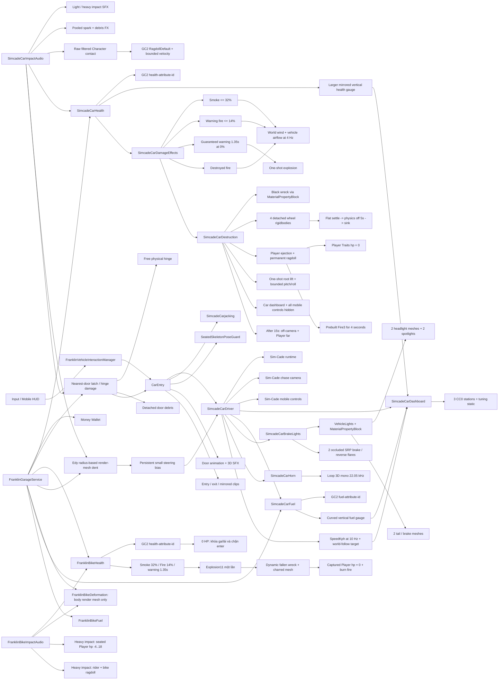
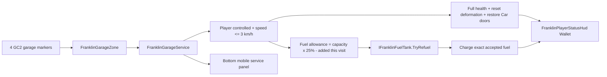
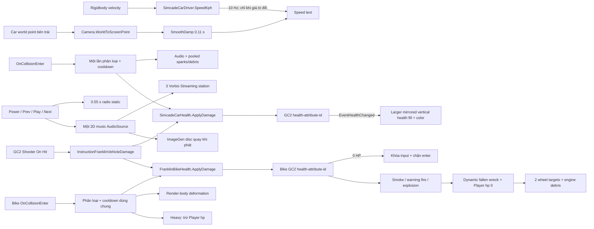
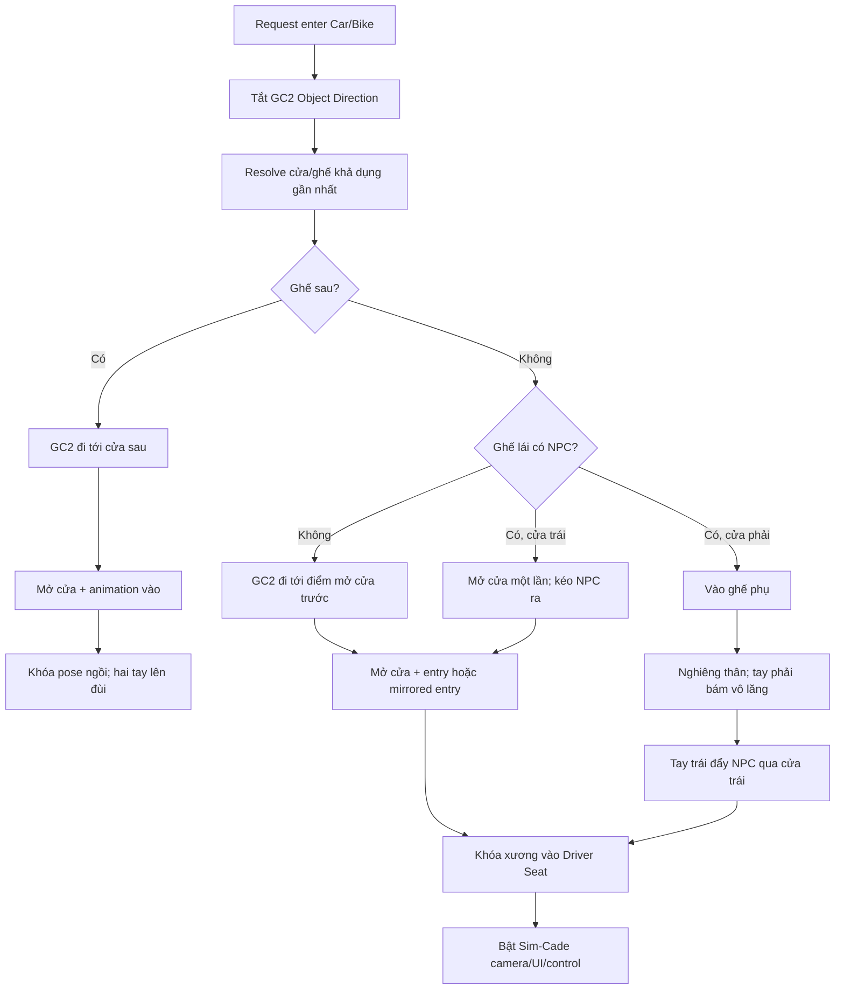
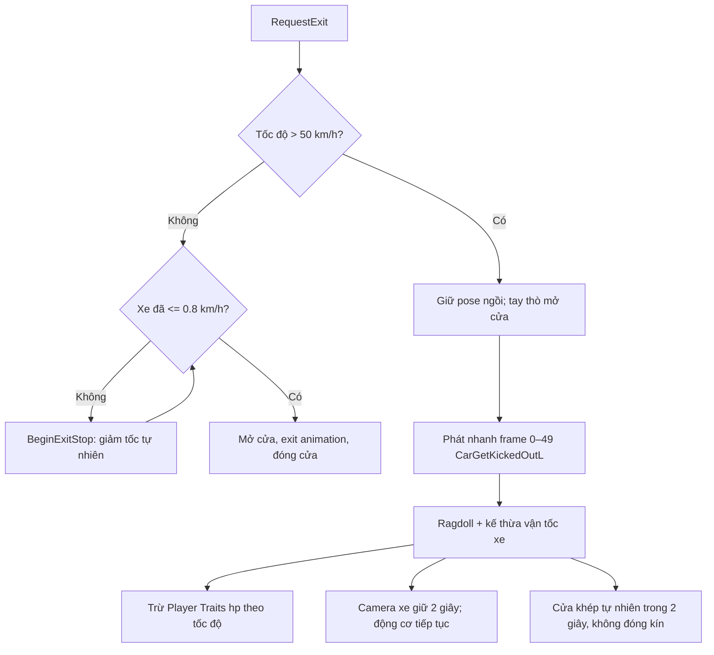

# Franklin Game — Vehicle Integration

Đây là module tập trung cho hạ tầng vehicle của Franklin Game: code dùng chung,
Car, Bike, Hover vehicle, nội dung shared và package bên thứ ba. Asset được phân
loại theo **domain trước, loại file sau** để dễ tìm nhưng không trộn code tự viết
với vendor package. Mỗi asset luôn được di chuyển cùng `.meta`, vì vậy GUID và
reference từ prefab/scene vẫn được giữ nguyên.

## Cấu trúc

```text
Vehicle Integration/
├── Core/
│   ├── Data/
│   │   ├── Input/           # Input Actions dùng chung
│   │   ├── Stats/           # GC2 health/fuel/car/bike stats
│   │   └── Variables/       # GC2 global vehicle variables
│   ├── Runtime/
│   │   ├── Conditions/      # Điều kiện Visual Scripting
│   │   ├── Input/           # Mobile/Input System bridge
│   │   ├── Instructions/    # Instruction dùng chung
│   │   ├── Vehicle/         # Contract và component vehicle dùng chung
│   │   └── Legacy/          # Script cũ còn phải giữ để tương thích
│   └── Editor/
│       ├── Input/           # Property drawer
│       └── Styles/          # USS dùng chung cho custom inspector
├── Vehicles/
│   ├── Car/
│   │   ├── Runtime/         # Enter/exit, Sim-Cade adapter, health, fuel, damage
│   │   ├── Editor/          # Installer, validator và Scene preview
│   │   ├── Prefabs/         # Car, Cyclone, 15 profile AllStar, UI và VFX prefab
│   │   ├── Models/          # Mỗi profile Car nằm trong thư mục cùng tên
│   │   ├── Materials/       # Vehicle materials và VFX materials
│   │   ├── Textures/        # UI generated/source và VFX textures
│   │   ├── Animations/      # EntryExit, Carjacking và clip Generated
│   │   ├── Audio/           # Door/impact/damage SFX và Radio
│   │   ├── VFX/             # VFX Graph, subgraph và Hovl subset
│   │   └── Legacy/          # PhysicsCarController cũ, không gắn lên Car chính
│   ├── Bike/
│   │   ├── Animations/      # Enter/exit/idle Bike
│   │   ├── Prefabs/         # Empty-Motorbike template
│   │   ├── Textures/UI/     # Icon editor riêng của Bike
│   │   └── Legacy/          # PhysicsBikeController cũ
│   └── Hover/
│       ├── Runtime/         # Hoverbike/hoverboard/hovercar controller
│       └── Editor/          # Custom editor Hover
├── Shared/
│   ├── Audio/               # Mixer, engine, bump và drift dùng lại
│   ├── Materials/           # Material không thuộc riêng một vehicle
│   ├── Textures/            # Texture utility dùng chung
│   ├── Shaders/             # Shader/Shader Graph dùng chung
│   └── UI/Sprites/          # Sprite editor/UI dùng chung
├── Stations/
│   ├── Fuel/Runtime/        # Marker trigger, hold button và giao dịch xăng
│   └── Garage/Runtime/      # Sửa Car/Bike, reset deformation và đổ giới hạn 25%
├── ThirdParty/
│   └── Sim-Cade Vehicle Physics/
│                              # Vendor package nguyên bản, không trộn custom code
└── README.md
```

### Chỉ mục nhanh theo loại asset

| Cần tìm | Đường dẫn chuẩn |
|---|---|
| Prefab Car chính | [`Vehicles/Car/Prefabs/Car.prefab`](Vehicles/Car/Prefabs/Car.prefab) |
| Prefab Cyclone 2 cửa | [`Vehicles/Car/Prefabs/Cyclone.prefab`](Vehicles/Car/Prefabs/Cyclone.prefab) |
| Prefab Bezerker 4 cửa | [`Vehicles/Car/Prefabs/Bezerker.prefab`](Vehicles/Car/Prefabs/Bezerker.prefab) |
| Prefab Boomslang 2 cửa | [`Vehicles/Car/Prefabs/Boomslang.prefab`](Vehicles/Car/Prefabs/Boomslang.prefab) |
| Prefab DZ 2 cửa | [`Vehicles/Car/Prefabs/DZ.prefab`](Vehicles/Car/Prefabs/DZ.prefab) |
| Prefab DZClassic 2 cửa | [`Vehicles/Car/Prefabs/DZClassic.prefab`](Vehicles/Car/Prefabs/DZClassic.prefab) |
| Prefab Fastback 2 cửa | [`Vehicles/Car/Prefabs/Fastback.prefab`](Vehicles/Car/Prefabs/Fastback.prefab) |
| Prefab Goat 2 cửa | [`Vehicles/Car/Prefabs/Goat.prefab`](Vehicles/Car/Prefabs/Goat.prefab) |
| Prefab GT 2 cửa | [`Vehicles/Car/Prefabs/GT.prefab`](Vehicles/Car/Prefabs/GT.prefab) |
| Prefab LuxSport 2 cửa | [`Vehicles/Car/Prefabs/LuxSport.prefab`](Vehicles/Car/Prefabs/LuxSport.prefab) |
| Prefab Mako 2 cửa | [`Vehicles/Car/Prefabs/Mako.prefab`](Vehicles/Car/Prefabs/Mako.prefab) |
| Prefab Matador 2 cửa | [`Vehicles/Car/Prefabs/Matador.prefab`](Vehicles/Car/Prefabs/Matador.prefab) |
| Prefab Minari 2 cửa | [`Vehicles/Car/Prefabs/Minari.prefab`](Vehicles/Car/Prefabs/Minari.prefab) |
| Prefab Palamino 2 cửa | [`Vehicles/Car/Prefabs/Palamino.prefab`](Vehicles/Car/Prefabs/Palamino.prefab) |
| Prefab Pickup 2 cửa | [`Vehicles/Car/Prefabs/Pickup.prefab`](Vehicles/Car/Prefabs/Pickup.prefab) |
| Prefab Stepvan 2 cửa trượt | [`Vehicles/Car/Prefabs/Stepvan.prefab`](Vehicles/Car/Prefabs/Stepvan.prefab) |
| Prefab Van 2 cửa | [`Vehicles/Car/Prefabs/Van.prefab`](Vehicles/Car/Prefabs/Van.prefab) |
| Prefab UI Car | [`Vehicles/Car/Prefabs/UI/`](Vehicles/Car/Prefabs/UI/) |
| Prefab VFX Car | [`Vehicles/Car/Prefabs/VFX/`](Vehicles/Car/Prefabs/VFX/) |
| Model Car | [`Vehicles/Car/Models/`](Vehicles/Car/Models/) |
| Material thân xe | [`Vehicles/Car/Materials/Vehicle/`](Vehicles/Car/Materials/Vehicle/) |
| Material kính Car dùng chung | [`Vehicles/Car/Materials/Vehicle/Shared/GlassWindow.mat`](Vehicles/Car/Materials/Vehicle/Shared/GlassWindow.mat) |
| Material đèn dùng chung | [`Shared/Materials/VehicleLights/`](Shared/Materials/VehicleLights/) |
| Material VFX | [`Vehicles/Car/Materials/VFX/`](Vehicles/Car/Materials/VFX/) |
| Texture UI runtime | [`Vehicles/Car/Textures/UI/Generated/`](Vehicles/Car/Textures/UI/Generated/) |
| File nguồn UI | [`Vehicles/Car/Textures/UI/Source/`](Vehicles/Car/Textures/UI/Source/) |
| Texture VFX | [`Vehicles/Car/Textures/VFX/`](Vehicles/Car/Textures/VFX/) |
| Animation Car | [`Vehicles/Car/Animations/`](Vehicles/Car/Animations/) |
| Audio Car | [`Vehicles/Car/Audio/`](Vehicles/Car/Audio/) |
| Graph và subgraph VFX | [`Vehicles/Car/VFX/Graphs/`](Vehicles/Car/VFX/Graphs/) |
| Stats/Input/Variables | [`Core/Data/`](Core/Data/) |
| Asset dùng chung | [`Shared/`](Shared/) |
| Logic trạm xăng | [`Stations/Fuel/Runtime/`](Stations/Fuel/Runtime/) |
| Logic garage Car/Bike | [`Stations/Garage/Runtime/`](Stations/Garage/Runtime/) |
| Sim-Cade nguyên bản | [`ThirdParty/Sim-Cade Vehicle Physics/`](ThirdParty/Sim-Cade%20Vehicle%20Physics/) |

### Quy ước phân loại

- `Runtime` không chứa `UnityEditor`; mọi custom inspector/installer nằm trong `Editor`.
- `Prefabs`, `Models`, `Materials`, `Textures`, `Animations` và `Audio` là các
  điểm tìm duy nhất trong từng vehicle domain; không đặt texture lẫn trong
  `Materials` hoặc prefab lẫn trong `UI`.
- Asset chỉ dùng cho một vehicle nằm dưới `Vehicles/<Type>`; asset dùng lại cho
  nhiều loại nằm dưới `Core` hoặc `Shared`.
- `ThirdParty` giữ nguyên cấu trúc vendor để dễ audit license và nâng cấp package.
- File tạo bằng ImageGen nằm trong `Textures/UI/Generated`; PSD/file nguồn nằm
  trong `Textures/UI/Source`.

### Dependency nằm ngoài `Vehicles/Car/`

Các thành phần dưới đây có liên quan tới luồng Car nhưng còn được Bike, Player
hoặc GC2 dùng chung, nên không được đưa vào domain Car:

- `../Arcade Bike Physics Pro/Scripts/Integration/Rider/CharacterIKSetter.cs`
- `Core/Runtime/Vehicle/IRvrVehicleDriveController.cs`
- `Core/Runtime/Instructions/InstructionEnterVehicle.cs`
- `Core/Runtime/Instructions/InstructionExitVehicle.cs`
- `Core/Runtime/Instructions/InstructionBikePassenger.cs`
- `Core/Runtime/Vehicle/VehicleLights.cs`
- `Core/Data/Input/InputSystem_RT.inputactions`
- `Core/Data/Variables/Global Variable - Vehicles.asset`
- `Assets/FranklinAnimations/Runtime/FranklinVehicleInteractionManager.cs`
- `Assets/FranklinAnimations/Runtime/FranklinMobileHud.cs`
- `Assets/Prefab/Player.prefab`, `Assets/Prefab/NPC.prefab`
- Game Creator 2, Input System và Cinemachine packages

`FranklinBikeImpactInstaller` vẫn tái sử dụng hai clip va chạm và pooled `Collision Spark` của Car/Sim-Cade; đường dẫn Editor đã được cập nhật sang cấu trúc mới.

## Đường dẫn script

### Car runtime

| Script | Đường dẫn | Trách nhiệm |
|---|---|---|
| `CarEntry` | [`Vehicles/Car/Runtime/CarEntry.cs`](Vehicles/Car/Runtime/CarEntry.cs) | Chủ sở hữu enter/exit cho profile hai hoặc bốn cửa, door animation, mirror entry và speed-aware bailout. |
| `SimcadeCarDriver` | [`Vehicles/Car/Runtime/SimcadeCarDriver.cs`](Vehicles/Car/Runtime/SimcadeCarDriver.cs) | Adapter input, camera, mobile control, speed và presentation cho Sim-Cade. |
| `SimcadeCarBrakeLights` | [`Vehicles/Car/Runtime/SimcadeCarBrakeLights.cs`](Vehicles/Car/Runtime/SimcadeCarBrakeLights.cs) | Điều khiển đèn hậu/phanh/số lùi từ input và vận tốc thật, theo kiến trúc Bike nhưng dùng hai mesh đèn hậu sẵn có của Car. |
| `SimcadeCarHorn` | [`Vehicles/Car/Runtime/SimcadeCarHorn.cs`](Vehicles/Car/Runtime/SimcadeCarHorn.cs) | Còi Car dạng hold, dùng một AudioSource 3D mono và tự ngủ hoàn toàn khi im lặng. |
| `SimcadeCarDashboard` | [`Vehicles/Car/Runtime/SimcadeCarDashboard.cs`](Vehicles/Car/Runtime/SimcadeCarDashboard.cs) | Một Canvas HUD dùng chung cho mọi instance Car; tự bind driver/health/fuel/radio của Car đang lái. |
| `SimcadeCarHealth` | [`Vehicles/Car/Runtime/SimcadeCarHealth.cs`](Vehicles/Car/Runtime/SimcadeCarHealth.cs) | Nối impact đã phân loại với GC2 `health-attribute-id`; API damage/repair. |
| `SimcadeCarFuel` | [`Vehicles/Car/Runtime/SimcadeCarFuel.cs`](Vehicles/Car/Runtime/SimcadeCarFuel.cs) | Nối GC2 `fuel-attribute-id`, hao xăng theo garanti/ga/tốc độ và khóa ga/engine khi cạn. |
| `SimcadeCarDamageEffects` | [`Vehicles/Car/Runtime/SimcadeCarDamageEffects.cs`](Vehicles/Car/Runtime/SimcadeCarDamageEffects.cs) | Event-driven khói dưới 32% máu, explosion một lần và lửa khi xe hết máu. |
| `SimcadeCarDestruction` | [`Vehicles/Car/Runtime/SimcadeCarDestruction.cs`](Vehicles/Car/Runtime/SimcadeCarDestruction.cs) | Phá hủy terminal: cháy đen riêng instance, văng bốn bánh, hất nhẹ thân xe, cưỡng chế Player ragdoll/cháy/Traits về 0 và khóa UI/điều khiển. |
| `SimcadeCarParticleWind` | [`Vehicles/Car/Runtime/SimcadeCarParticleWind.cs`](Vehicles/Car/Runtime/SimcadeCarParticleWind.cs) | Lực gió world-space cho smoke/fire, cộng airflow ngược vận tốc xe và chỉ cập nhật 4 Hz khi VFX gần camera. |
| `SimcadeDetachedWheelCleanup` | [`Vehicles/Car/Runtime/SimcadeDetachedWheelCleanup.cs`](Vehicles/Car/Runtime/SimcadeDetachedWheelCleanup.cs) | Vòng đời debris bánh: văng, nằm phẳng theo ground, khóa physics 5 giây, chìm và tự dọn. |
| `SimcadeCarImpactAudio` | [`Vehicles/Car/Runtime/SimcadeCarImpactAudio.cs`](Vehicles/Car/Runtime/SimcadeCarImpactAudio.cs) | Phân loại va chạm, audio, pooled spark/debris và phát event impact dùng chung. |
| `SimcadeCarCharacterImpact` | [`Vehicles/Car/Runtime/SimcadeCarCharacterImpact.cs`](Vehicles/Car/Runtime/SimcadeCarCharacterImpact.cs) | Tông GC2 Character đủ nhanh sẽ gọi `RagdollDefault`, truyền vận tốc hất giới hạn và chỉ tự recover ragdoll do shared Car/explosion lease sở hữu. |
| `VehicleImpactIgnored` | [`Vehicles/Car/Runtime/VehicleImpactIgnored.cs`](Vehicles/Car/Runtime/VehicleImpactIgnored.cs) | Marker cho physics prop nhẹ như shell: vẫn va chạm/phát tiếng riêng nhưng không đi vào damage, deformation, crash VFX hoặc ragdoll của Car/Bike. |
| `SimcadeCarMetalDebris` | [`Vehicles/Car/Runtime/SimcadeCarMetalDebris.cs`](Vehicles/Car/Runtime/SimcadeCarMetalDebris.cs) | Tái sử dụng event impact để bắn mảnh kim loại lớn hơn Bike bằng một ParticleSystem pool tối ưu mobile. |
| `SimcadeCarDoorDamage` | [`Vehicles/Car/Runtime/SimcadeCarDoorDamage.cs`](Vehicles/Car/Runtime/SimcadeCarDoorDamage.cs) | Tông mạnh tại từng cửa nhả chốt thành bản lề vật lý; kính đi cùng đúng cửa, còn cú cực mạnh hoặc va chạm trực tiếp tiếp theo mới làm cửa rời. |
| `SimcadeCarDeformation` | [`Vehicles/Car/Runtime/SimcadeCarDeformation.cs`](Vehicles/Car/Runtime/SimcadeCarDeformation.cs) | Adapter event Sim-Cade gọi thuật toán deformation Edy cho các render mesh gần contact, đồng thời giữ sai lệch lái nhỏ. |
| `EdysVehicleMeshDeformation` | [`Vehicles/Car/Runtime/EdysVehicleMeshDeformation.cs`](Vehicles/Car/Runtime/EdysVehicleMeshDeformation.cs) | Phần duy nhất port từ `VehicleDamage.cs` của Edy's 5.5.3: falloff theo bán kính, impact velocity, fracture và giới hạn displacement. |
| `SimcadeCarjacking` | [`Vehicles/Car/Runtime/SimcadeCarjacking.cs`](Vehicles/Car/Runtime/SimcadeCarjacking.cs) | Kéo NPC cửa trái và nhánh ghế phụ đẩy NPC sang trái. |
| `SeatedSkeletonPoseGuard` | [`Vehicles/Car/Runtime/SeatedSkeletonPoseGuard.cs`](Vehicles/Car/Runtime/SeatedSkeletonPoseGuard.cs) | Giữ pelvis/spine/head đúng ghế trong camera handoff và bailout. |
| `ConditionCarEnabled` | [`Vehicles/Car/Runtime/ConditionCarEnabled.cs`](Vehicles/Car/Runtime/ConditionCarEnabled.cs) | Điều kiện Visual Scripting kiểm tra trạng thái Car. |

### Car editor

| Script | Đường dẫn | Trách nhiệm |
|---|---|---|
| `SimcadeCarInstaller` | [`Vehicles/Car/Editor/SimcadeCarInstaller.cs`](Vehicles/Car/Editor/SimcadeCarInstaller.cs) | Gắn và xác thực Sim-Cade stack, camera, mobile UI, audio/VFX. |
| `SimcadeCarDashboardInstaller` | [`Vehicles/Car/Editor/SimcadeCarDashboardInstaller.cs`](Vehicles/Car/Editor/SimcadeCarDashboardInstaller.cs) | Gắn HUD ImageGen, health, ba station CC0, radio tuning và validator mobile. |
| `SimcadeCarDamageEffectsInstaller` | [`Vehicles/Car/Editor/SimcadeCarDamageEffectsInstaller.cs`](Vehicles/Car/Editor/SimcadeCarDamageEffectsInstaller.cs) | Author/validate CPU particles và 3D explosion audio trực tiếp trong Car prefab. |
| `SimcadeCarDeformationInstaller` | [`Vehicles/Car/Editor/SimcadeCarDeformationInstaller.cs`](Vehicles/Car/Editor/SimcadeCarDeformationInstaller.cs) | Gắn 10 visible exterior meshes, profile Edy Sport Coupe và xác thực không có dependency EVP ngoài deformation kernel. |
| `SimcadeCarjackingInstaller` | [`Vehicles/Car/Editor/SimcadeCarjackingInstaller.cs`](Vehicles/Car/Editor/SimcadeCarjackingInstaller.cs) | Cấu hình animation, GC2 NPC, landing point và passenger push. |
| `SimcadeCarEntrySceneTool` | [`Vehicles/Car/Editor/SimcadeCarEntrySceneTool.cs`](Vehicles/Car/Editor/SimcadeCarEntrySceneTool.cs) | Preview/chỉnh anchor, cửa, IK và animation trực tiếp trong Scene view. |
| `CarEntryEditor` | [`Vehicles/Car/Editor/CarEntryEditor.cs`](Vehicles/Car/Editor/CarEntryEditor.cs) | Custom Inspector cho `CarEntry`. |
| `VehicleCarAssetConsolidator` | [`Vehicles/Car/Editor/VehicleCarAssetConsolidator.cs`](Vehicles/Car/Editor/VehicleCarAssetConsolidator.cs) | Migration giữ GUID và validator tổng hợp. |

### Script dùng chung ngoài `Car/`

| Script | Đường dẫn | Trách nhiệm |
|---|---|---|
| `IRvrVehicleDriveController` | [`Core/Runtime/Vehicle/IRvrVehicleDriveController.cs`](Core/Runtime/Vehicle/IRvrVehicleDriveController.cs) | Contract điều khiển dùng chung Car/Bike/vehicle interaction. |
| `CharacterIKSetter` | [`../Arcade Bike Physics Pro/Scripts/Integration/Rider/CharacterIKSetter.cs`](../Arcade%20Bike%20Physics%20Pro/Scripts/Integration/Rider/CharacterIKSetter.cs) | Cầu nối IK humanoid dùng chung. |
| `FranklinVehicleInteractionManager` | [`../../FranklinAnimations/Runtime/FranklinVehicleInteractionManager.cs`](../../FranklinAnimations/Runtime/FranklinVehicleInteractionManager.cs) | Phát hiện vehicle gần Player và gọi API enter/exit. |
| `FranklinMobileHud` | [`../../FranklinAnimations/Runtime/FranklinMobileHud.cs`](../../FranklinAnimations/Runtime/FranklinMobileHud.cs) | HUD điều khiển Player/Car/Bike dùng chung; không chứa logic riêng của Car dashboard. |
| `FranklinPlayerRagdollGroundGuard` | [`../../FranklinAnimations/Runtime/FranklinPlayerRagdollGroundGuard.cs`](../../FranklinAnimations/Runtime/FranklinPlayerRagdollGroundGuard.cs) | Profile mobile của Player: core CCD chính xác, limb speculative và chống pelvis xuyên static ground trong lúc ragdoll. |
| `FranklinRagdollGroundGuard` | [`../../FranklinAnimations/Runtime/FranklinRagdollGroundGuard.cs`](../../FranklinAnimations/Runtime/FranklinRagdollGroundGuard.cs) | Gia cố CCD/solver cho xương ragdoll GC2 và đưa pelvis trở lại trên static ground nếu solver thực sự xuyên mặt nền. |
| `FranklinExplosionRagdollImpulse` | [`../../ShooterSystemGC2/Runtime/FranklinExplosionRagdollImpulse.cs`](../../ShooterSystemGC2/Runtime/FranklinExplosionRagdollImpulse.cs) | Lease ragdoll dùng chung Car/explosion: gộp velocity/deadline, recovery có blocker check, proxy bone→Character và cleanup an toàn khi pool/despawn. |
| GC2 `Ragdoll` | [`../../Plugins/GameCreator/Packages/Core/Runtime/Characters/Features/Ragdoll/Ragdoll.cs`](../../Plugins/GameCreator/Packages/Core/Runtime/Characters/Features/Ragdoll/Ragdoll.cs) | API gốc `StartRagdoll`/`StartRecover`; bổ sung `StopRagdollImmediate()` để tắt bone physics và reparent model an toàn khi pool/despawn mà không chạy animation đứng dậy. |
| `FranklinBikeImpactInstaller` | [`../Arcade Bike Physics Pro/Editor/Installation/FranklinBikeImpactInstaller.cs`](../Arcade%20Bike%20Physics%20Pro/Editor/Installation/FranklinBikeImpactInstaller.cs) | Bike tái sử dụng impact SFX/FX nhưng không phụ thuộc runtime dashboard Car. |
| `FranklinBikeHealth` | [`../Arcade Bike Physics Pro/Scripts/Integration/Damage/FranklinBikeHealth.cs`](../Arcade%20Bike%20Physics%20Pro/Scripts/Integration/Damage/FranklinBikeHealth.cs) | Nối impact Bike đã qua phân loại/cooldown với GC2 `health-attribute-id`; API damage/repair và khóa ga/lái ở 0 HP. |
| `FranklinFuelStation` | [`Stations/Fuel/Runtime/FranklinFuelStation.cs`](Stations/Fuel/Runtime/FranklinFuelStation.cs) | Tạo trigger tại GC2 Marker, hiển thị nút hold mobile và thực hiện giao dịch xăng cho Car/Bike. |
| `IFranklinFuelTank` | [`Stations/Fuel/Runtime/IFranklinFuelTank.cs`](Stations/Fuel/Runtime/IFranklinFuelTank.cs) | Contract nhiên liệu dùng chung để trạm xăng không phụ thuộc controller Car hoặc Bike. |
| `FranklinGarageService` | [`Stations/Garage/Runtime/FranklinGarageService.cs`](Stations/Garage/Runtime/FranklinGarageService.cs) | Dịch vụ chung tại bốn bay: sửa đầy health, reset deformation, gắn lại cửa Car và cho Car/Bike mua tối đa 25% dung tích bình mỗi lượt ghé. |
| `FranklinGarageZone` | [`Stations/Garage/Runtime/FranklinGarageZone.cs`](Stations/Garage/Runtime/FranklinGarageZone.cs) | Trigger adapter nhẹ được gắn vào các GC2 Marker của garage. |
| `FranklinPlayerStatusHud` | [`../../FranklinAnimations/Runtime/FranklinPlayerStatusHud.cs`](../../FranklinAnimations/Runtime/FranklinPlayerStatusHud.cs) | Wallet API và HUD tiền dùng chung; thay đổi tiền phát event ngay lập tức. |

## Sơ đồ thành phần



Quyền sở hữu luồng vào/ra nằm trên `CarEntry` của prefab Car. Player chỉ gọi API và cung cấp `Character`; Player không tự teleport hoặc tự điều khiển cửa.

## API runtime chính

### `CarEntry`

| API | Ý nghĩa |
|---|---|
| `bool RequestEnter(Character character)` | Yêu cầu vào cửa/ghế gần nhất. Car tự phân giải cửa, tình trạng ghế và carjacking. |
| `bool RequestEnter(Character character, CarEntrySideMode side)` | Yêu cầu cửa cụ thể: `DriverDoor`, `PassengerDoor`, `RearLeftDoor`, `RearRightDoor` hoặc `Automatic`. |
| `bool CanRequestEnter(Character character, CarEntrySideMode side)` | Kiểm tra trước mà không thay đổi state. |
| `CarEntrySideMode ResolveEntrySide(...)` | Trả về cửa/ghế thực tế sau khi xét khoảng cách và khả dụng. |
| `bool RequestExit(Character character)` | Ra xe theo tốc độ: dừng tự nhiên hoặc bailout trên 50 km/h; bailout nhanh trừ GC2 Player Traits `hp` theo vận tốc. |
| `bool IsCharacterSeated(Character character)` | Character có đang ở một trong bốn ghế hay không. |
| `bool IsRearPassenger(Character character)` | Character có đang ngồi ghế sau hay không. |
| `bool SeatOccupantInstant(Character character)` | API hệ thống để đặt NPC lái xe; tắt vật lý NPC khi ngồi. Không dùng cho tương tác Player bình thường. |
| `Task<bool> ForceEjectForDestructionAsync(...)` | API nội bộ của hệ thống nổ: nhả ghế không chạy exit animation, phục hồi physics rồi bật ragdoll không tự đứng dậy. |
| `Task<bool> MoveCharacterToEntryStandingPointAsync(Character character)` | Cho GC2 điều khiển Player đi tới điểm mở cửa; không teleport. |
| `Task<bool> EnterThroughOpenDoorAsync(...)` | Tiếp tục vào xe khi cửa đã được mở bởi carjacking; tránh mở/đóng cửa hai lần. |

Trạng thái đọc nhanh:

- `IsTransitioning`: đang vào hoặc ra xe.
- `IsUsingMirroredEntry`: đang dùng clip mirror cửa bên phải.
- `IsPassengerCarjackingSeatOccupied`: Player đang ở ghế phụ trong nhánh đẩy NPC.

### `SimcadeCarDriver`

| API | Ý nghĩa |
|---|---|
| `SetVehicleEnabled(bool state)` | Bật/tắt điều khiển xe, camera và presentation. |
| `SetVehicleEnabled(bool state, bool preserveMomentum)` | Tắt điều khiển nhưng tùy chọn giữ động lượng cho bailout. |
| `bool SnapSpawnToGround()` | API pool/spawner gọi sau khi gán pose world cuối cùng; dùng bốn wheel authoring để đặt Car lên static ground rồi khóa pose đỗ. `Start` và pooled `OnEnable` đã tự gọi cùng luồng này. |
| `FinalizeParkedPoseAfterKinematicTransition()` | API nội bộ `CarEntry` gọi sau cửa sổ kinematic của enter/exit ghế trước/sau; khóa lại ride height của xe đỗ để marker không chìm theo chassis. |
| `SetPassengerPresentation(bool active)` | Giữ camera/UI phù hợp khi Player là hành khách. |
| `SetDestroyed()` | Khóa vĩnh viễn input/controller/audio/dashboard của wreck; camera chỉ tắt ngay nếu không có destruction hold. |
| `RequestExit()` | Chuyển yêu cầu thoát từ UI/input về `CarEntry`. |
| `SetVirtualAccelerateInput(bool)` | Hold ga nhanh trên mobile. |
| `SetVirtualSlowAccelerateInput(bool)` | Hold ga chậm; taper lực kéo tự nhiên và giới hạn ở `60 km/h`, không giả lập bằng phanh. |
| `SetVirtualBrakeReverseInput(bool)` | Hold phanh/lùi. |
| `SetVirtualSteerLeftInput(bool)` / `SetVirtualSteerRightInput(bool)` | Điều khiển lái mobile. |
| `SetVirtualHandbrakeInput(bool)` | Phanh tay mobile. |
| `SetHeadlightEnabled(bool)` | Bật/tắt đồng thời đèn pha, spotlight và đèn hậu chạy đêm. |
| `ToggleHeadlights()` | Đảo trạng thái đèn; dùng được từ GC2 Instruction hoặc UI chung. |
| `SetHornPressed(bool)` | Nhấn/thả còi Car; HUD gọi `true` ở PointerDown và `false` ở PointerUp/PointerExit. |
| `SetRearViewPressed(bool)` | Hold góc nhìn sau: `true` snap orbit camera Sim-Cade 180°, `false` snap ngay về đúng góc trước khi giữ. |
| `SetFirstPersonView(bool)` | `true` chuyển camera hiện tại vào cabin; `false` phục hồi nguyên cấu hình chase TPS. Lựa chọn từ nút HUD được lưu dùng chung cho mọi Car. |
| `RestoreThirdPersonViewPreservingPreference()` | Tạm trả camera về TPS cho exit/modal/destruction nhưng không đổi lựa chọn đã lưu. |
| `BeginExitStop()` / `CancelExitStop()` | Hãm tốc có kiểm soát cho nhánh exit dưới ngưỡng. |
| `BeginBailoutCameraHold()` / `EndBailoutCameraHold()` | Giữ camera xe thêm 2 giây khi nhảy khỏi xe. |
| `BeginDestructionCameraHold()` | Giữ camera Sim-Cade đang active tại wreck; không tự bật camera cho Car rỗng/off-screen. |
| `ReturnDestructionCameraToPlayer(...)` | Đợi explosion burst, lerp target tới hips Player ragdoll rồi trả quyền cho GC2 camera. |
| `KeepEngineRunningAfterBailout()` | Giữ tiếng động cơ và trạng thái máy khi Player nhảy khỏi xe. |
| `ResetVehicle()` | Đưa xe về tư thế an toàn. |

Thuộc tính đọc: `IsVehicleEnabled`, `IsPassengerPresentationActive`,
`IsRearViewPressed`, `IsFirstPersonViewActive`, `SpeedMetersPerSecond`,
`SpeedKph`.

### Camera nhìn phía sau dạng hold

Nút ImageGen
[`vehicle-control-rear-view.png`](../../UI/FranklinMobile/Resources/FranklinMobileUI/vehicle-control-rear-view.png)
chỉ hiện khi Player thực sự lái Car. `PointerDown` gọi
`SetRearViewPressed(true)` để xoay orbit target hiện có `180°`; `PointerUp`,
`PointerExit`, exit Car, disable hoặc destruction đều nhả input. Camera trở về
đúng yaw đã có trước lúc giữ nên không làm mất góc orbit do người chơi vừa chỉnh.
Hai chiều nhìn sau/trở về đều snap ngay trong cùng frame và vô hiệu hóa state
Cinemachine trước đó, nên không còn lerp hoặc damping khi giữ/nhả nút.

Luồng này không tạo thêm Camera, Cinemachine rig, Canvas hay coroutine. Nó chỉ
đổi yaw của orbit target vốn đã có, vì vậy phù hợp mobile và không ảnh hưởng
camera Bike/GC2.

### Chuyển TPS/FPS khi lái Car

Nút toggle ImageGen
[`vehicle-control-camera-mode.png`](../../UI/FranklinMobile/Resources/FranklinMobileUI/vehicle-control-camera-mode.png)
đổi giữa chase TPS hiện tại và góc nhìn khoang lái. Khi bật FPS,
`SimcadeCarDriver` lấy vị trí head bone Humanoid một lần và gắn camera nhìn trước
vào Neck tại đúng vị trí đầu. Không parent trực tiếp vào Head vì Head được scale
về `0` trong FPS; mount Neck vẫn đi theo chuyển động đầu nhưng giữ Transform camera
hợp lệ. Chỉ khi giữ Rear View, anchor mới snap tức thì sang điểm thuộc ghế lái,
lùi `0.24m` phía sau đầu để vai/lưng không che camera; nhả nút sẽ mount ngay lại
vào đầu, không lerp.
[`FirstPersonHeadOcclusion`](Vehicles/Car/Runtime/FirstPersonHeadOcclusion.cs)
co head bone về scale `0` tại pivot cổ sau Animator/pose guard, tạo mặt cổ phẳng
và ngăn đầu lọt vào camera dù chỉ một frame. Khi về TPS, exit, disable hoặc
destruction, local position/scale ban đầu của đầu được phục hồi ngay. Nếu không
đọc được head bone, driver dùng `First Person Fallback Offset`. FPS mặc định dùng
FOV `82°`, near clip `0.04m`; offset/FOV/near clip vẫn chỉnh được trên component.

FPS không tự mô phỏng orbit bằng Cinemachine nữa. Driver tái sử dụng chính GC2
`ShotTypeThirdPerson` đang active của Player, đổi pivot sang head anchor, đặt
shoulder/lift `0`, radius `0.015m` và zoom minimum `0`. Vì vậy input
`HalfRightMobileController`/chuột/gamepad, pitch và yaw chạy đúng pipeline Camera
Shot vốn đã dùng ngoài xe. Pitch dùng toàn dải `80°` (`±40°`); yaw GC2 được mở
tối đa `179°` (`±89.5°`); sensitivity `(0.2, 0.18)` và smooth time `0.14s`.
Auto Align của TPS được bật với `Delay = 0`: camera chỉ bắt đầu trở về hướng xe
ngay sau khi người dùng thả orbit, còn trong thời gian giữ input thì pitch/yaw
vẫn toàn quyền theo ngón tay/chuột/gamepad. Chase TPS Sim-Cade dùng cùng delay `0`.
Nút hold nhìn sau vẫn snap tức thì và tạm chuyển pivot ra sau đầu. Khi về TPS,
exit, disable hoặc destruction, driver phục hồi nguyên pivot, framing,
sensitivity, pitch/yaw, align, zoom, rotation, FOV và near clip của GC2 Shot rồi
trả quyền camera cho chase Sim-Cade. Không instantiate thêm Camera Shot.
Chế độ cuối được lưu tại PlayerPrefs key `Franklin.Vehicle.Car.FirstPersonView`:
exit/destruction chỉ tạm phục hồi camera Player và không ghi đè lựa chọn; lần enter
Car tiếp theo (kể cả Car khác hoặc sau khi mở lại game) tự bật đúng TPS/FPS đã lưu.
Runtime chỉ tạo lười một Transform anchor ở lần bật FPS đầu tiên và
guard head chỉ ghi hai thuộc tính Transform trong `LateUpdate` khi FPS đang bật;
không tạo Camera/Canvas/coroutine và không tìm bone mỗi frame. Khi FPS active,
Dashboard chỉ ẩn km/h, thanh xăng và thanh máu; radio cùng các nút lái vẫn giữ.

Vô lăng model vẫn được phép quay tối đa `360°`, nhưng hai target hand IK dùng góc
riêng giới hạn mặc định `85°`. Vì vậy khi người dùng giữ trái/phải, hai bàn tay
giữ nguyên tư thế quay tương ứng suốt thời gian hold thay vì đi hết một vòng rồi
trở về tư thế thẳng. Nhả nút mới đưa tay và vô lăng về giữa; cách này chỉ cập nhật
hai Transform sẵn có, không tạo rig hoặc allocation mỗi frame trên mobile.

### Đèn pha, đèn hậu và đèn phanh

Car tái sử dụng [`VehicleLights`](Core/Runtime/Vehicle/VehicleLights.cs) giống
`Bike_01`, nhưng có thêm
[`SimcadeCarBrakeLights`](Vehicles/Car/Runtime/SimcadeCarBrakeLights.cs) để đọc
input đã được `SimcadeCarDriver` sample và vận tốc dọc của chính Rigidbody:

- `SetHeadlightEnabled(true)` bật hai mesh đèn trước, hai spotlight và mức đèn
  hậu chạy đêm `0.32x`.
- Profile pha Car dùng cường độ `45`, range `42m`, outer cone `68°` và inner
  cone `48°`: vùng sáng rộng/dài hơn nhưng vẫn tắt realtime shadow trên cả hai
  spotlight để giữ ngân sách GPU mobile.
- Nút headlight dạng toggle vốn dùng cho Bike trong `FranklinMobileHud` được
  dùng chung khi `m_ActiveDriver` là Car; không sinh thêm button hoặc texture.
- Trục phanh/lùi, phanh tay hoặc nhánh dừng xe trước khi exit làm hai đèn hậu
  chuyển mượt tới mức đỏ `1.8x`; khi nhả phanh fade chậm hơn để không chớp gắt.
- Hai `LensFlareComponentSRP` dùng data riêng
  [`Vehicles/Car/VFX/CarBrakeOpticalFlare.asset`](Vehicles/Car/VFX/CarBrakeOpticalFlare.asset)
  và texture ImageGen 512×512
  [`Car_Brake_OpticalFlare.png`](Vehicles/Car/Textures/VFX/Car_Brake_OpticalFlare.png).
  Anchor được khóa vào đúng `Renderer.localBounds.center` của từng mesh đèn ở
  `LateUpdate`, vì visual body có thể roll độc lập với Rigidbody khi đánh lái.
  Điểm occlusion được đẩy `0.2m` về phía camera thay vì đẩy anchor ra sau xe,
  nên flare không còn parallax/trượt khỏi tâm đèn. Flare có lõi oval đỏ-trắng
  dày, không variation/distortion, scale cố định, fade cùng brake blend,
  intensity tối đa `1.1`, attenuation `70m`, occlusion `4` sample; không thêm
  point light hay realtime shadow.
- Khi xe đang lùi thật, đèn cảnh báo sau vẫn sáng kể cả input vừa được nhả.
- `VehicleLights` ghi `_GlowColor` bằng `MaterialPropertyBlock`, không gọi
  `Renderer.material`, không clone material cho từng Car. Không tạo GameObject
  lúc runtime, không raycast và không thêm realtime shadow; mỗi frame chỉ đọc input/velocity,
  còn renderer chỉ được ghi khi blend hoặc trạng thái pha thực sự thay đổi.

API đọc thêm trên `SimcadeCarDriver`: `HeadlightsEnabled`,
`SignedAccelerationInput`, `IsHandbrakeRequested`, `IsStoppingForExit`. Trạng
thái runtime trên `SimcadeCarBrakeLights`: `IsIlluminated`, `CurrentBlend`.

### Còi Car mobile

[`SimcadeCarHorn`](Vehicles/Car/Runtime/SimcadeCarHorn.cs) được Car quản lý và
HUD chỉ gọi API `SimcadeCarDriver.SetHornPressed(bool)`. Nút
[`vehicle-control-horn.png`](../../UI/FranklinMobile/Resources/FranklinMobileUI/vehicle-control-horn.png)
được tạo bằng built-in ImageGen, tách chroma-key thành PNG alpha 512² và chỉ
hiện khi Player thực sự lái Car. Nhấn giữ phát
[`car_horn_loop.wav`](Vehicles/Car/Audio/SFX/car_horn_loop.wav); thả nút,
PointerExit, exit Car, disable hoặc destruction đều dừng còi.

Clip là PCM mono 22.05 kHz dài một giây và loop liền mạch. AudioSource đặt gần
đầu xe, dùng 3D logarithmic, min/max distance `3m/55m`, Doppler `0.2`; volume
fade ngắn để không click. Component bị disable trong toàn bộ thời gian im lặng,
không `Update`, allocation, tìm component hoặc tạo AudioClip runtime trên mobile.

### `SimcadeCarjacking`

| API | Ý nghĩa |
|---|---|
| `bool CanCarjack(Character attacker)` | Kiểm tra có NPC lái và luồng không bận. |
| `bool TryBeginCarjack(Character attacker, ...)` | Bắt đầu kéo NPC qua cửa lái. |
| `bool TryEnterOccupiedCar(Character attacker, CarEntrySideMode side)` | Car tự chọn nhánh kéo bên trái hoặc vào ghế phụ rồi đẩy NPC sang cửa trái. |

### `SimcadeCarImpactAudio`

Component tự phân loại va chạm nhẹ/nặng theo impulse, điều chỉnh âm lượng/pitch so với động cơ và phát VFX tia lửa–mảnh vụn bằng pool. `EventCollisionContact(Collision)` được phát đồng bộ sau bộ lọc prop nhẹ nhưng trước cấu hình/cooldown SFX; subscriber phải lấy dữ liệu ngay trong callback và không giữ `Collision`. `EventImpactAccepted(bool isHeavy, float severity)` được phát một lần sau cooldown để `SimcadeCarHealth` dùng lại kết quả. `EventImpactContactAccepted(Collision, bool, float)` chuyển cùng kết quả và contact point cho deformation ngay trong callback, không tính collision lần hai. API `Configure(...)` chỉ dành cho installer/authoring.

Năm prefab vỏ đạn Shooter (`AK`, `Pistol`, `Shotgun`, `Minigun`, `Sniper`) có marker `VehicleImpactIgnored`. Bộ phân loại Car và lớp Bike kế thừa đều loại chúng trước khi tính impact; collider, Rigidbody và âm thanh rơi/nảy riêng của shell vẫn giữ nguyên, nhưng shell không thể làm móp mesh, trừ máu xe, phát crash VFX hay kích hoạt ragdoll.

### `SimcadeCarCharacterImpact`

Car và Cyclone dùng chung component event-only này. Nó nhận raw contact từ chính
`SimcadeCarImpactAudio`, vì vậy cú tông Character không bị mất khi một collision
âm thanh khác còn trong cooldown `0.16s`, đồng thời Car vẫn chỉ có một
`OnCollisionEnter`. Target phải là GC2 `Character` còn sống, có
`RagdollDefault`, không ngồi hoặc tham gia transition của chính Car đó, và Car
không ở trạng thái destroyed. Người đi đường không liên quan vẫn là target hợp lệ
khi một occupant khác đang exit; Player đang bị khóa điều khiển bởi một
entry/exit/cutscene khác cũng không bị luồng mới giành quyền ragdoll.

Ragdoll bắt đầu khi cả vận tốc tại contact của thân xe và vận tốc đóng theo hướng
tới Character đạt `4.1667m/s` (xấp xỉ `15km/h`). Response tăng dần tới profile đầy
đủ tại `13.89m/s` (`50km/h`): lực hất ngang `2.4–5.5m/s`, hất lên
`0.35–0.8m/s`, tổng bị clamp `6m/s`. GC2 bật các Rigidbody xương đồng bộ, sau đó
component truyền cùng vận tốc giới hạn cho toàn bộ xương để joint không bị giật
rời. Character sống tự recover sau `2.25s`; nếu BoxCollider Car còn đè lên xương,
recovery được kiểm tra lại ở `10Hz` và chỉ trì hoãn tối đa thêm `1.5s`. Car và
explosion dùng cùng một lease/deadline nên vụ nổ đến sau sẽ gia hạn đúng ragdoll.
Một ragdoll đã thuộc hệ khác có thể nhận thêm vận tốc hất đã clamp nhưng Car không
giành quyền tự recover nó; Character chết cũng không bị dựng dậy. Cooldown `0.8s`
trên chính Character ngăn multi-collider gọi lại phản ứng liên tục.

Contact đã nhận là GC2 Character được consume trước nhánh impact kim loại, nên
không phát spark/mảnh vỡ, không móp panel, làm hỏng cửa hoặc trừ health Car. Tính
năng này chỉ điều khiển ragdoll; nó không tự trừ `hp` hay Armor của Character.
Với Player, Shooter hủy ngay fire-hold/aim/reload, Object Direction và throwable camera,
đóng weapon menu rồi ẩn Shooter controls/FPS trong toàn bộ thời gian GC2 ragdoll
hoặc death. Sau recovery chỉ UI hợp lệ được hiện lại; thao tác fire cũ không tự
tiếp tục và lựa chọn vũ khí/FPS đã lưu không bị xóa.

`SimcadeCarCharacterImpact` không có `Update`, overlap/raycast hoặc
`Physics.SyncTransforms`. Player và NPC được gắn sẵn shared lease; component tự
tắt khi không có phản ứng, cache Rigidbody/collider theo Animator và chỉ bật
`Update` trong thời gian ragdoll tạm. Trước mọi nguồn GC2 ragdoll, một proxy
không-tick được gắn lên model để giữ liên kết về Character sau khi GC2 unparent
Animator. Nhờ vậy cú tông đầu tiên sau Bike crash, bailout hoặc ragdoll thủ công
vẫn resolve đúng; với Character đã chết, proxy vẫn consume contact khỏi pipeline
kim loại nhưng không tạo lease/recovery mới. Explosion overlap dùng cùng proxy,
nên vẫn trừ damage/gia hạn lease và không dán scorch decal lên xương. Khi pool,
disable hoặc destroy trong ragdoll do lease sở hữu, guard dùng
`Ragdoll.StopRagdollImmediate()` để tắt bone physics và reparent model. Nếu GC2 đã
bắt đầu get-up, hierarchy/bone physics đã được phục hồi đồng bộ và CrossFade tự
thoát khi Character inactive, không giữ task nền vô hạn.

### `SimcadeCarMetalDebris`

Component nghe trực tiếp `EventImpactContactAccepted` của `SimcadeCarImpactAudio`, vì vậy không tạo thêm callback collision hoặc tính severity lần hai. Mảnh vụn chỉ xuất hiện khi vận tốc tương đối hoặc vận tốc Car lớn hơn `60 km/h`; mọi va chạm ở hoặc dưới ngưỡng này, kể cả va chạm được phân loại nặng, đều không phát mảnh. Mỗi burst có `9–16` mảnh, size `0.21675–0.39525`, đã giảm thêm 15% từ profile Car trước đó. ParticleSystem pool tối đa `24` particle chỉ được tạo lười ở cú va chạm tốc độ cao hợp lệ đầu tiên, nên Car chưa từng va chạm không giữ pool riêng; billboard không collision, trail, noise, shadow, light probe hay motion vector và dùng chung atlas `MetalDebris.mat` với Bike để giữ chi phí mobile thấp.

### `SimcadeCarDoorDamage`

Component nhận lại chính `EventImpactContactAccepted`, chỉ tìm cửa trong bán kính `0.8m` quanh contact sau một cú va chạm nặng đã được chấp nhận. Severity mặc định `8` làm cửa nhả chốt, mở và dao động tự do bằng `HingeJoint`; cú va chạm đầu phải đạt mức thảm khốc `22` mới làm cửa rời ngay. Với cửa đã lỏng, impact Car tiếp theo phải đạt `16.5`, hoặc chính cánh cửa phải nhận một contact mới có normal speed `13m/s` và impulse/mass `8.5m/s` sau khoảng bảo vệ `0.45s`. Break force/torque bản lề được nâng lên `14500/12000`, tránh việc cửa vừa mở đã tự rơi do chạm nền hay do chính contact vừa nhả chốt.

Mỗi mesh kính của **cửa đã cấu hình** được bind một lần vào đúng pivot trước khi
cache renderer/collider. Sedan chính dùng `FLWin`, `FRWin`, `RLWin`, `RRWin`;
Cyclone chỉ bind `WindowL` và `WindowR`. Vì vậy mở cửa, cửa lỏng và cửa rời đều
mang đúng kính đi cùng mà không tạo Rigidbody, collider hay script riêng cho
kính. `WindowBL`/`WindowBR` của Cyclone là kính quarter cố định trên thân xe,
không phải cửa sau.

Pickup và Van bind `WindowL/WindowR` và gương vào đúng cửa tương ứng.
Stepvan bind riêng `WindowBL/WindowBR` vào hai cửa trượt; `WindowFL/FR`,
`WindowL/R` và `MirrorL/R` vẫn cố định trên thân. Cửa Stepvan mở bằng
local-position offset về đuôi xe theo `-Z`, không xoay pivot; cùng luồng pose này
được dùng cho enter/exit, carjacking, bailout và phục hồi khi pool.

Parent và local position/rotation/scale của từng kính cửa được cache đúng một
lần. Trước khi cửa thành bản lề/rời và khi garage sửa, runtime áp lại anchor này;
không có logic giữ kính chạy mỗi frame. Khi Car pooled/streamed bị tắt, cửa lỏng
lưu pose tương đối với root rồi được rebase ở vị trí Car mới; cửa đã rời không bị
hồi sinh tại world pose cũ. Điều này ngăn `HingeJoint` kéo cả cửa và kính vọt lên
khi một instance được tái sử dụng.

`RepairAllDoors()` trả tất cả cửa lỏng/rời về đúng parent và local pose đã cache
khi `Awake`, khóa physics ngay rồi dọn `HingeJoint`, Rigidbody, BoxCollider và
helper tạm. `RepairDoor(side)` phục hồi riêng một cửa; `HasDamagedDoors` và
`DamagedDoorCount` cho garage/save system kiểm tra mà không tìm GameObject.

`CarEntry.CanAnimateDoor(side)` trả về `false` cho cửa đã lỏng hoặc rời; door rotation, âm thanh đóng/mở và IK tay nắm được bỏ qua. `CarEntry.IsDoorMissing(side)` cho biết riêng trạng thái cửa đã mất. Entry/exit và carjacking vẫn dùng đúng standing/step/seat anchor, vì vậy chỉ bỏ thao tác cửa chứ không bỏ căn ghế hoặc di chuyển GC2.

### `SimcadeCarDeformation`

Car có đúng một collider thân xe: `BoxCollider` ở root, size `(1.7317466, 1.2402761, 4.327468)`, center `(-0.43742472, -0.08479142, 0.027270794)`. Không có `MeshCollider`, `SphereCollider` hoặc `CapsuleCollider` trong prefab. Collider primitive này chỉ giải quyết physics của Rigidbody; mesh bị móp là render mesh readable lấy từ `Vehicles/Car/Models/Car.FBX`, không phải collider mesh.

Lý do không đổi sang MeshCollider: tài liệu Unity 6 xếp convex MeshCollider tốn CPU hơn primitive, còn non-convex MeshCollider không được gắn lên non-kinematic Rigidbody; mỗi lần thay đổi mesh collider còn có nguy cơ runtime cooking spike. Xem [Collider types and performance](https://docs.unity3d.com/kr/current/Manual/physics-optimization-cpu-collider-types.html) và [Mesh Collider cooking optimization](https://docs.unity3d.com/jp/current/Manual/physics-optimization-cpu-mesh-cooking-options.html).

Thuật toán cũ đã được thay bằng phần render-mesh deformation của `Assets/EVP5/Scripts/VehicleDamage.cs` trong Edy's Vehicle Physics 5.5.3 do chủ project cung cấp. Chỉ công thức `DeformMesh` được port: contact velocity nhân `0.02`, falloff tuyến tính trong bán kính, fracture ngẫu nhiên nhẹ, clamp tổng displacement, sau đó luôn `RecalculateNormals()` và `RecalculateBounds()`. Không import `EVP.VehicleController`, wheel/node damage, input, repair hotkey, camera, UI hay controller nào khác của package.

Profile mobile giữ cảm giác móp của prefab `Sport Coupe` Edy: minimum relative velocity `2.5 m/s`, multiplier `1`, radius `0.5m`, max displacement `0.2m`; fracture ngẫu nhiên đặt `0` để bỏ `Random.onUnitSphere` theo từng vertex. Mỗi impact chỉ xử lý hai render panel gần contact nhất trong bán kính. Danh sách ứng viên vẫn gồm `FrontBumper`, `RearBumper`, hai `FrontFender`, cửa lái active `DoorFL (1)`, ba cửa còn lại, `RearSanoughDoor` và `MainBody`; `DoorFL` inactive không được dùng. Mesh chỉ clone khi lần đầu thực sự tham gia deformation, vertex buffer được tái sử dụng, giới hạn `12.000` vertices/panel và tối đa 8 impact trên một Car.

Cyclone dùng profile low-poly riêng gồm `Cyclone3BodyDoorCut`, `DoorL` và
`DoorR`; không thêm hai body variant inactive để lấp số panel, không deform
kính/bánh và không dùng mesh `Collision` làm collider runtime. Ngưỡng cấu hình
chấp nhận ba panel thật cho Car hai cửa; sedan chính vẫn giữ danh sách 10 panel.

Va chạm lệch trái/phải từ severity `4.5` trở lên cộng một steering bias nhỏ theo phía hư hỏng. Mỗi lần tối đa `0.055`, tổng được `SimcadeCarDriver` clamp ở `±0.16`; người chơi vẫn counter-steer được. API sửa chữa là `ResetDeformation(bool resetSteering = true)`, `RepairDamageSteering(float amount)` và `ResetDamageSteering()`.

### `SimcadeCarHealth`

| API | Ý nghĩa |
|---|---|
| `ApplyDamage(float amount)` | Trừ máu qua GC2 Runtime Attribute và tự clamp. |
| `Repair(float amount)` | Hồi một lượng máu. |
| `RepairFull()` | Hồi đầy máu Car. |
| `SetNormalizedHealth(float ratio)` | Đặt máu theo tỷ lệ `0..1`, phù hợp save/load hoặc garage. |
| `EventHealthChanged(current, maximum)` | Event cho UI; không poll health mỗi frame. |

Thuộc tính đọc: `CurrentHealth`, `MaximumHealth`, `HealthRatio`, `IsDestroyed`.
Impact nhẹ gây `0.35–2.25` damage, impact nặng gây `4.5–14` damage theo severity
(giảm khoảng 35% so với profile ban đầu); chỉ impact đã vượt ngưỡng/cooldown của
`SimcadeCarImpactAudio` mới được tính. Ngoài va chạm, GC2 Shooter gọi
`SimcadeCarHealth.ApplyDamage` qua
`Assets/ShooterSystemGC2/Runtime/InstructionFranklinVehicleDamage.cs` khi projectile
trúng một collider thuộc Car. Người bắn không gây damage cho chính Car đang ngồi.
Bridge Shooter chỉ thay đổi health và không gọi trực tiếp deformation/destruction.
Phân loại âm thanh, VFX va chạm và deformation vẫn dùng severity gốc nên không bị
làm yếu theo lượng máu trừ.

### `SimcadeCarFuel`

| API | Ý nghĩa |
|---|---|
| `Consume(float amount)` | Trừ trực tiếp GC2 `fuel-attribute-id` và tự clamp. |
| `Refuel(float amount)` / `RefuelFull()` | Thêm xăng hoặc đổ đầy bình. |
| `SetNormalizedFuel(float ratio)` | Đặt nhiên liệu theo tỷ lệ `0..1`, dùng cho save/load hoặc trạm xăng. |
| `SetEngineActive(bool)` | API nội bộ từ Driver để chỉ chạy tiêu hao khi động cơ thực sự hoạt động. |
| `EventFuelChanged(current, maximum)` | Cập nhật thanh xăng theo event, không poll GC2 mỗi frame. |

Mỗi instance Car mới khởi tạo `Starting Fuel = 100` đúng một lần; GC2 `Fuel` Stat cũng có base `100` và `FuelAtr` có start percent `1`. Disable/enable component không tự đổ đầy lại. Profile mặc định tiêu hao `0.02` đơn vị/giây ở garanti, cộng tối đa `0.1` theo mức ga và `0.03` theo tốc độ so với mốc `120 km/h`. Coroutine chỉ tồn tại khi engine được yêu cầu chạy và tick mỗi `0.25s`; Car đỗ/tắt máy không có công việc fuel theo frame. Khi cạn xăng, `SimcadeCarDriver` khóa ga/lùi và dừng engine audio nhưng vẫn giữ phanh, lái và quán tính. Nếu `Refuel` trong lúc Player vẫn ngồi, engine và khả năng tăng tốc được khôi phục tự động.

### Trạm xăng và Money Wallet API

`fuel_station_mobile.prefab` có bốn GC2 Marker. `FranklinFuelStation` giữ nguyên
Marker và tạo `BoxCollider` trigger nhẹ tại runtime. Khi Car/Bike do Player điều
khiển đi vào vùng, nút ImageGen “hold to refuel” xuất hiện trên Canvas mobile.
Xe phải chậm hơn `3 km/h`; giữ nút sẽ bơm `5` đơn vị/giây theo tick `0.2s`.
Giá mặc định `$5` cho mỗi đơn vị, nên mỗi tick xăng tăng `1` và tiền giảm `$5`.
Nút bám sát đáy màn hình và hiển thị chi phí còn thiếu để đầy bình; con số này
giảm theo lượng xăng vừa nhận. `FranklinPlayerStatusHud` giữ balance thật nhưng
tween số tiền hiển thị bằng unscaled time, còn fuel gauge của Car/Bike SmoothDamp
về giá trị mới để thanh xăng tăng liên tục thay vì nhảy theo từng tick.
Rời marker, thả/ngắt pointer, xe chạy, đầy bình hoặc hết tiền đều dừng giao dịch.
Thanh xăng trong prompt đã được nâng thành progress bar `8px` sắc nét, cập nhật
theo phần trăm bình và hiển thị thời gian còn lại tính từ lượng thiếu chia cho
`Fuel Units Per Second`; bình càng cạn thì thời gian hold càng lâu. Trong lúc
prompt hiện, toàn bộ control lái mobile được tạm ẩn và input đang giữ được nhả.
Nút `×` đóng prompt và phục hồi control cho tới lần rời/vào marker tiếp theo;
khi đang giữ để bơm, nút đóng bị khóa nên giao dịch không bị ngắt bởi touch thứ
hai. Suppression theo owner nên không ghi đè khóa death/destruction.
Prompt chỉ xuất hiện sau khi xe đã xuống dưới `3 km/h`, vì vậy Player vẫn giữ
đầy đủ nút phanh/lái để căn xe trong marker trước khi control được tạm ẩn.

Project chưa có GC2 `Currency` asset hoặc `Bag Wealth` được cấu hình làm nguồn
tiền. Vì HUD trước đây chỉ giữ số demo `m_Money`, nó đã được nâng thành Wallet
API dùng chung thay vì tạo hai nguồn tiền độc lập:

| API | Ý nghĩa |
|---|---|
| `CurrentMoney` | Số tiền hiện tại đang hiển thị trên HUD. |
| `CanAfford(int amount)` | Kiểm tra khả năng thanh toán mà không thay đổi tiền. |
| `TrySpendMoney(int amount)` | Trừ tiền nguyên tử nếu đủ; trả `false` nếu thiếu. |
| `AddMoney(int amount)` / `SetMoney(int amount)` | Cộng hoặc đặt tiền an toàn, không cho số âm/tràn `int`. |
| `EventMoneyChanged(int current)` | Event realtime cho UI/save system. |

`IFranklinFuelTank.TryRefuel(float)` trả lại đúng lượng xăng thực nhận. Trạm chỉ
tính tiền theo lượng này, vì vậy bình gần đầy không bị tính dư. Sau này nếu chuyển
nguồn tiền sang GC2 Inventory, chỉ cần adapter Wallet gọi `Bag.Wealth`; logic
marker, UI hold và fuel tank không cần thay đổi.

### Garage sửa xe và đổ giới hạn 25%

`auto_bay_garage_mobile.prefab` dùng bốn GC2 Marker làm bốn vùng service. Component
`FranklinGarageService` tạo trigger tại runtime, tự tìm đúng Car/Bike do Player
đang điều khiển và chỉ bật UI khi xe nằm trong bay. Xe phải dừng dưới `3 km/h`.
Panel mobile nằm giữa sát đáy màn hình và có hai action rõ ràng:

- **Sửa toàn bộ**: tính giá từ phí cơ bản `$75` cộng `$12` cho mỗi HP bị thiếu,
  mở một tiến trình sửa bắt buộc chờ, hồi health dần rồi reset
  deformation/sai lệch lái và phục hồi toàn bộ cửa Car khi hoàn tất. Car đầy
  máu nhưng còn cửa lỏng/mất vẫn được nhận sửa với phí cơ bản. Wreck terminal đã nổ không được hồi
  sinh bằng garage.
- **Đổ thêm tối đa 25%**: mỗi lượt xe ở trong garage chỉ được mua thêm tối đa
  `MaximumFuel × 0.25`, không phải ép bình về mức 25%. Bình gần đầy chỉ nhận
  phần còn thiếu. Rời hẳn garage rồi quay lại mới mở một lượt 25% mới.

Fuel và tiền dùng giao dịch chính xác theo lượng `TryRefuel` thực nhận; thiếu
tiền thì mua được lượng tương ứng, không âm Wallet. Giá mặc định vẫn là `$5`
cho mỗi đơn vị. `FranklinPlayerStatusHud` tween số tiền giảm dần và fuel gauge
Car/Bike tiếp tục tăng mượt qua event hiện có. Khi panel garage hiện, prompt
radio/refuel khác cùng toàn bộ control lái Car/Bike được tạm ẩn để UI mobile
không chồng nhau và không truyền input lái ngoài ý muốn. Nút `×` góc phải đóng
panel và phục hồi control ngay; panel chỉ tự mở lại sau khi xe rời rồi vào garage
lần nữa. Suppression được quản lý theo owner nên đóng garage không thể bật lại
control đang bị hệ thống death/destruction khóa.

Thời gian sửa được tính từ tỷ lệ health bị thiếu theo đường cong lũy thừa: mặc
định hỏng rất nhẹ mất khoảng `2.5s`, gần hỏng hoàn toàn mất tới `12s`. Hai mốc
`Min Repair Duration` và `Max Repair Duration` chỉnh được trong Inspector.
Thanh progress xanh da trời cập nhật mỗi frame; trong lúc chạy, nút đóng, sửa,
đổ xăng và toàn bộ control lái đều bị khóa nên Player buộc phải chờ. Xe ở mức
critical được ổn định lên `16%` trước rồi health tăng tuyến tính để warning fire
không biến thành vụ nổ terminal giữa một giao dịch sửa đã thanh toán.

Hai icon `garage-repair-icon.png` và `garage-fuel-25-icon.png` được tạo bằng
ImageGen, xử lý alpha trong suốt và import dạng Sprite giới hạn `512px` cho
mobile. Phần khung, chữ và divider do Unity UI dựng trực tiếp nên cạnh sắc,
không phụ thuộc một ảnh panel raster lớn.

| API | Ý nghĩa |
|---|---|
| `RequestFullRepair()` | Thực hiện một giao dịch sửa xe nếu xe dừng, chưa terminal và Wallet đủ tiền. |
| `RequestLimitedRefuel()` | Mua một lần lượng xăng còn được phép trong lượt hiện tại, tối đa 25% dung tích bình. |
| `ActiveVehicle` | `IFranklinFuelTank` của Car/Bike Player đang đặt trong bay. |
| `MaximumFuelFractionPerVisit` | Giới hạn chỉ đọc; Inspector clamp trong khoảng `0.01..0.25`. |

Luồng giao dịch:



### `FranklinBikeHealth`

Bike dùng cùng kiến trúc event-driven của Car nhưng giữ profile riêng phù hợp khối lượng và ngưỡng impact của Arcade Bike. `FranklinBikeImpactAudio` tiếp tục là nơi duy nhất phân loại collision, áp cooldown, phát âm thanh và pooled spark; `FranklinBikeHealth` chỉ nhận `EventImpactAccepted` nên một contact không bị tính damage hai lần.

| API | Ý nghĩa |
|---|---|
| `ApplyDamage(float amount)` | Trừ trực tiếp GC2 `health-attribute-id`, tự clamp theo Runtime Attribute. |
| `Repair(float amount)` | Hồi một lượng HP và mở khóa damage khi HP lớn hơn 0. |
| `RepairFull()` | Hồi đầy HP Bike. |
| `SetNormalizedHealth(float ratio)` | Đặt HP theo tỷ lệ `0..1`, dùng cho save/load hoặc garage. |
| `EventHealthChanged(current, maximum)` | Cập nhật thanh máu Bike trong UI mobile dùng chung; không poll mỗi frame. |
| `SpeedMetersPerSecond × 3.6` | Hiển thị tốc độ Bike theo `km/h` trên UI mobile chung, cùng style với Car. |
| `EventDestroyed` / `EventRestored` | Phát đúng một lần khi đi qua biên 0 HP. |

Thuộc tính đọc: `CurrentHealth`, `MaximumHealth`, `HealthRatio`, `IsDestroyed`. Profile mặc định đã giảm: impact nhẹ gây `0.35–2` damage, impact nặng gây `4–12` damage và đạt mức tối đa ở severity `14`. Impact nặng còn trừ `4–18 HP` của GC2 Player đang ngồi. Khi HP bằng 0, `FranklinArcadeBikeDriver` giữ suspension/exit flow nhưng bỏ toàn bộ input ga, lùi, lái, wheelie và burnout; `BikeEntry` từ chối lượt enter mới. Repair chỉ mở khóa, không tự enter hoặc tự bật điều khiển.

### Bike damage VFX, destruction và deformation

`FranklinBikeDamageEffects` tái sử dụng asset Hovl và audio 3D của Car nhưng có
ngân sách nhỏ hơn: Smoke1 tối đa 22 hạt, warning Fire3 12, destroyed Fire3 18,
Player burn 10 và Explosion11 tổng tối đa 60. Ngưỡng là smoke `<=32%`, warning
fire `<=14%`. Trong critical fire, Bike tự mất `1.5%` maximum HP mỗi giây theo
tick `0.25s`; Repair vượt 14% sẽ dừng drain. Tại 0 HP luôn cảnh báo thêm `1.35s`
rồi mới nổ một lần. Critical drain chỉ trừ Bike health, không trừ Player lần hai.

`FranklinBikeDestruction` lưu rider ở thời điểm `EventDestroyed`, nên vụ nổ vẫn
trừ đúng Player dù `FranklinBikeCrashRagdoll` đã nhả rider khỏi seat. Xe thật
được bỏ kinematic/freeze rotation và trở thành fallen wreck. Hai wheel target
(gồm cả mâm+lốp) cùng một mesh cơ khí trung tâm được tách thành Rigidbody debris,
văng theo vận tốc explosion rồi khóa physics, giữ 5 giây, chìm và tự dọn. Wreck
nhận lực ngã và char bằng `MaterialPropertyBlock`; Player Traits `hp` về 0 và
nhận burn fire 4 giây. Không có camera explosion riêng cho Bike.

`FranklinBikeDeformation` dùng `EventImpactContactAccepted` và kernel
`EdysVehicleMeshDeformation` của Car. Chỉ MeshFilter thân dưới `BikeBody` được
deform; wheel/tire, glass và MeshCollider không thay đổi. Profile mặc định:
minimum `2.5m/s`, radius `0.38m`, max displacement `0.12m`, fracture `0.018m`,
tối đa 10 dents và 32.000 vertices/panel. Giới hạn này bao phủ body panel DQP
lớn nhất hiện tại (30.320 vertices). `ResetDeformation()` phục hồi mesh.

### `SimcadeCarDamageEffects`

Component không có `Update`: chỉ nhận `EventHealthChanged`. Dưới hoặc bằng 32% máu, Hovl `Smoke1` được bật. Dưới hoặc bằng 14%, một `Critical Warning Fire` nhỏ bắt đầu cháy và tự rút máu theo tick `0.25s`; tốc độ được tính theo phần trăm maximum health nên từ đúng ngưỡng 14% sẽ mất khoảng `7s` để về 0. Nếu Repair đưa máu lên trên 14%, coroutine dừng mà không trừ thêm. Khi health chạm 0, smoke và warning fire luôn được giữ thêm `1.35s` rồi `Explosion11` mới chạy đúng một lần; vì vậy lửa tiếp tục báo nguy hiểm cho tới đúng lúc nổ. Sau explosion, warning/smoke tắt và `Destroyed Fire` cháy tối đa `25s`, sau đó particle, loop audio và wind đều dừng trong khi thân xe cháy đen vẫn còn hiển thị. Cờ expiry chặn mọi health refresh hoặc re-enable bật lại loop này. Wreck là trạng thái terminal: Repair không hồi sinh điều khiển hoặc arm lại explosion; muốn dùng lại phải respawn prefab Car.

Explosion audio dùng bản ghi thực tế từ một lần thử nghiệm nổ xe của `eth131`, giấy phép CC0. Bản dùng trong game được cắt khoảng lặng, downmix mono, resample `32 kHz` và giữ dynamic transient/đuôi vang tự nhiên; Unity nén Vorbis `Compressed In Memory` để phù hợp mobile. AudioSource là 3D logarithmic, không Doppler, nghe đầy ở gần trong `7m` và giảm tự nhiên đến `110m`. Nguồn và quy trình xử lý được lưu tại `Car/Audio/SFX/CarExplosionSfx_SOURCE.txt`.

Khi Weak Smoke hoạt động, một loop hơi/khí xì 3D rất nhẹ chạy ở volume `0.18`, nghe gần trong `2.5m` và tắt ở `30m`. Khi Critical Fire bắt đầu, loop lửa crackle chạy ở volume `0.5`; sau explosion cùng Destroyed Fire, volume tăng thành `0.8` và giảm tự nhiên tới `48m`. Runtime chỉ gọi `Play/Stop` lúc health đổi trạng thái, không poll âm thanh trong `Update`, không tạo AudioSource lúc chạy. Hai clip CC0 đã được xử lý mono `32 kHz`, nén Vorbis `Compressed In Memory`; nguồn được ghi tại `Car/Audio/SFX/CarDamageLoopSfx_SOURCES.txt`.

`SimcadeCarParticleWind` đặt toàn bộ smoke/fire loop ở simulation space `World` và dùng `Force over Lifetime` thay vì xoay emitter giả. Gia tốc cuối cùng là hướng gió thế giới cộng với airflow ngược vận tốc vật lý của Rigidbody Car, được clamp tối đa `6m/s²`. Không có `Update`: một coroutine duy nhất chỉ chạy khi ít nhất một loop VFX đang hiện và cập nhật tối đa `4 Hz`; lời gọi bật cùng trạng thái là no-op nên health tick không ghi lại particle module. `SimcadeCarDamageEffects` kiểm tra LOD mỗi `1s`; ngoài `55m`, loop particle được pause, audio và wind dừng, rồi tự tiếp tục khi camera quay lại. Khi VFX tắt coroutine dừng hoàn toàn. Trong Inspector có thể chỉnh hướng/lực gió, airflow, khoảng cull và chu kỳ LOD.

`SimcadeCarDestruction` quét renderer đúng một lần lúc nổ và ghi màu đen bằng `MaterialPropertyBlock`, vì vậy không clone material và không làm đổi màu những Car khác đang dùng chung material. Bốn wheel visual được tách thành rigidbody tạm thời, kế thừa một phần vận tốc xe và văng ngang/xoay. Khi chạm ground và giảm tốc (hoặc hết thời gian bay tối đa), `SimcadeDetachedWheelCleanup` căn trục bánh theo pháp tuyến mặt đất để lốp nằm phẳng, đặt Rigidbody kinematic, tắt gravity/collision/collider hoàn toàn, giữ nguyên 5 giây rồi chìm `0.48m` trong `0.8s` và tự dọn.

Sau khi bánh và mọi occupant đã được detach, root Rigidbody nhận đúng một lần
`VelocityChange`: `+1.4m/s` theo world-up, pitch `0.16rad/s` để đầu xe nhấc nhẹ
và roll ngẫu nhiên trái/phải `0.22rad/s`; không thêm yaw. Thứ tự này ngăn bánh
và Player/NPC bị cộng lực hai lần. Root được trả về dynamic, gravity/collision
bật và BoxCollider không còn trigger trước khi kick; controller/suspension vẫn
tắt vĩnh viễn. `Explosion11`, `Sparks`, `SmokeBig` dùng World simulation space
nên vụ nổ đứng lại tại điểm phát, không bị dán theo thân xe đang nhô lên. Toàn bộ
phản ứng là event một lần, không có `Update`, `AddExplosionForce` scan hay collider
mới trên body.

Nếu Player đang ngồi trong Car, camera Sim-Cade được giữ tại vụ nổ theo thời lượng visual burst của ParticleSystem, clamp trong `0.9–2.5s` (`Explosion11` hiện là `1.5s`). Đuôi vang 7 giây của audio không giữ camera quá lâu; audio length chỉ là fallback nếu không có particle. Sau đó camera target dùng smoothstep để lerp trong `0.75s` từ wreck tới hips của Player ragdoll, chờ thêm một `LateUpdate`, rồi mới trả camera cho GC2. Car rỗng hoặc camera xe không active không khởi tạo luồng camera này.

Xác Car luôn tồn tại ít nhất 15 giây. Sau mốc này hệ thống chỉ kiểm tra mỗi `1s` và chỉ giải phóng terminal wreck khi đồng thời thỏa hai điều kiện: bounds thân xe không nằm trong frustum của `Camera.main`, và Player cách xe ít nhất `35m`. Ngay trước `Destroy`, mọi cửa lỏng/rời đã unparent được tắt physics/render và dọn cùng wreck, nên không để lại door root trong scene. Các giá trị này chỉnh được trong nhóm `Wreck Cleanup` của `SimcadeCarDestruction`. Khi Player đang ở bất kỳ ghế nào, Car nhả Player cạnh thân xe không qua exit animation, bật ragdoll không auto-recover, gắn `Fire3` đã author sẵn trong prefab trong 4 giây, đưa GC2 Player Traits `hp` về `0`, đồng thời ẩn cả dashboard/Car controls và Player mobile controls. Sau đuôi particle, hoặc ngay khi Car disable/destroy sớm, `Fire3` luôn được stop/clear, tắt và parent về đúng pose gốc dưới Car; Player không tích lũy VFX cháy ẩn qua nhiều vụ nổ. Có thể mở lại HUD sau respawn bằng `FranklinMobileHud.SetControlsSuppressed(false)`.

Chỉ các asset/dependency cần thiết được lấy từ `3D Fire and Explosions v2.1`; không import toàn bộ package. Texture 2K được giới hạn còn `512px` (`Point19` là `256px`) và dùng ASTC 6x6 trên Android/iOS. Ngân sách mobile: smoke tối đa 28 hạt, critical fire 16 hạt, destroyed fire 24 hạt, Player burn 12 hạt và ba lớp explosion tổng capacity không quá 60 hạt. Tất cả ParticleSystem được author sẵn trong prefab, không `Instantiate` lúc nổ.

### `SimcadeCarDashboard`

| API | Ý nghĩa |
|---|---|
| `SetPresentationActive(bool)` | Hiện/ẩn dashboard cùng trạng thái driver/passenger Car. |
| `IsSharedHudActive` | Cho HUD vehicle dùng chung biết Car đang sở hữu Canvas; dùng để loại trừ telemetry Bike trong lúc chuyển vehicle. |
| `SetSpeedHudPosition(float left, float height, Vector2 screenOffset)` | Chỉnh điểm bám world và bù vị trí pixel của km/h bằng code. |
| `SetHealthHudPosition(float right, float height, Vector2 screenOffset)` | Giữ API cấu hình profile và bù pixel cuối cho thanh máu mirror bên phải. |
| `SetDrivingTelemetryVisible(bool)` | Ẩn/hiện riêng km/h, xăng và máu; FPS gọi API này mà không tắt radio. |
| `ToggleRadio()` / `SetRadioEnabled(bool)` | Bật hoặc tắt radio. |
| `PreviousTrack()` / `NextTrack()` | Chuyển track và bắt đầu phát. |
| `SelectTrack(int index, bool play)` | Chọn track bằng code, hỗ trợ mở rộng playlist. |

Dashboard dùng đúng một Canvas static dùng chung với sorting order `1210`, không tạo một Canvas cho từng Car. Khi đổi xe, `s_ActiveDashboard` chỉ rebind telemetry/radio sang `SimcadeCarDashboard` của xe đang lái; các Car còn lại không update HUD và event của chúng không được phép ghi lên UI. Khi Canvas Car active, `FranklinMobileHud` ưu tiên driver Car và tắt ngay speed/fuel/health cùng ba nút riêng của Bike; khi trở lại Bike, HUD Bike mới được bind lại. Vì vậy cung máu xanh lá của Bike không thể chồng lên dấu cộng/thanh máu xanh da trời của Car, kể cả trong frame handoff. Canvas dùng `ScaleWithScreenSize` ở mốc `1920x1080` và tự áp dụng `Screen.safeArea` cho màn hình tai thỏ.

- Tốc độ lấy từ `SimcadeCarDriver.SpeedKph`, cập nhật text tối đa 10 Hz. Tâm HUD lấy từ bounds của renderer thật thay vì pivot prefab, loại trừ particle/trail/line; khoảng cách trái/phải còn tự cộng half-width nhìn thấy theo góc camera. Vì vậy cùng một HUD giữ đúng tâm và kích thước trên các mẫu Car khác nhau. World target dùng local height `0.82m` và `SmoothDamp` `0.11s`.
- Typography dùng `Josefin Sans Bold`; speed `56px`, hậu tố `km/h` `29px` và shadow nhẹ `1px`/alpha `0.34` để không tạo quầng đen trên màn hình nhỏ.
- Thanh xăng nằm ngay dưới `km/h`, dùng sprite ImageGen flat vàng `VehicleFuelArc.png` kích thước nguồn `71x512`, alpha trong suốt, cong nhẹ sang trái (đã flip ngược hướng Car) và chỉ giữ shadow charcoal rất mềm. Không còn highlight, bevel hoặc gradient 3D. Một Image tối mờ làm rãnh nền; Image vàng phía trên dùng `Filled/Vertical` từ `E` lên `F`, nên `EventFuelChanged` chỉ đổi `fillAmount` và không rebuild custom mesh. Không có panel nền; texture tắt mipmap, clamp, giới hạn `512px` và nén cho mobile. Có thể chỉnh `Fuel Gauge Offset` trong Inspector.
- HUD project tám góc `BoxCollider` thân xe sang Canvas tối đa `20 Hz` ở TPS và lấy trực tiếp mép trái/phải đang hiển thị. Cụm km/h/xăng nằm cách mép trái `45px`; thanh máu xanh da trời nằm cách mép phải đúng `45px`, nên camera sau/orbit không thể làm ba cụm phình xa khỏi Car. Không dùng tâm/bounds renderer vì cửa, flare, đèn và effect có thể làm sai kích thước. Đáy hai thanh luôn ngang nhau; `Health Screen Offset` chỉ là fine-tuning, mặc định `(0,0)`. Bar máu cao `184px`, dày `40px`, icon dấu cộng xanh da trời nằm chính giữa trên đỉnh; `EventHealthChanged` chỉ đổi `fillAmount` và tự ngủ sau khi fill đạt target, không poll hay custom mesh. Khi FPS ẩn telemetry, phép project tám góc cũng không chạy.
- Cụm radio neo cách đáy safe area `70px`, gần sát cạnh dưới nhưng vẫn tránh home indicator/tai thỏ ngang. Đĩa radio quay `38°/s` khi phát. Bốn button PNG alpha có vùng chạm `88x88`; trạng thái Off được thể hiện bằng tint và tên station.
- Ba station CC0 dùng một `AudioSource` 2D, Vorbis quality `0.48`, `Streaming`, `loadInBackground=true`, `preloadAudioData=false`.
- Static dò sóng dài `0.55s` dùng source 2D riêng, mono PCM/preload vì file rất nhỏ; chỉ phát khi bật/tắt/chuyển station.
- Radio dừng khi rời Car và không giữ audio voice.

## Ví dụ gọi API

```csharp
CarEntry car = carObject.GetComponent<CarEntry>();

// Cửa gần nhất trong các cửa đã cấu hình, không teleport Player.
if (car.CanRequestEnter(player, CarEntrySideMode.Automatic))
{
    car.RequestEnter(player);
}

// Car quyết định exit thường hay bailout theo tốc độ thực tế.
car.RequestExit(player);
```

```csharp
SimcadeCarDriver driver = carObject.GetComponent<SimcadeCarDriver>();

// Các button mobile phải gọi true ở PointerDown và false ở PointerUp.
driver.SetVirtualSlowAccelerateInput(true);
driver.SetVirtualSlowAccelerateInput(false);
```

```csharp
SimcadeCarHealth health = carObject.GetComponent<SimcadeCarHealth>();
SimcadeCarFuel fuel = carObject.GetComponent<SimcadeCarFuel>();
SimcadeCarDashboard dashboard = carObject.GetComponent<SimcadeCarDashboard>();

health.RepairFull();
fuel.RefuelFull();
dashboard.SetRadioEnabled(true);
dashboard.NextTrack();
```

```csharp
FranklinBikeHealth bikeHealth = bikeObject.GetComponent<FranklinBikeHealth>();

bikeHealth.ApplyDamage(15f);
bikeHealth.Repair(10f);
bikeHealth.RepairFull();
```

## Luồng telemetry, health và radio



## Radio CC0 và sprite ImageGen

Playlist không còn dùng menu background `Franklin_FM.wav`. Các file runtime mới:

| Asset | Nguồn / giấy phép | Import mobile |
|---|---|---|
| [`City_Loop_CC0.mp3`](Vehicles/Car/Audio/Radio/Stations/City_Loop_CC0.mp3) | [City Loop — OpenGameArt](https://opengameart.org/content/city-loop-0), CC0/Public Domain | Vorbis `0.48`, Streaming, không preload |
| [`Vision_CC0.mp3`](Vehicles/Car/Audio/Radio/Stations/Vision_CC0.mp3) | [Vision — OpenGameArt](https://opengameart.org/content/vision), CC0 | Vorbis `0.48`, Streaming, không preload |
| [`Iso1nhab1tans_CC0.mp3`](Vehicles/Car/Audio/Radio/Stations/Iso1nhab1tans_CC0.mp3) | [Iso1nhab1tans — OpenGameArt](https://opengameart.org/content/iso1nhab1tans), CC0 | Vorbis `0.48`, Streaming, không preload |
| [`Radio_Tune_Static_CC0.mp3`](Vehicles/Car/Audio/Radio/SFX/Radio_Tune_Static_CC0.mp3) | [Static — OpenGameArt](https://opengameart.org/content/static), CC0; cắt/fade thành cue `0.55s` | Mono PCM, Decompress On Load, preload |

Sprite [`Vehicles/Car/Textures/UI/Generated/`](Vehicles/Car/Textures/UI/Generated/) được tạo bằng built-in ImageGen theo ảnh HUD tham chiếu, sau đó tách chroma thành PNG alpha. Runtime chỉ giữ các texture đã crop/downscale: disc `256²`, button `192²`, health frame `1024x100`; không đưa ảnh nguồn độ phân giải lớn vào build.

## Luồng enter



`FranklinVehicleInteractionManager` tắt `FranklinObjectDirectionToggle` ngay sau khi
xác nhận target và trước khi khóa movement/khởi chạy `CarEntry` hoặc `BikeEntry`.
Nếu prefab gán trực tiếp GC2 `UnitFacingObjectDirection`, manager chuyển về
`UnitFacingPivot` làm fallback. Vì vậy camera không còn ghi đè rotation root trong
lúc Player đi tới điểm mở cửa. Điểm đứng cửa được tiếp cận bằng motion của GC2;
việc căn root/khung xương vào ghế chỉ bắt đầu trong đoạn animation bước vào cabin.

## Luồng exit theo tốc độ



`SeatedSkeletonPoseGuard` giữ pelvis/spine/head ở pose ghế trong điểm chuyển camera và trước bailout, ngăn locomotion graph làm Player đứng hoặc nhô lên nóc xe vài frame. Profile cabin thấp có thể bật `autoFitSeatedModel`: sau khi Driving pose đã evaluate, `CarEntry` đo Head/Hips với ceiling anchor của đúng ghế, chỉ scale đồng đều model Animator quanh Hips và bù xuống trong giới hạn profile. Character root/capsule, Car root, body, wheel và collider không bị scale; transform model gốc được phục hồi ở mọi nhánh exit, carjacking, ragdoll, destruction và pool disable.

Damage bailout chỉ áp dụng cho GC2 Player khi tốc độ lúc bắt đầu exit lớn hơn `50 km/h`, sau khi ragdoll đã nhận pose. Công thức mặc định là `min(60, 10 + (speedKph - 50) * 0.5)`: 60 km/h mất 15 HP, 100 km/h mất 35 HP và từ 150 km/h trở lên mất tối đa 60 HP. Giá trị được ghi trực tiếp vào Player Traits `hp`, tự clamp theo Min/Max của GC2. Exit chậm sau khi xe dừng và NPC không bị trừ HP bởi nhánh này. Các thông số nằm trong nhóm `Moving Exit Traits Damage` của `CarEntry`.

## Ngân sách mobile và kiểm soát nhiệt

Runtime Car dùng nguyên tắc **active-on-demand**; Car không được Player/NPC sử
dụng không tiếp tục chạy hệ thống treo, HUD, audio hoặc presentation phụ:

- Khi đỗ, `SimcadeVehicleController` và bốn `WheelSkid` tắt hoàn toàn; bốn loop
  audio lốp cũng được `Stop`, không chỉ `mute`. BoxCollider/Rigidbody vẫn tham gia
  collision và phát impact/damage event, nhưng pose đã grounded được khóa
  `FreezeAll` ở đúng ride height. Vì Sim-Cade dùng raycast suspension thay vì
  WheelCollider vật lý, bước này ngăn Player/cửa đánh thức Rigidbody rồi kéo thân
  rơi khoảng `0.25m` xuống chassis collider. `CarEntry` reassert khóa ngay sau
  mọi cửa sổ kinematic và Driver phục hồi constraints gốc trước enter, bailout
  hoặc explosion. Bốn suspension `SphereCast` mỗi physics tick chỉ chạy trong
  lúc lái, dừng để exit hoặc coast tối đa `12s`; xe airborne không bao giờ bị
  freeze giữa không trung. Car mới spawn và Car được bật lại từ pool chạy một
  pass `SnapSpawnToGround` allocation-free: tối đa hai lượt × bốn raycast từ tâm
  wheel authoring, chỉ nhận static `Default/Ground/Building/Prop`, loại
  trigger, chính chiếc Car và Rigidbody động. Ít nhất ba wheel cùng cả hai axle
  phải có support; root được căn theo pháp tuyến mặt đường, nâng theo wheel cao
  nhất + clearance `0.015m`, zero velocity rồi khóa pose đỗ. Đây là one-shot,
  không tạo polling sau spawn trên mặt phẳng/dốc đồng nhất. Chỉ khi curb/lift làm
  độ cao support lệch quá nửa hành trình wheel, suspension được bật tạm trong cửa
  sổ giới hạn `0.25–1.5s` để phía thấp không bị nổi rồi mới ngủ. Nếu marker không
  có ground hợp lệ trong `30m`,
  development build cảnh báo một lần và giữ pose fail-safe thay vì để chassis
  chìm. Brake light cũng tắt hai frame callback khi Car không được lái.
- High-speed bailout vẫn giữ engine loop đúng gameplay. Khi xe bỏ lại đã dừng
  hoặc hết ngân sách coast `12s`, `GearSystem` và `AudioSystem` ngừng `Update`;
  AudioSource giữ pitch garanti cuối thay vì tiếp tục tính pitch/gear mỗi frame.
  Đèn pha tắt ngay lúc rời xe. Engine/fuel chuyển sang kiểm tra `1 Hz`, được giữ
  tối thiểu `30s` và tiếp tục khi Player còn gần; sau mốc đó, nếu camera/Player đã
  cách ít nhất `60m`, audio voice và fuel coroutine tự kết thúc. Enter lại trước
  khi retire khôi phục engine bình thường, không có race giữa tick chậm và handoff.
- `CarEntry.LateUpdate` thoát ngay khi không enter/exit, không có IK/alignment và
  không có người ngồi; khi đã ngồi chỉ ghi lại seat Transform nếu phát hiện drift,
  không dirty hierarchy mỗi frame. Horn tự disable khi nhả nút; fuel chỉ chạy coroutine
  `0.25s` khi đang lái, `1s` khi engine của Car bỏ lại còn chạy, và chỉ báo Driver
  khi trạng thái có-xăng thay đổi. Animator NPC ngồi xe dùng `CullCompletely` khi
  ra ngoài frustum rồi phục hồi đúng mode cũ lúc NPC rời ghế; Player không bị đổi.
- `FranklinMobileHud` lấy Car đang active qua registry, không
  `FindObjectsByType<SimcadeCarDriver>` định kỳ. Availability của nút Enter được
  refresh `10 Hz`, trong khi thao tác nhấn vẫn xác thực target thật ngay lập tức.
  Fallback tìm `CanvasPlayerControl` cho phép UI xuất hiện trễ trong `8s`, sau đó
  dừng scene scan thay vì gọi `FindObjectsByType<Canvas>` suốt phiên chơi. Nút
  hold Sim-Cade cũng tự xóa `isPressed` khi Canvas bị disable nên input không thể
  kẹt qua lần exit/enter kế tiếp.
- Text tốc độ tối đa `10 Hz`; phép chiếu chassis/HUD tối đa `20 Hz`, còn bước
  `SmoothDamp` chạy theo render frame trên desktop nhưng bị giới hạn `30 Hz` trên
  thiết bị mobile để giảm Canvas rebuild. Đĩa radio chỉ đổi Transform `15 Hz`
  trên mobile; góc quay vẫn dùng thời gian thực nên không chạy chậm sau frame
  drop. Fuel fill dừng ghi Canvas khi đã tới target. FPS ẩn telemetry nên không
  chạy phép chiếu. Orbit target chỉ được ghi Transform khi yaw thật sự đổi.
- Wind smoke/fire tối đa `4 Hz`. LOD `1 Hz` pause particle, wind và loop audio
  ngoài `55m`; explosion one-shot không bị cull sai. Bánh rời chỉ dò ground
  khoảng `6.7 Hz` sau thời gian bay tối đa thay vì mỗi FixedUpdate. Destroyed
  Fire tự kết thúc sau `25s`; health refresh không thể bật lại particle/audio/wind.
- Cửa lỏng dùng `ContinuousSpeculative`, không interpolation và solver `3/1`;
  cửa đã rời dừng physics muộn nhất sau `15s`. Khi terminal wreck đủ xa và ngoài
  camera, mọi pivot cửa đã unparent được dọn trước khi toàn bộ wreck bị `Destroy`;
  không còn Rigidbody, renderer hoặc helper cửa mồ côi. Nếu Car bị pool/stream
  bằng `SetActive(false)`, cửa world-root cũng tắt theo và chỉ bật lại cùng owner;
  `OnDestroy` là fallback cleanup cho mọi nhánh despawn. Body Car vẫn dùng
  primitive `BoxCollider`, không runtime-cook `MeshCollider`.
- Deformation là event-only: tối đa `8` dents, `12.000` vertices/panel, chỉ hai
  panel hợp lệ gần contact mỗi impact và fracture ngẫu nhiên bằng `0` trên
  profile mobile. Panel unreadable/quá giới hạn được loại trước khi chọn nearest,
  nên panel hợp lệ kế tiếp vẫn nhận móp. Vết móp, normals, bounds và sai lệch lái
  vẫn được giữ.
- Skidmark root runtime được Car sở hữu và dọn trong `OnDestroy`; car pool/hidden
  tắt root cùng owner nên không còn renderer/mesh mồ côi. Mobile chỉ giữ `512`
  đoạn thay vì `2.048`; buffer/mesh chỉ cấp phát ở lần trượt lốp thật đầu tiên.
  Renderer dùng shared material, bounds thật và không có callback `LateUpdate` khi
  mesh ổn định. Sau `30s` không phát sinh mark, mesh được clear và renderer tắt;
  desktop giữ tối đa `90s`. Mỗi lần Car bị pool cũng clear ngay.
- Cinemachine rig, hai camera target và fallback mobile Canvas chỉ được tạo khi
  Player thật sự yêu cầu enter (prewarm trong lúc đi/mở cửa), không còn prewarm
  trên mọi Car ở `Start`. Destruction handoff unparent target vẫn được dọn tường
  minh trong `OnDestroy`.

Các giới hạn này loại bỏ tải nền/GC lặp lại do stack Car. Nhiệt độ tuyệt đối còn
phụ thuộc SoC, ambient, số draw call của scene, target FPS và chất lượng URP, nên
QA release phải đo trên thiết bị thật bằng Development Build + Autoconnect
Profiler. Trong một lượt lái ổn định cần xác nhận `GC Alloc = 0 B/frame` từ các
script Car, chỉ một `SimcadeVehicleController` của Car do Player điều khiển chạy,
không có particle/audio loop ở Car xa, và không xuất hiện spike deformation lặp
lại ngoài đúng frame va chạm.

Scene traffic dày vẫn phải đo thêm Memory Profiler và không bật đồng thời nhiều
cặp spotlight. NPC driver là một GC2 Character đầy đủ nên số Car có NPC đồng thời
vẫn là một budget gameplay cần giới hạn; culling Animator đã giảm phần render-off,
nhưng nếu sau này có đội xe NPC chạy ban đêm cần dùng traffic pool/LOD tập trung,
không thêm polling riêng trên từng Car.

## Authoring và validation

Các menu Car được giữ tối thiểu trong Unity:

- `Tools > Franklin Game > Car Entry Live Setup`: chỉnh/preview điểm đứng, doorway, ghế, tay nắm, cửa và animation Player trong Scene view.
- `Tools > Franklin Game > Install Sim-Cade Car`: installer tổng; tự gắn physics, entry/exit, deformation, dashboard/radio và damage VFX theo đúng thứ tự.
- `Tools > Franklin Game > Validate Consolidated Car Assets`: kiểm tra profile sedan `Car.prefab`, toàn bộ Sim-Cade stack, bốn cửa/ghế, camera/mobile UI, audio/VFX, bailout và NPC carjacking. Cyclone dùng cấu hình hai cửa đã author sẵn, không chạy rule exact-mesh/exact-door của sedan.

Các installer/validator thành phần vẫn là API Editor nội bộ để installer tổng gọi, nhưng không tạo thêm mục trong menu. `Consolidate()` cũng được giữ làm API migration nội bộ vì asset đã gom xong.

Prefab chính: `Vehicles/Car/Prefabs/Car.prefab`.

### Cyclone — profile Car 2 cửa

Cyclone dùng nguyên stack runtime của Car chính nhưng chỉ có hai cửa và không có
entry ghế sau. Prefab production được dựng từ cấu hình `Car.prefab`; prefab Unity 5 legacy
chỉ được dùng làm nguồn visual và không còn `CarMotor`, entry script cũ,
`WheelCollider` hay `MeshCollider`. Root giữ đúng một `Rigidbody` mass `1000` và
một `BoxCollider` primitive; mesh `Collision` trong FBX chỉ là dữ liệu authoring.

| Asset | Đường dẫn |
|---|---|
| Prefab runtime | [`Vehicles/Car/Prefabs/Cyclone.prefab`](Vehicles/Car/Prefabs/Cyclone.prefab) |
| Model | [`Vehicles/Car/Models/Cyclone/Cyclone.FBX`](Vehicles/Car/Models/Cyclone/Cyclone.FBX) |
| Texture | [`Vehicles/Car/Textures/Vehicle/Cyclone/Cyclone.tga`](Vehicles/Car/Textures/Vehicle/Cyclone/Cyclone.tga) |
| Materials | [`Vehicles/Car/Materials/Vehicle/Cyclone/`](Vehicles/Car/Materials/Vehicle/Cyclone/) |
| Shared window material | [`Vehicles/Car/Materials/Vehicle/Shared/GlassWindow.mat`](Vehicles/Car/Materials/Vehicle/Shared/GlassWindow.mat) |
| Entry | [`Vehicles/Car/Runtime/CarEntry.cs`](Vehicles/Car/Runtime/CarEntry.cs) |
| Driver/camera | [`Vehicles/Car/Runtime/SimcadeCarDriver.cs`](Vehicles/Car/Runtime/SimcadeCarDriver.cs) |
| Shared dashboard binder | [`Vehicles/Car/Runtime/SimcadeCarDashboard.cs`](Vehicles/Car/Runtime/SimcadeCarDashboard.cs) |
| Shared interaction owner | [`../../FranklinAnimations/Runtime/FranklinVehicleInteractionManager.cs`](../../FranklinAnimations/Runtime/FranklinVehicleInteractionManager.cs) |

Wheel mapping luôn là `WheelFL`, `WheelFR`, `WheelBL`, `WheelBR` → controller
`FL`, `FR`, `RL`, `RR`; mỗi target có visual ở child 0 và hardpoint nằm cùng local
frame. Model được hạ `0.94m` để wheel center khớp ride height Sim-Cade. Cyclone
giữ `entrySideMode = Automatic`, hai Hotspot GC2 tên chính xác
`Triggers_Enter/Exit` và `Triggers_Enter/Exit Passenger`; toàn bộ reference và
Hotspot rear bị bỏ nên `HasRearSeatSetup()` luôn `false`. Cửa trái dùng
`DoorL/WindowL/MirrorL`, cửa phải dùng `DoorR/WindowR/MirrorR`.

Cyclone không tạo Canvas hoặc camera riêng. Mỗi instance có health/fuel/radio
binder riêng nhưng dùng chung một `Sim-Cade Shared Car Dashboard`; camera rig và
mobile fallback vẫn được `SimcadeCarDriver` tạo lazy đúng như Car chính. Prefab
chỉ giữ vô-lăng cùng bốn emitter đèn canonical đã căn theo Cyclone. Toàn bộ
cockpit, pedal, đồng hồ, gạt mưa, thân và suspension sedan mẫu bị lệch đã tắt;
`HUD_Car` cũng không được dùng. `Front Seat Cabin Ceiling` là ceiling anchor dùng
chung cho hai ghế trước; auto-fit chỉ tác động model nhân vật và được tính một lần
khi ngồi, không chạy scan/scale mỗi frame. Texture
thân xe bật mipmap, Default/Android/iOS giới hạn `1024px`; mobile dùng ASTC 6x6.
`Cyclone.FBX` phải giữ Read/Write vì deformation tạo runtime render mesh khi có
impact, nhưng không runtime-cook collider.

### AllStar — 15 profile Car dùng chung

Mười lăm profile dưới đây dùng cùng runtime stack với `Car.prefab` và
`Cyclone.prefab`.
Mỗi prefab production chỉ giữ một `Rigidbody`, một `BoxCollider` primitive, bốn
wheel/hardpoint Sim-Cade và visual của đúng model tương ứng. Rigidbody,
`MeshCollider`, `WheelCollider`, `WheelRamp`, motor và entry script trong prefab
AllStar cũ chỉ là dữ liệu nguồn và không được mang sang prefab production.

| Profile | Cửa/ghế | Body và kính canonical | Lưu ý authoring |
|---|---|---|---|
| Bezerker | 4 cửa, 4 ghế | `Bezerker3BodyDoorCut`; `DoorL/WindowL`, `DoorR/WindowR`, `DoorBL/WindowBL`, `DoorBR/WindowBR`; `WindowFront/WindowRear` cố định | Là profile duy nhất bind rear doors, rear seat parents, rear Hotspot, rear ceiling và lap-hand targets. |
| Boomslang | 2 cửa, 2 ghế dùng entry | `Boomslang3BodyDoorCut`; `DoorL/WindowL`, `DoorR/WindowR`; `WindowF/WindowB` cố định | Hai standing point trái/phải được author riêng vì vị trí nguồn không đối xứng tuyệt đối. |
| DZ | 2 cửa, 2 ghế dùng entry | `DZ3BodyDoorCut`; `DoorL`, `DoorR`; chỉ có `WindowF` cố định | Model không có kính cửa. Hai reference kính trước của `SimcadeCarDoorDamage` phải để `null`; không dùng windshield làm kính cửa và validator phải xem đây là cấu hình hợp lệ của DZ. |
| DZClassic | 2 cửa, 2 ghế dùng entry | `DZClassic3BodyDoorCut`; `DoorL/WindowL`, `DoorR/WindowR`; `WindowF/B/BL/BR` cố định | Kính quarter `WindowBL/WindowBR` ở lại body, không đi theo cửa. |
| Fastback | 2 cửa, 2 ghế dùng entry | `Fastback3BodyDoorCut`; `DoorL/WindowL`, `DoorR/WindowR`; `WindowF/B/BL/BR` cố định | Không mang hai legacy door `Animator` sang production; reset translation/yaw được lưu trong prefab nguồn trước khi căn hardpoint. |
| Goat | 2 cửa, 2 ghế dùng entry | `Goat3BodyDoorCut`; `DoorL/WindowL`, `DoorR/WindowR`; `WindowF/B/BL/BR` cố định | Thân dài không đồng nghĩa có rear entry: toàn bộ rear reference và Hotspot vẫn phải `null`. |
| GT | 2 cửa, 2 ghế dùng entry | `GT3BodyDoorCut`; `DoorL/WindowL`, `DoorR/WindowR`; `WindowF/B/BL/BR` cố định | Giữ nguyên local scale `0.0162387` của `DoorL/WindowL` và `WindowBL`; không normalize về `1`. Reset translation/yaw nguồn và tune wheel radius theo visual rear wheel. |
| LuxSport | 2 cửa, 2 ghế dùng entry | `LuxSport3BodyDoorCut`; `DoorL/WindowL`, `DoorR/WindowR`; `WindowF/B/BL/BR` cố định | Wheelbase dài nên seat, Steering và ceiling phải căn theo cabin LuxSport, không copy tọa độ Cyclone. |
| Mako | 2 cửa, 2 ghế dùng entry | `Mako3BodyDoorCut`; `DoorL/WindowL`, `DoorR/WindowR`; chỉ `WindowF/B` cố định | Cabin thấp: ceiling/head-clearance phải QA riêng. Reset translation/yaw nguồn; bỏ `WheelRamp` vì nó trùng đúng front-right collider. |
| Matador | 2 cửa, 2 ghế dùng entry | `Matador3BodyDoorCut`; `DoorL/WindowL`, `DoorR/WindowR`; `WindowF/B/BL/BL2/BR/BR2` cố định | Cabin thấp. Giữ body/pane offset Z `0.75542` và scale âm của kính trái; chỉ reset root scene transform. Không copy suspension legacy `0.03`. |
| Minari | 2 cửa, 2 ghế dùng entry | `Minari3BodyDoorCut`; `DoorL/WindowL`, `DoorR/WindowR`; chỉ `WindowF` cố định | Cabin thấp và cửa/bánh hơi bất đối xứng. Giữ body import transform, reset root scene transform và lấy hardpoint từ visual wheel thay vì legacy collider. |
| Palamino | 2 cửa, 2 ghế dùng entry | `Palamino3BodyDoorCut`; `DoorL/WindowL`, `DoorR/WindowR`; `WindowF/B` cố định | Pivot kính cố định ở root vì vị trí đã bake trong mesh; cabin/seat không được suy ra từ body center lệch về sau. |
| Pickup | 2 cửa, 2 ghế dùng entry | `Pickup3BodyDoorCut`; `DoorL/WindowL/MirrorL`, `DoorR/WindowR/MirrorR`; `WindowF/B` cố định | Thùng sau là khoang hàng, không tạo rear seat/Hotspot. Root nguồn sạch; giữ `PickupTeal` và texture `Pickup_1024` là appearance production. |
| Stepvan | 2 cửa trượt, 2 ghế dùng entry | `Stepvan3BodyDoorCut`; pivot ngoài `DoorL > DoorL/WindowBL`, `DoorR > DoorR/WindowBR`; `WindowFL/FR/L/R`, `MirrorL/R` cố định | Hai cửa trượt về `-Z` lần lượt `0.57987m/0.57701m`, không xoay; chuỗi `DoorBack1Top > ... > DoorBack6Bottom` chỉ là cửa khoang hàng. Production không dùng legacy `Animator`/controller và reset translation/yaw scene nguồn. |
| Van | 2 cửa, 2 ghế dùng entry | `Van3BodyDoorCut`; `DoorL/WindowL/MirrorL`, `DoorR/WindowR/MirrorR`; `WindowF/B` cố định | Thân dài không đồng nghĩa có rear entry; reset translation/yaw scene nguồn và giữ toàn bộ rear reference/Hotspot `null`. |

Asset của từng profile nằm đúng bốn vị trí sau; `<Name>` là một trong
`Bezerker`, `Boomslang`, `DZ`, `DZClassic`, `Fastback`, `Goat`, `GT`,
`LuxSport`, `Mako`, `Matador`, `Minari`, `Palamino`, `Pickup`, `Stepvan`, `Van`:

| Loại asset | Đường dẫn chuẩn |
|---|---|
| Prefab runtime | `Vehicles/Car/Prefabs/<Name>.prefab` |
| Model | `Vehicles/Car/Models/<Name>/<Name>.FBX` |
| Material | `Vehicles/Car/Materials/Vehicle/<Name>/` |
| Texture | `Vehicles/Car/Textures/Vehicle/<Name>/` |

Stepvan giữ thêm `Models/Stepvan/DoorL.FBX` và `DoorR.FBX`; hai nested mesh
cửa production tham chiếu trực tiếp các FBX này nhưng không dùng Animator,
animation clip hay controller legacy. Mọi FBX production tắt material import;
chỉ các material canonical trong
`Materials/Vehicle/<Name>/` được dùng, không sinh bản trùng trong `Models/`.

Model import giữ scale `1`; ride height được căn bằng visual wheel center và
hardpoint của từng profile, không bằng cách scale cả xe. Chỉ bật body variant
`*3BodyDoorCut`, các door panel và kính canonical trong bảng; mọi low-res,
windowed/super-low body và mesh `Collision` chồng hình phải tắt. `Enter*` trong
model nguồn có renderer nên chỉ dùng tọa độ tham khảo để tạo empty standing,
step, cabin và handle anchor, không được render trong prefab production.

Mười bốn profile 2 cửa phải để toàn bộ rear door/seat/ceiling/lap-hand reference
và rear Hotspot là `null`; không tự tạo lối vào ghế sau qua cửa trước. Bezerker
dùng đầy đủ luồng bốn cửa và chọn Hotspot gần Player. Mọi profile vẫn dùng chung
`Sim-Cade Shared Car Dashboard`, radio binder, mobile controls và camera rig do
`SimcadeCarDriver` quản lý. Không profile nào tạo Canvas, EventSystem, dashboard
singleton hoặc camera riêng; đổi `Car → profile → profile → Car` chỉ rebind
telemetry/health/fuel/radio và active camera target.

Các model AllStar không có semantic seat, cabin ceiling, steering hoặc lamp
transform. Vì vậy prefab production author các empty anchor nhẹ và bốn lamp
emitter theo hình học riêng, nhưng tái sử dụng material, flare, light controller
và Steering/hand-target contract hiện có. Không copy cabin/body cosmetic của
sedan mẫu để lấp phần interior còn thiếu.

Tám profile LuxSport/Mako/Matador/Minari/Palamino/Pickup/Stepvan/Van đặt
driver seat và passenger cabin theo sàn cabin thật, không nâng kính hoặc
mái để che lỗi head clipping. Năm profile đầu có root-local
`seat / ceiling Y` lần lượt là `-0.200 / 0.379`,
`-0.280 / 0.192`, `-0.281 / 0.223`, `-0.293 / 0.210` và
`-0.188 / 0.383`; Pickup, Stepvan và Van lần lượt là
`0.159 / 0.8065`, `0.454 / 1.4408` và `0.112 / 0.7979`. `CarEntry` vẫn
đo Humanoid Head/Hips sau khi Driving pose đã
evaluate và chỉ co/hạ model nhân vật một lần nếu avatar cao hơn khoảng trống;
Character root, capsule, thân xe, bánh, collider và toàn bộ kính giữ nguyên.

## Quy tắc mở rộng

1. Logic chỉ dành cho các profile Car đặt trong `Vehicles/Car/Runtime` hoặc `Vehicles/Car/Editor`.
2. API dùng từ hai loại vehicle trở lên đặt trong `Core/Runtime/Vehicle`, `Core/Runtime/Instructions` hoặc layer shared tương ứng.
3. Không sửa trực tiếp mã trong `ThirdParty/Sim-Cade Vehicle Physics` trừ adapter đường dẫn/package compatibility hoặc bản vá lifecycle/performance đã được kiểm chứng; gameplay tùy biến đặt ở `SimcadeCarDriver`.
4. Không gắn `Legacy/PhysicsCarController` hoặc `SimcadeRvrCarPhysics` lên prefab Car chính thức.
5. Khi thêm asset, luôn di chuyển trong Unity/`AssetDatabase` để giữ `.meta` và GUID.
6. UI hold dùng `PointerDown`/`PointerUp`; không cấp phát hoặc tìm component trong `Update`/`FixedUpdate`.
7. Collision VFX tiếp tục dùng pool; không `Instantiate` mảnh vụn cho từng contact trên mobile.
8. Track radio dài phải dùng `Streaming`; không bật preload hoặc `Decompress On Load` trên mobile.
9. Telemetry text không được cập nhật 60 lần/giây; giữ tần suất 10 Hz hoặc thấp hơn.
10. World-follow Car tối đa 20 Hz, speed text tối đa 10 Hz; không cấp phát, không tìm component và không đọc health/radio bằng polling.
11. HUD Car không được thêm panel nền toàn chiều rộng; giữ alpha sprite và safe-area để không che gameplay.
12. Damage smoke/fire/explosion/Player burn phải dùng component event-driven và ParticleSystem đã có sẵn trong prefab; không spawn effect lúc nhận damage.
13. Màu cháy đen phải dùng `MaterialPropertyBlock`; không sửa `sharedMaterial` và không tạo material runtime cho từng Car.
14. Wheel cleanup chỉ chạy `FixedUpdate` trong vài giây đang bay; sau khi nằm phẳng phải khóa Rigidbody/collider hoàn toàn, giữ 5 giây rồi chìm và tự dọn.
15. Wreck cleanup chỉ kiểm tra mỗi `1s` sau mốc 15 giây; không dùng kiểm tra camera/khoảng cách mỗi frame.
16. Smoke/fire dùng world-space `Force over Lifetime`; cập nhật airflow tối đa 4 Hz, pause ngoài 55m và dừng coroutine khi không có loop VFX hoạt động.
17. Car động giữ primitive `BoxCollider`; visual dent không được cập nhật MeshCollider hoặc gọi runtime mesh cooking.
18. Profile sedan dùng 10 render mesh visible từ `Vehicles/Car/Models/Car.FBX`; Cyclone dùng đúng ba panel visible `Cyclone3BodyDoorCut`, `DoorL`, `DoorR`. Không dùng mesh inactive/overlap để lấp panel count.
19. Mỗi impact Edy chỉ xử lý hai panel gần nhất có renderer bounds nằm trong radius, tối đa 8 impact và 12.000 vertices/panel; mesh thay đổi phải tính lại normals và bounds để vết móp hiển thị đúng.
20. Không tạo thêm `MenuItem`, EditorWindow, wizard hoặc tool preview mới nếu người dùng chưa yêu cầu rõ. Ưu tiên API/component, installer tổng và validator tổng hiện có để menu không bị rối.
21. Ragdoll Player phải dùng core `ContinuousDynamic`, limb `ContinuousSpeculative` và solver profile của `FranklinPlayerRagdollGroundGuard`; chỉ sửa vị trí khi đáy pelvis đã xuyên quá tolerance, không snap nhân vật xuống ground khi vẫn ở trên không. `FranklinRagdollGroundGuard` là fallback generic cho Character không có guard mobile này.
22. Car dùng một `MobileBlobShadow` trên root: footprint box bo góc rất nhẹ bằng
    superellipse bậc 8, raster bằng một oversized triangle duy nhất nên không còn
    cạnh chia chéo. `Opacity 0.94` và dark core `0.58` mô phỏng gầm xe
    che gần hết ánh sáng. Bounds `1.91m × 4.23m`, tâm local X `-0.43m` là profile
    sedan chính; mỗi Car model khác phải author footprint từ bounds riêng thay vì
    copy tọa độ sedan hoặc mặc định đặt tại pivot `(0,0)`.
    Probe ground `10 Hz`, distance check `4 Hz` có stagger và cull hoàn toàn sau `45m`.
    Khi bị cull phải dừng cả renderer lẫn ground raycast. API authoring dùng chung là
    `FranklinGame.Rendering.Editor.FranklinBlobShadowInstaller.InstallAll()`;
    runtime có `SetRectangle(width, length)` và không tạo thêm material instance hoặc
    collider runtime. `FranklinBlobShadow.SetGlobalEnabled(bool)` là master switch lưu
    trạng thái, áp dụng đồng thời cho Player/NPC/Car/Bike và dừng toàn bộ update khi tắt.
23. Player FBS phải gọi `SetSuspended(true)` ngay khi shared interaction manager bắt đầu
    enter Car/Bike và chỉ `SetSuspended(false)` sau exit/crash release. Ground probe Player
    bỏ qua collider có attached Rigidbody để không chiếu lên nóc/thân vehicle.
24. Character FBS mặc định bật `Suppress Inside Shadow Owner`. Khi Player/NPC/passenger
    được parent vào seat dưới một Car/Bike có FBS, FBS Character tắt tự động để không
    double với vehicle. Khi detach do exit, carjack, eject hoặc crash, FBS bật lại bằng
    callback `OnTransformParentChanged`; không quét parent hierarchy mỗi frame.

## QA tối thiểu

| Nhánh | Cần kiểm tra |
|---|---|
| Object Direction → Enter Car/Bike | Giữ Object Direction rồi nhấn enter: chế độ phải tắt trước bước đi tới vehicle; Player tự quay đúng hướng cửa và không bị camera kéo ngược root. |
| Enter trái/phải không NPC | Player đi tới đúng cửa, cửa mở một lần, không đứng/nhô lên nóc. |
| Enter trái có NPC | Kéo NPC đúng landing point, NPC tắt vật lý khi ngồi và phục hồi một lần khi ra. |
| Enter phải có NPC | Player vào ghế phụ, thân nghiêng/nhìn NPC, tay phải bám vô lăng, tay trái đẩy NPC. |
| Ghế sau trái/phải | Cửa gần nhất được chọn; hai tay giữ trên đùi, không giơ lên trần. |
| Exit dừng → park → enter lại | Lặp 10 lần với mọi cửa đã cấu hình: root Y trước/sau lệch không quá 1 cm, bánh không lún, hotspot vẫn chọn được. Khi park, Rigidbody giữ `FreezeAll` và controller nghỉ; khi enter, constraints gốc/controller phải được phục hồi. Kiểm tra thêm exit sau auto-stop dưới 50 km/h và trên mặt dốc. |
| Spawn/Pool Car + Cyclone + AllStar | Spawn ở marker mặt đất, cao `0.5m/3m/10m` và thấp `0.2m`, yaw khác nhau, mặt phẳng/dốc; cả hai axle phải bám ground, chassis không xuyên và không nghỉ trên BoxCollider. Disable → đổi pose → enable 20 lần phải snap trước frame render kế tiếp, zero stale velocity, giữ đúng một Rigidbody/BoxCollider và sau đó controller/skid nghỉ hoàn toàn. Marker không có ground trong `30m` phải chỉ cảnh báo một lần, không polling vô hạn. |
| Cyclone cấu trúc | Không Missing MonoBehaviour/legacy motor; 0 `MeshCollider`/`WheelCollider`; đúng 1 root `Rigidbody` + `BoxCollider`; bốn wheel/hardpoint theo thứ tự `FL,FR,RL,RR`; không có Hotspot rear. Chỉ 4 light emitter và Steering từ template Car được phép render; không còn cockpit/body/pedal/gauge/wiper sedan bay ngoài Cyclone. |
| Cyclone enter hai cửa | Đứng từng bên chọn đúng cửa gần nhất và Player đi tới anchor, không teleport; lặp enter/exit 10 lần không nhô lên nóc/lệch ghế. Kiểm tra Head nằm dưới `Front Seat Cabin Ceiling`, Hips không đổi vị trí và model/capsule trở về đúng scale sau exit, bailout/ragdoll rồi enter Car/Bike khác. Có NPC: cửa trái kéo NPC, cửa phải vào ghế phụ rồi đẩy NPC sang trái. |
| Cyclone shared HUD/camera | Chuyển `Car → Cyclone → Car`: Hierarchy chỉ có một shared dashboard, telemetry/radio bind đúng active vehicle; TPS/FPS/orbit/rear-view centered và không tạo Canvas/camera Cyclone riêng. |
| AllStar cấu trúc 15 profile | Mỗi prefab Bezerker/Boomslang/DZ/DZClassic/Fastback/Goat/GT/LuxSport/Mako/Matador/Minari/Palamino/Pickup/Stepvan/Van có đúng 1 root `Rigidbody` + `BoxCollider`, 0 `MeshCollider`/`WheelCollider`/`WheelRamp`/legacy motor, 4 wheel theo thứ tự `FL,FR,RL,RR`, đúng một body `*3BodyDoorCut` và không render `Enter*` hay body variant chồng hình. Model scale giữ `1`; Fastback/GT/Mako/Matador/Minari/Stepvan/Van không còn root transform từ scene nguồn. |
| AllStar cửa và kính | Bezerker chọn được đủ bốn cửa/ghế và kính đi theo đúng cửa. Mười bốn profile còn lại không có rear Hotspot/reference. DZ mở/rơi cửa bình thường khi door-window refs đều `null`; Minari chỉ có windshield cố định. GT giữ scale kính `0.0162387`; Matador giữ scale âm kính trái và đủ bốn quarter panes; Fastback không còn legacy Animator tranh rotation với `CarEntry`. Stepvan phải trượt hai cửa về `-Z`, chỉ mang `WindowBL/BR`; kính hông, gương và chuỗi cửa khoang hàng phải giữ nguyên. |
| AllStar cabin/profile đặc thù | LuxSport dùng cabin/wheelbase riêng; Mako, Matador và Minari không nhô đầu qua mái thấp khi enter hoặc đổi camera; Mako không có wheel thứ năm trùng FR. Matador giữ offset body/pane nhưng root sạch, mọi kính fixed không đi theo cửa; Minari dùng visual wheel center và không tạo rear glass giả; Palamino giữ WindowF/B tại baked mesh pose và seat không lệch theo body center. Pickup không tạo ghế trong thùng; Stepvan/Van không tạo rear seat dù cabin cao hoặc thân dài. |
| AllStar ghế/cabin/lights | Enter/exit hai phía từng profile 10 lần: Player đi tới anchor, không teleport/nhô nóc/lệch ghế; head nằm dưới ceiling và tay khớp Steering. Kiểm riêng Pickup/Van với avatar cao và Stepvan với bậc cabin cao. Bốn emitter pha/phanh bám đúng lens khi đánh lái, không flare trượt trong model. Bezerker rear-seat hands nằm trên đùi; profile 2 cửa không được chọn rear seat. |
| AllStar ground/physics | Spawn từng profile trên phẳng/dốc ở nhiều cao độ, exit/park/enter lại và pool 20 lần: visual wheel center trùng hardpoint, đủ ground clearance, không lún/nảy do radius nguồn sai; BoxCollider không chạm nền trước bánh. Riêng DZ/DZClassic/GT/Minari kiểm radius/hardpoint theo wheel mesh thay vì copy mù giá trị legacy; Matador không dùng suspension `0.03`; Pickup/Stepvan/Van phải giữ bốn bánh tiếp đất và collider thân cao hơn đáy bánh ngay frame spawn đầu. |
| AllStar shared HUD/camera | Chuyển liên tục `Car → 15 profile → Cyclone → Car`: chỉ tồn tại một shared dashboard/camera rig/mobile control set; km/h, fuel, health, radio và TPS/FPS/orbit/rear-view rebind đúng active vehicle, không giữ target đã pool và không phát sinh Canvas/camera/runtime UI clone. |
| AllStar mobile soak | Development Build trên thiết bị thật chạy lần lượt cả 15 profile tối thiểu 30 phút, gồm enter/exit, camera, light/horn, impact/deformation, door detach, damage VFX và garage repair. Steady state phải `0 B/frame` GC từ Car script; xe không active không polling HUD/camera, không mô phỏng VFX/audio xa và không làm tăng dần AudioSource, runtime Mesh, ParticleSystem hoặc nhiệt độ sau mỗi lần đổi xe. |
| Exit dưới 50 km/h | Xe giảm tốc tự nhiên tới dừng rồi mới mở cửa; không sinh khói phanh giả. |
| Exit trên 50 km/h | Không đứng lên; dùng 50 frame đầu, ragdoll, trừ Traits `hp` đúng một lần theo tốc độ, giữ camera/engine, cửa khép không kín. |
| Camera/UI mobile | Orbit trái/phải có input và tự trở về; giữ Rear View thấy đúng đường phía sau; toggle FPS nằm đúng mắt tài xế, không thấy mesh đầu, orbit/rear-view vẫn hoạt động; exit phục hồi đúng chase offset/FOV nhưng lần enter Car tiếp theo và lần mở game sau vẫn nhớ lựa chọn TPS/FPS cuối. |
| Va chạm | Âm nhẹ/nặng nghe rõ hơn động cơ theo mức va chạm; spark/debris được pool; panel gần contact móp theo severity. |
| Tông GC2 Character | Thử Player/NPC ở `0/14/15.1/50 km/h`, tiến/lùi và quẹt ngang: dưới ngưỡng không ragdoll; trên ngưỡng gọi đúng `RagdollDefault`, hất có giới hạn và Character sống tự recover khoảng 2.25s. Character chạy vào Car đỗ, occupant/Character đang transition với chính Car, Character chết hoặc Player bị cutscene khóa không được tạo lease mới; một NPC không liên quan vẫn phải bị hất khi Car đang exit/coast. Một Character đang ragdoll không được `StartRagdoll` lần hai: shared Car/explosion lease có thể được cú tông/explosion hợp lệ gia hạn, còn ragdoll thuộc hệ khác tuyệt đối không bị Car tự recover. Khi Player ngã, Shooter phải nhả trigger/aim/Object Direction, tắt throwable camera, weapon menu, Shooter controls và FPS; sau recover UI trở lại nhưng không tự bắn tiếp. Tông ngay sau va tường trong 0.16s vẫn phải hoạt động; nhiều collider không được kích hoạt hai lần hoặc xuyên ground. Test thêm: Bike/bailout/manual ragdoll trước cú tông đầu tiên; xe thứ hai tông sau khi model đã rời root; explosion đến sau; external/manual ragdoll trong lúc Player chờ Bike entry hoặc NPC đang đi tới cửa Car phải abort an toàn; disable/re-enable pool giữa ragdoll phải reparent model, tắt bone physics và không kẹt trạng thái. Disable Car giữa rear-entry hoặc driver/passenger carjack không được để continuation cũ attach Character, giữ IK/pose guard hay đổi cửa sau khi pool. |
| Deformation mobile | Từ `2.5m/s` trở lên phải thấy tối đa hai panel gần contact móp, ánh sáng/mesh bounds cập nhật ngay; quá 8 impact không tiếp tục sửa vertex. |
| Lệch lái do hỏng | Tông lệch trái/phải đủ mạnh làm xe kéo nhẹ về phía hỏng; bias không vượt `±0.16`, counter-steer và Reset API hoạt động. |
| Hư hỏng cửa | Tông mạnh đúng vùng cửa chỉ làm cửa bật và dao động trên bản lề, không tự rơi ngay khi chạm nền; cú cực mạnh/va chạm trực tiếp lần hai mới làm cửa rời. Mọi kính cửa đã cấu hình phải mở, lắc và rơi cùng đúng cửa (Cyclone chỉ `WindowL/R`; kính quarter giữ trên body). Pool move/re-enable không được làm cửa/kính vọt lên. Enter/exit qua cửa đã mất không chạy rotation, SFX hoặc IK mở cửa. |
| Garage sửa cửa | Cửa lỏng hoặc rơi vẫn làm nút sửa khả dụng khi Car đang 100% máu; sau progress, cửa và kính trở lại đúng pose đóng, không còn Rigidbody/collider tạm và enter/exit dùng cửa bình thường. |
| Máu Car | Va chạm nhẹ/nặng trừ đúng một lần; fill/icon xanh da trời và Repair API cập nhật ngay trên HUD dùng chung. |
| Damage VFX | <=32% có khói; <=14% có warning fire; health 0 phải cảnh báo thêm 1.35s mới nổ; Destroyed Fire tắt hoàn toàn sau khoảng 25s và không bật lại khi refresh health/re-enable; wreck terminal không nổ lại hoặc lái lại sau Repair. |
| Gió VFX | Khi đứng yên smoke/fire nghiêng theo world wind; khi xe chạy, luồng khí bẻ ngược hướng vận tốc; hạt cũ ở world-space không bị kéo cứng theo xe. |
| Phá hủy Car rỗng/NPC lái | Toàn bộ renderer Car cháy đen riêng instance; bốn bánh tách/văng rồi nằm phẳng, khóa physics 5 giây và chìm/ẩn. Thân root nhấc nhẹ đúng một lần rồi rơi lại bằng BoxCollider; chỉ camera/dashboard/Car control của xe bị ẩn. HUD đi bộ của Player đứng ngoài phải giữ nguyên. Thử cả Car/Cyclone đang đỗ FreezeAll và đang chạy: giữ momentum ngang, root phải dynamic/non-trigger, không lật và explosion particle không chạy theo body. |
| Cleanup xác xe | Trước 15 giây không giải phóng; sau 15 giây vẫn giữ nếu camera thấy hoặc Player gần hơn 35m; chỉ `Destroy` khi ngoài camera và Player đủ xa. Cửa lỏng/rời không được còn lại trong Hierarchy sau cleanup. Thử thêm disable/re-enable một Car có cửa lỏng: door root phải tắt/bật theo owner và despawn phải dọn sạch. |
| Phá hủy khi Player ngồi | Player nằm gần Car, ragdoll không tự đứng, cháy đen + Fire3, Traits `hp` = 0; camera giữ hết burst rồi lerp 0.75s tới Player, controls vẫn ẩn ngay. Sau khoảng 5s Fire3 phải tắt/clear và rời khỏi Player; thử disable/destroy Car sớm để xác nhận không còn particle hoặc object cháy mồ côi. |
| Tốc độ | Hiển thị km/h bên trái thân xe, bám chuyển động/camera với target lag nhẹ; text không cập nhật khi số không đổi. |
| Radio | Power/Prev/Play/Next hoạt động, disc quay, static phát ngắn, ba station loop và rời xe thì dừng. |
| HUD không nền | Không có radio panel hoặc health rectangle background; PNG alpha không tạo viền chroma. |
| Safe area | Speed/radio/health không nằm dưới notch hoặc home indicator ở cả hai hướng landscape. |
| Thermal/Profiler | Chạy soak test tối thiểu 30 phút: đổi qua nhiều Car, tạo skid, bailout nhanh, làm hỏng cửa và phá hủy nhiều xe. Scene nhiều Car đỗ chỉ có controller của Car đang lái chạy; steady-state Car scripts `GC Alloc = 0 B/frame`; Car xa hơn 55m không còn smoke/fire loop audio, wind hoặc particle simulation. Skid renderer phải tắt khoảng 30s sau mark cuối trên mobile; không có `* Skidmarks (Runtime)`, camera target, cửa hoặc Fire3 mồ côi sau despawn. Engine Car bailout xa 60m phải retire sau grace 30s. Số AudioSource đang phát, runtime Mesh, ParticleSystem và terminal wreck phải trở về baseline; không có Destroyed Fire nào chạy quá 25s. |
| Blob shadow Car | Có đúng một child `MobileBlobShadow`; projection footprint `1.91 × 4.23m`, không có vệt chéo, center X `-0.43m`, opacity/core `0.94/0.58`, trục dài xoay theo hướng Car, bám ground, nhỏ/mờ khi Car bay và không render/raycast khi camera xa hơn 45m. |
| FBS Player khi dùng xe | Bắt đầu enter là Player FBS tắt; giữ tắt khi ngồi và trong exit; chỉ bật lại sau khi Player trở về đi bộ. FBS không được chiếu lên nóc Car/Bike. |
| FBS NPC/passenger | Khi Character nằm trong hierarchy ghế Car/Bike, chỉ giữ FBS vehicle; FBS Character phải tắt. Sau detach, Character FBS xuất hiện lại trên nền. |

Sau khi đổi prefab, animation hoặc anchor, chạy validator rồi mới QA trong Play Mode trên cấu hình mobile mục tiêu.

Để kiểm tra VFX và SFX độc lập với damage trong Play Mode, mở menu ngữ cảnh của component `SimcadeCarDamageEffects` và chọn `Damage FX/Preview Weak Smoke`, `Damage FX/Preview Critical Fire Warning`, `Damage FX/Preview Explosion + Fire` hoặc `Damage FX/Stop Preview`. Preview smoke/fire cũng bật đúng loop 3D tương ứng.
